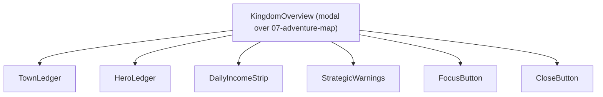
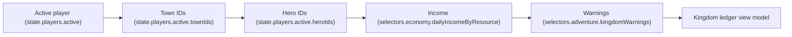
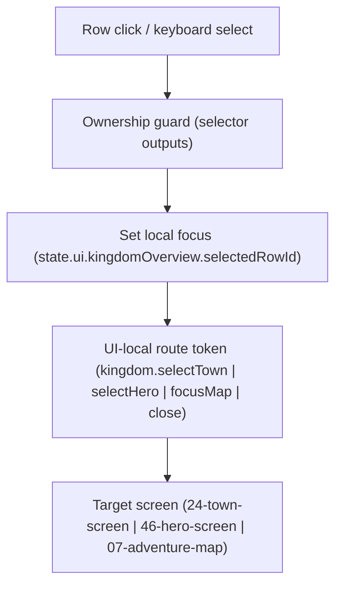
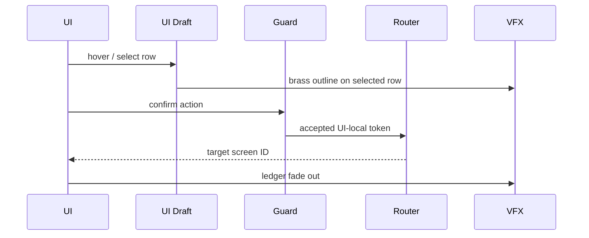
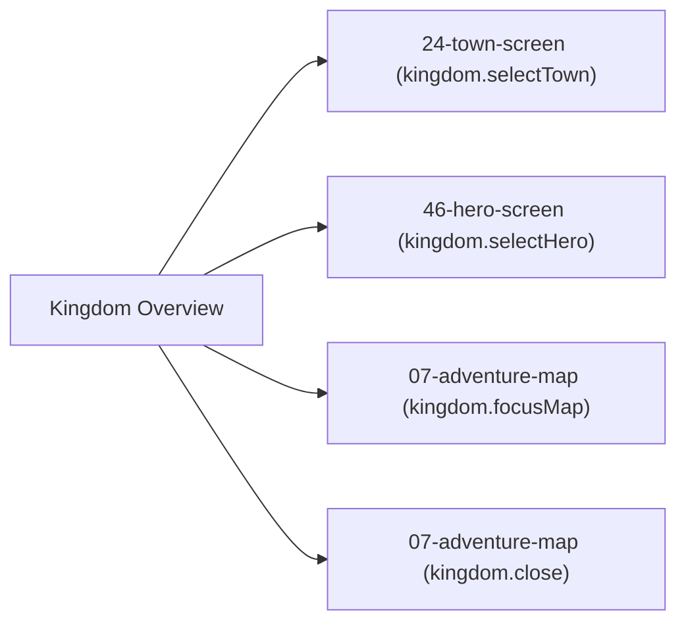

# Screen 08: Kingdom Overview — Architecture

System: `adventure` · Screen ID: `kingdom-overview` · Visual Archetype:
`curated-adventure-ledger` · Curation Status: `curated-pass-3`

## Companion Files
- [`mockup.html`](./mockup.html) — visual reference.
- [`spec.md`](./spec.md) — components, bindings.
- [`interactions.md`](./interactions.md) — per-control behavior.
- [`data-contracts.md`](./data-contracts.md) — schemas, config, localization, assets.

## 1. Purpose
Adventure-layer kingdom ledger summarizing owned towns, heroes,
daily income, garrison pressure, movement readiness, and strategic
warnings. Rendered as a modal over a dimmed
[`07-adventure-map`](../07-adventure-map/). Selecting a row sets
local focus and routes to another screen; **no deterministic
gameplay command is committed here**. Authoritative bindings live
in [`spec.md` § 5 State Bindings](./spec.md#5-state-bindings);
per-control behavior, routing, and animation live in
[`interactions.md` § 2 Actions](./interactions.md#2-actions). This
file owns the screen-specific diagrams only.

## 2. Visual Direction
Original internal UI contract. Do not use third-party captures,
copied franchise art, or external product pixels as implementation
input.

## 3. Visual Composition

## 4. Screen Load & Data Resolution

## 5. Main Interaction Flow

## 6. Animation Flow

## 7. Outgoing Transitions

## 8. State Inputs
- `townRows` → `state.players.active.townIds`
- `heroRows` → `state.players.active.heroIds`
- `incomeTotals` → `selectors.economy.dailyIncomeByResource`
- `selectedRow` → `state.ui.kingdomOverview.selectedRowId` (UI-only; not persisted, not replayed)
- `warnings` → `selectors.adventure.kingdomWarnings`

## 9. Implementation Contract
- [`mockup.html`](./mockup.html) defines visual regions and data hooks only.
- [`spec.md`](./spec.md) defines the component / state contract.
- [`interactions.md`](./interactions.md) defines controls, timing, routing, disabled states, and error behavior.
- [`data-contracts.md`](./data-contracts.md) defines schemas, config, localization, assets, audio, VFX, save, and replay references.
- Diagrams in this file summarize the same contract and must not introduce hidden behavior.

---

## 🔍 Sync Check

- **UI: ✔** — Component tree, transitions, and animation match [`spec.md`](./spec.md) and [`interactions.md`](./interactions.md). Visual Composition now lists `FocusButton` so the four `Outgoing Transitions` routes match the two `data-action` buttons + two row clicks in [`mockup.html`](./mockup.html).
- **Schema: ✔** — Selectors and state slices mirror [`data-contracts.md` § 2](./data-contracts.md#2-runtime-state-selectors); referenced schemas all exist under [`content-schema/schemas/`](../../../../../content-schema/schemas/).
- **Tasks: ✔** — Diagrams align with the owning task [`tasks/phase-2/07-ui-screen-backlog/08-kingdom-overview-screen.md`](../../../../../tasks/phase-2/07-ui-screen-backlog/08-kingdom-overview-screen.md); no new behavior introduced.

## ⚠ Issues

- **`FocusButton` added to Visual Composition.** Reconciled across the package in this audit pass — see sibling [`spec.md` § 4 Component Tree](./spec.md#4-component-tree) and `## ⚠ Issues` block for the full note. The `kingdom.focusMap` route was already documented in [`interactions.md`](./interactions.md) and in this file's § 7; only the Visual Composition diagram was incomplete. No feature invented.
- **`Outgoing Transitions` nodes now labeled by action.** Previously both focus and close pointed at unlabeled `07-adventure-map` nodes; now suffixed with `(kingdom.focusMap)` and `(kingdom.close)` to disambiguate. Destination unchanged.
