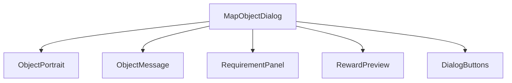
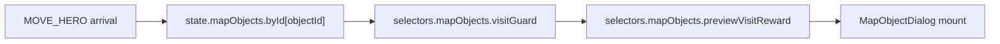
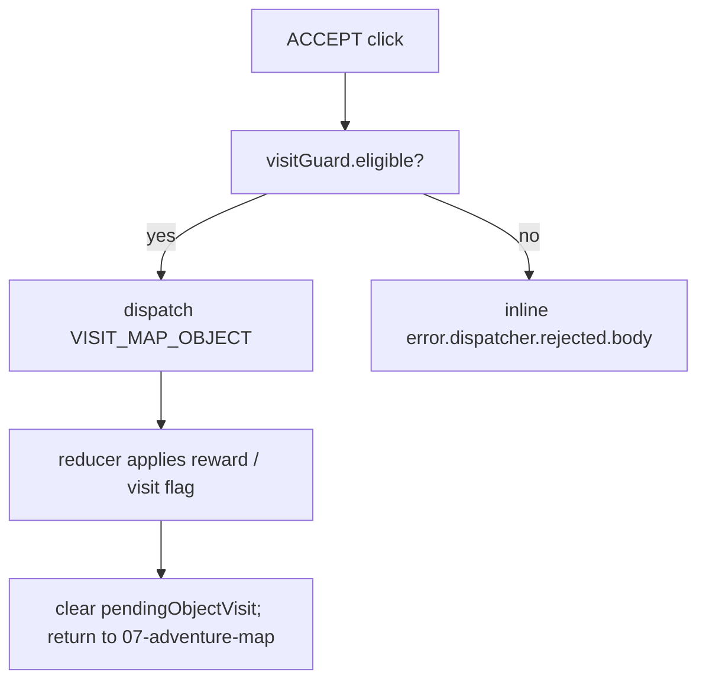
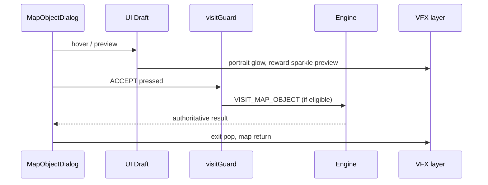
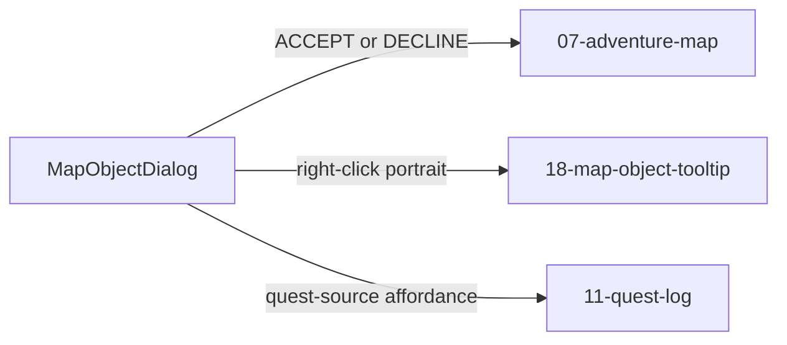

# Screen 09 Architecture: Map Object Dialog

- System: `adventure`
- Screen ID: `map-object-dialog`
- Visual Archetype: `curated-map-object-dialog`
- Curation Status: `curated-pass-3`

## Purpose
Generic adventure object visit dialog for shrines, events, guarded
rewards, signs, one-shot pickups, and choice prompts. The diagrams
below summarize the contract owned by sibling `spec.md`,
`interactions.md`, and `data-contracts.md`; they must not introduce
behavior absent from those files.

## Visual Direction
- Original internal UI contract. Do not use third-party captures,
  copied franchise art, or external product pixels as implementation
  input.

## Visual Composition

## Screen Load And Data Resolution

## Main Interaction Flow

## Animation Flow

## Outgoing Transitions

## State Inputs
| Binding | Source |
| --- | --- |
| `objectId` | `state.ui.adventure.pendingObjectVisit.objectId` |
| `heroId` | `state.adventure.selectedHeroId` |
| `visitRecord` | `state.mapObjects.byId[objectId]` |
| `rewardPreview` | `selectors.mapObjects.previewVisitReward` |
| `guardResult` | `selectors.mapObjects.visitGuard` |

## Implementation Contract
- `mockup.html` defines visible regions and data hooks only.
- `spec.md` owns the component / state contract.
- `interactions.md` owns controls, timing, command routing, disabled
  states, and error behavior.
- `data-contracts.md` enumerates schemas, config, localization,
  asset, sound, VFX, save, and replay references.
- These diagrams summarize the same contract and must not introduce
  hidden behavior.

---

## 🔍 Sync Check

- **UI: ✔** — Component tree mirrors sibling `spec.md` § Component
  Tree; outgoing transitions match the Actions table in sibling
  `interactions.md` (`07-adventure-map`, `18-map-object-tooltip`,
  `11-quest-log`).
- **Schema: ✔** — The `VISIT_MAP_OBJECT` node in the Main Interaction
  Flow is the closed-enum kind defined in
  [`command.schema.json`](../../../../../content-schema/schemas/command.schema.json)
  and documented in
  [`command-schema.md`](../../../command-schema.md#visit_map_object).
- **Tasks: ✔** — Owning task
  [`mvp.05-adventure-map.09-map-object-dialogs`](../../../../../tasks/mvp/05-adventure-map/09-map-object-dialogs.md)
  reads this file; the reducer for `VISIT_MAP_OBJECT` is owned by
  [`mvp.05-adventure-map.21-map-object-visit-and-battle-initiation-commands`](../../../../../tasks/mvp/05-adventure-map/21-map-object-visit-and-battle-initiation-commands.md).

## ⚠ Issues

_None._
