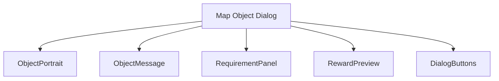
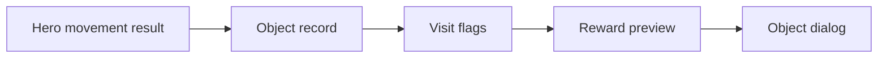
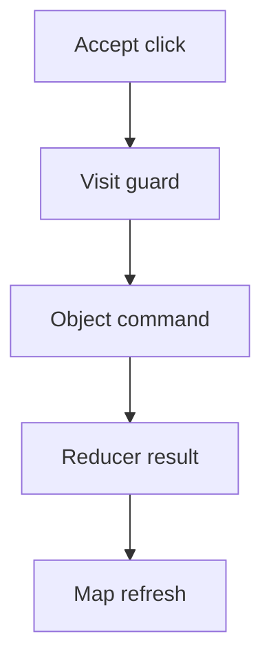
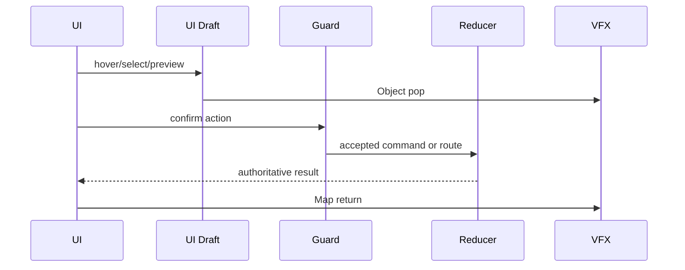
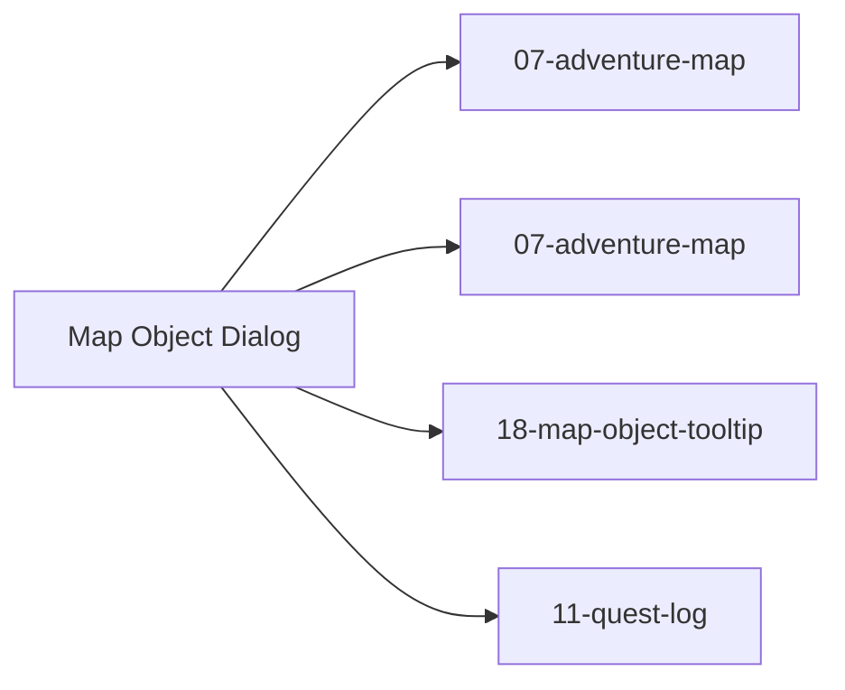

# Screen 09 Architecture: Map Object Dialog

System: adventure
Screen ID: map-object-dialog
Visual Archetype: curated-map-object-dialog
Curation Status: curated-pass-3

## Purpose
Generic adventure object visit dialog for shrines, events, guarded rewards, signs, one-shot pickups, and choice prompts.

## Visual Direction
- Original internal UI contract. Do not use third-party captures,
  copied franchise art, or external product pixels as implementation input.

## Visual Composition

## Screen Load And Data Resolution

## Main Interaction Flow

## Animation Flow

## Outgoing Transitions

## State Inputs
- objectId -> state.ui.adventure.pendingObjectVisit.objectId
- heroId -> state.adventure.selectedHeroId
- visitRecord -> state.mapObjects.byId[objectId]
- rewardPreview -> selectors.mapObjects.previewVisitReward
- guardResult -> selectors.mapObjects.visitGuard

## Implementation Contract
- Mockup defines visual regions and data hooks only.
- Spec defines the component/state contract.
- Interactions define controls, timing, command routing, disabled states, and error behavior.
- Data contracts define schemas, config, localization, asset, audio, VFX, save, and replay references.
- Diagrams are screen-specific summaries of the same contract and must not introduce hidden behavior.
