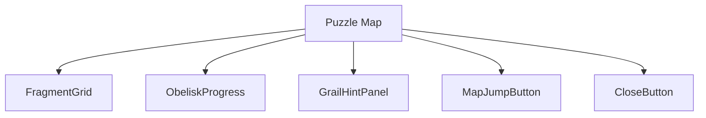
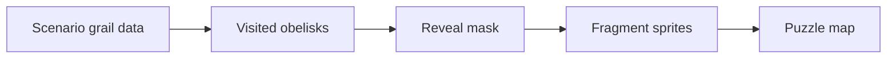
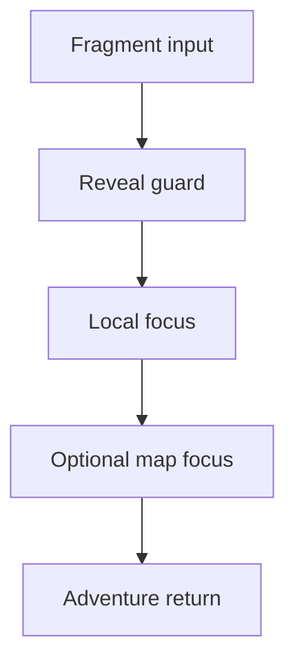
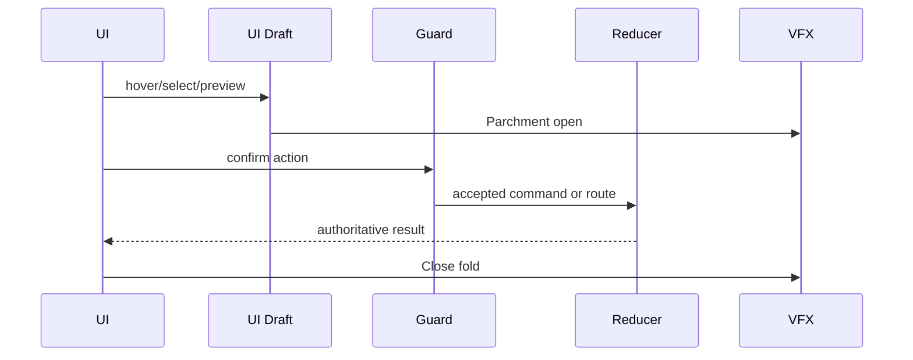
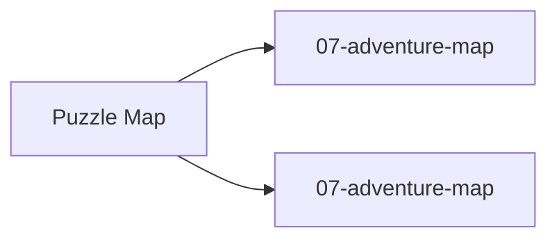

# Screen 10 Architecture: Puzzle Map

System: adventure
Screen ID: puzzle-map
Visual Archetype: curated-puzzle-map
Curation Status: curated-pass-3

## Purpose
Obelisk puzzle map view revealing grail-location fragments according to visited obelisks.

## Visual Direction
- Original internal UI contract. Do not use third-party captures,
  copied franchise art, or external product pixels as implementation input.

## Visual Composition

## Screen Load And Data Resolution

## Main Interaction Flow

## Animation Flow

## Outgoing Transitions

## State Inputs
- obeliskProgress -> state.players.active.obelisksVisited
- fragmentGrid -> selectors.grail.revealedPuzzleFragments
- selectedFragment -> state.ui.puzzleMap.selectedFragment
- grailRegionHint -> selectors.grail.visibleRegionHint
- mapJumpTarget -> selectors.grail.selectedFragmentMapFocus

## Implementation Contract
- Mockup defines visual regions and data hooks only.
- Spec defines the component/state contract.
- Interactions define controls, timing, command routing, disabled states, and error behavior.
- Data contracts define schemas, config, localization, asset, audio, VFX, save, and replay references.
- Diagrams are screen-specific summaries of the same contract and must not introduce hidden behavior.
