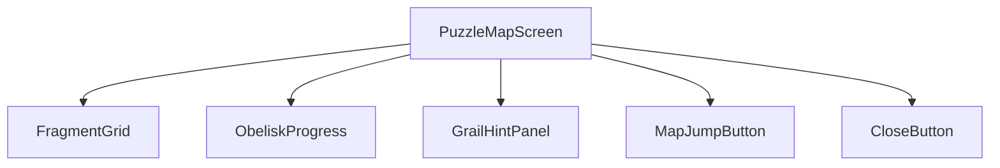
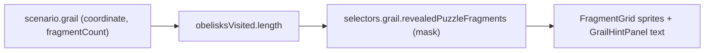
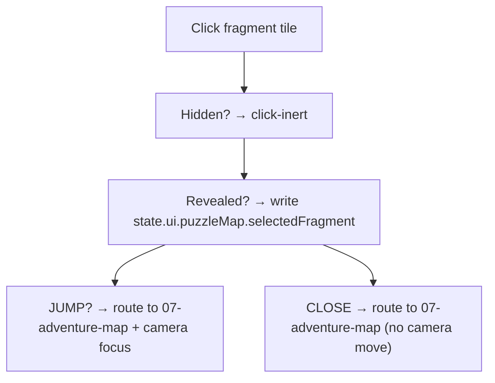
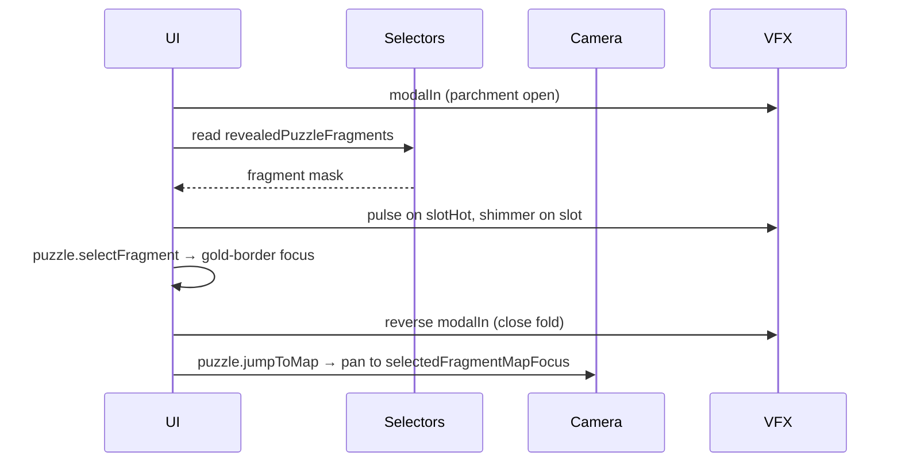
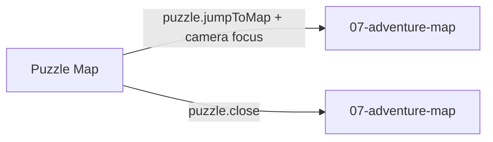

# Screen 10 Architecture: Puzzle Map

System: adventure
Screen ID: puzzle-map
Visual Archetype: curated-puzzle-map
Curation Status: curated-pass-3

## Purpose
Obelisk puzzle map view revealing grail-location fragments according
to visited obelisks. All controls are UI-local; no engine commands
enter this screen.

## Visual Direction
- Original internal UI contract. Do not use third-party captures,
  copied franchise art, or external product pixels as implementation
  input.

## Companion docs
- [`spec.md`](./spec.md) — component tree and state bindings.
- [`interactions.md`](./interactions.md) — per-control routing,
  timing, and disabled states.
- [`data-contracts.md`](./data-contracts.md) — schemas, selectors,
  localization, assets, save/replay.
- [`mockup.html`](./mockup.html) — visual reference only.

## Visual Composition

## Screen Load And Data Resolution

## Main Interaction Flow

## Animation Flow

## Outgoing Transitions

## State Inputs
- `obeliskProgress` → `state.players.active.obelisksVisited`
- `fragmentGrid` → `selectors.grail.revealedPuzzleFragments`
- `selectedFragment` → `state.ui.puzzleMap.selectedFragment`
- `grailRegionHint` → `selectors.grail.visibleRegionHint`
- `mapJumpTarget` → `selectors.grail.selectedFragmentMapFocus`

The four `selectors.grail.*` paths and the `obelisksVisited` field
are produced by [`mvp.05-adventure-map.22-obelisk-visits-and-grail-state`](../../../../../tasks/mvp/05-adventure-map/22-obelisk-visits-and-grail-state.md).

## Implementation Contract
- `mockup.html` defines visual regions and data hooks only.
- [`spec.md`](./spec.md) owns the component/state contract.
- [`interactions.md`](./interactions.md) owns controls, timing,
  command routing, disabled states, and error behavior.
- [`data-contracts.md`](./data-contracts.md) owns schema, config,
  localization, asset, audio, VFX, save, and replay references.
- Diagrams above are screen-specific summaries of the same contract
  and must not introduce hidden behavior.

---

## 🔍 Sync Check

- **UI: ✔** — Diagram component names (`PuzzleMapScreen`,
  `FragmentGrid`, `ObeliskProgress`, `GrailHintPanel`,
  `MapJumpButton`, `CloseButton`) match the component tree in
  sibling [`spec.md`](./spec.md). Outgoing-transition labels match
  the action IDs in sibling [`interactions.md`](./interactions.md).
- **Schema: ✔** — State inputs match the selector / state-path list
  in sibling [`data-contracts.md`](./data-contracts.md). No engine
  command enters this screen.
- **Tasks: ✔** — Owning task
  [`phase-2.07-ui-screen-backlog.10-puzzle-map-screen`](../../../../../tasks/phase-2/07-ui-screen-backlog/10-puzzle-map-screen.md)
  reads this file first; upstream selector / schema owner
  [`mvp.05-adventure-map.22-obelisk-visits-and-grail-state`](../../../../../tasks/mvp/05-adventure-map/22-obelisk-visits-and-grail-state.md)
  reads sibling [`spec.md`](./spec.md) and
  [`data-contracts.md`](./data-contracts.md) first.

## ⚠ Issues

_None._
