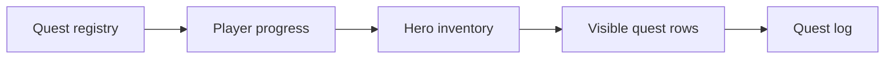
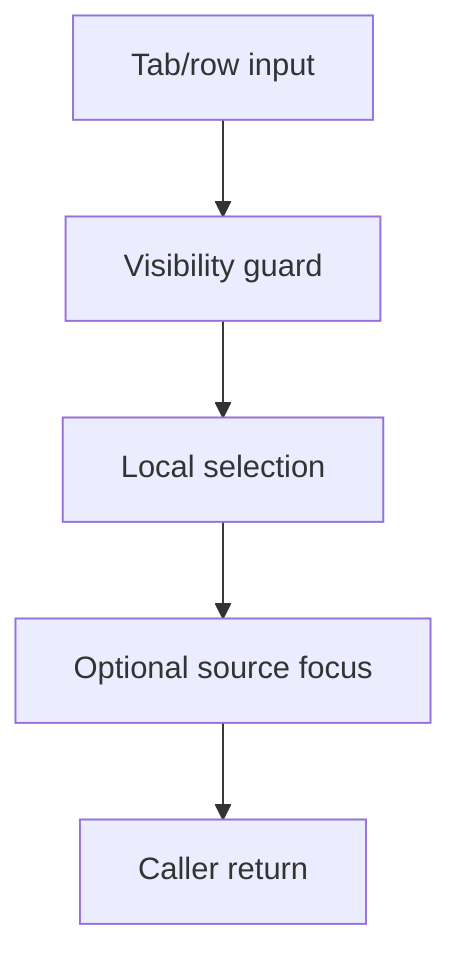
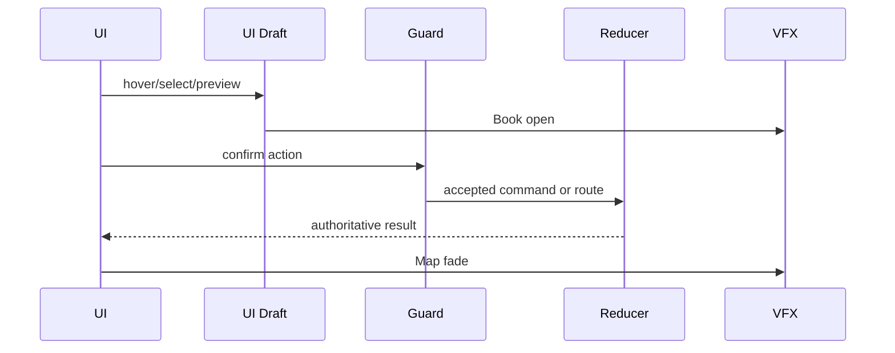
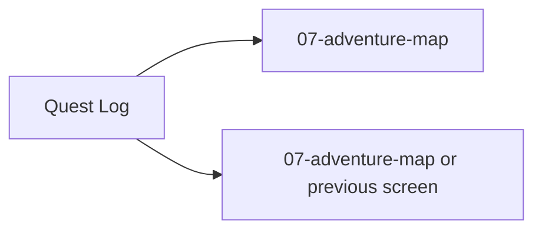

# Screen 11 Architecture: Quest Log

System: adventure
Screen ID: quest-log
Visual Archetype: curated-quest-log
Curation Status: curated-pass-3

## Purpose
Adventure quest ledger listing active, completed, failed, and repeatable map-object quests with requirements, deadlines, and rewards.

## Visual Direction
- Original internal UI contract. Do not use third-party captures,
  copied franchise art, or external product pixels as implementation input.

## Visual Composition

## Screen Load And Data Resolution

## Main Interaction Flow

## Animation Flow

## Outgoing Transitions

## State Inputs
- questFilter -> state.ui.questLog.filter
- questRows -> selectors.quests.visibleQuestRows
- selectedQuest -> state.ui.questLog.selectedQuestId
- requirements -> selectors.quests.selectedQuestRequirements
- rewardPreview -> selectors.quests.selectedQuestRewards

## Implementation Contract
- Mockup defines visual regions and data hooks only.
- Spec defines the component/state contract.
- Interactions define controls, timing, command routing, disabled states, and error behavior.
- Data contracts define schemas, config, localization, asset, audio, VFX, save, and replay references.
- Diagrams are screen-specific summaries of the same contract and must not introduce hidden behavior.
