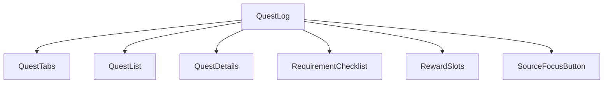
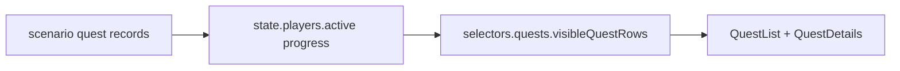
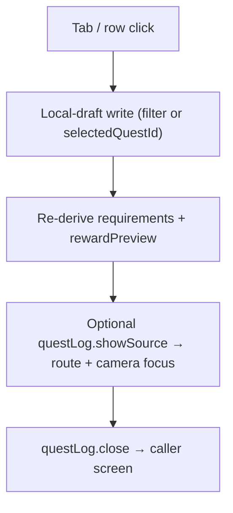
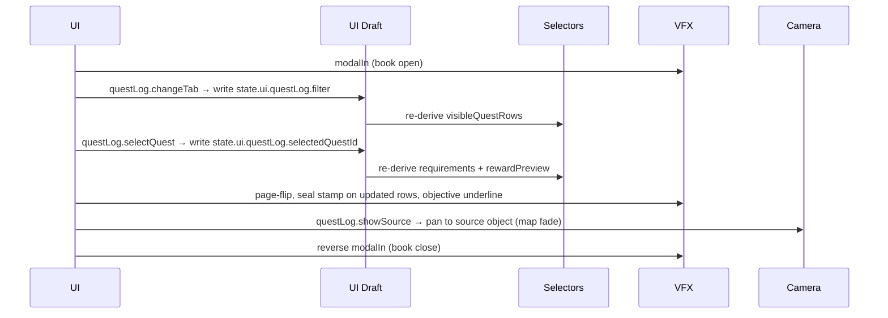
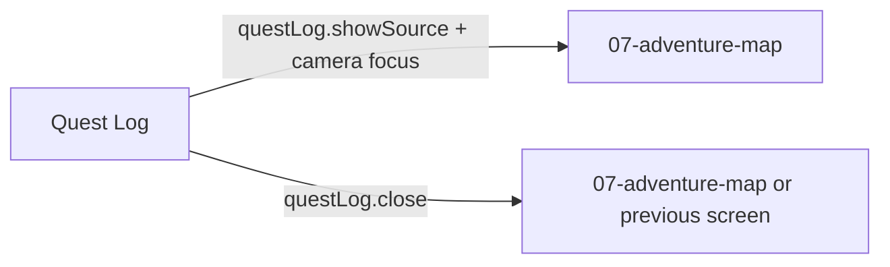

# Screen 11 Architecture: Quest Log

System: adventure
Screen ID: quest-log
Visual Archetype: curated-quest-log
Curation Status: curated-pass-3

## Purpose
Adventure quest ledger that lists active, completed, failed, and
repeatable map-object quests with requirements, deadlines, and
rewards. All four controls are UI-local routing or local-draft
operations; no command enters the deterministic command log on this
screen.

## Visual Direction
- Original internal UI contract. Do not use third-party captures,
  copied franchise art, or external product pixels as implementation
  input.

## Companion docs
- [`spec.md`](./spec.md) — component tree and state bindings.
- [`interactions.md`](./interactions.md) — per-control routing,
  timing, and disabled states.
- [`data-contracts.md`](./data-contracts.md) — schemas, selectors,
  localization, assets, save/replay.
- [`mockup.html`](./mockup.html) — visual reference only.

## Visual Composition

## Screen Load And Data Resolution

## Main Interaction Flow

## Animation Flow

## Outgoing Transitions

## State Inputs
- `questFilter` → `state.ui.questLog.filter`
- `questRows` → `selectors.quests.visibleQuestRows`
- `selectedQuest` → `state.ui.questLog.selectedQuestId`
- `requirements` → `selectors.quests.selectedQuestRequirements`
- `rewardPreview` → `selectors.quests.selectedQuestRewards`

The three `selectors.quests.*` paths are produced by upstream task
[`phase-2.08-meta-systems.04-quest-log-engine`](../../../../../tasks/phase-2/08-meta-systems/04-quest-log-engine.md);
the underlying quest records resolve through
[`mvp.02-content-schemas.16-quest-schema`](../../../../../tasks/mvp/02-content-schemas/16-quest-schema.md).
Both tasks are `planned` per
[`tasks/task-status.json`](../../../../../tasks/task-status.json),
so the selectors do not yet resolve in `main`.

## Implementation Contract
- `mockup.html` defines visual regions and data hooks only.
- [`spec.md`](./spec.md) owns the component/state contract.
- [`interactions.md`](./interactions.md) owns controls, timing,
  command routing, disabled states, and error behavior.
- [`data-contracts.md`](./data-contracts.md) owns schema, config,
  localization, asset, audio, VFX, save, and replay references.
- Diagrams above are screen-specific summaries of the same contract
  and must not introduce hidden behavior.

---

## 🔍 Sync Check

- **UI: ✔** — Diagram component names (`QuestLog`, `QuestTabs`,
  `QuestList`, `QuestDetails`, `RequirementChecklist`, `RewardSlots`,
  `SourceFocusButton`) match the component tree in sibling
  [`spec.md`](./spec.md). Outgoing-transition action IDs
  (`questLog.showSource`, `questLog.close`) match the `data-action`
  attributes in [`mockup.html`](./mockup.html) and the rows in
  sibling [`interactions.md`](./interactions.md).
- **Schema: ✔** — State inputs match the selector / state-path list
  in sibling [`data-contracts.md`](./data-contracts.md). No engine
  command enters this screen; quest content resolves through
  upstream `quest.schema.json` (planned per
  [`mvp.02-content-schemas.16-quest-schema`](../../../../../tasks/mvp/02-content-schemas/16-quest-schema.md)).
- **Tasks: ✔** — Owning task
  [`phase-2.07-ui-screen-backlog.11-quest-log-screen`](../../../../../tasks/phase-2/07-ui-screen-backlog/11-quest-log-screen.md)
  reads this file first; upstream selector owner
  [`phase-2.08-meta-systems.04-quest-log-engine`](../../../../../tasks/phase-2/08-meta-systems/04-quest-log-engine.md)
  reads sibling [`interactions.md`](./interactions.md) first.

## ⚠ Issues

_None._
