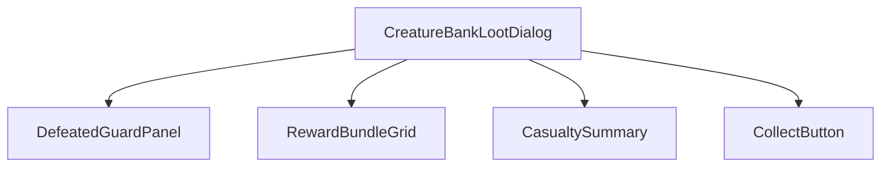
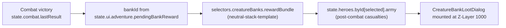
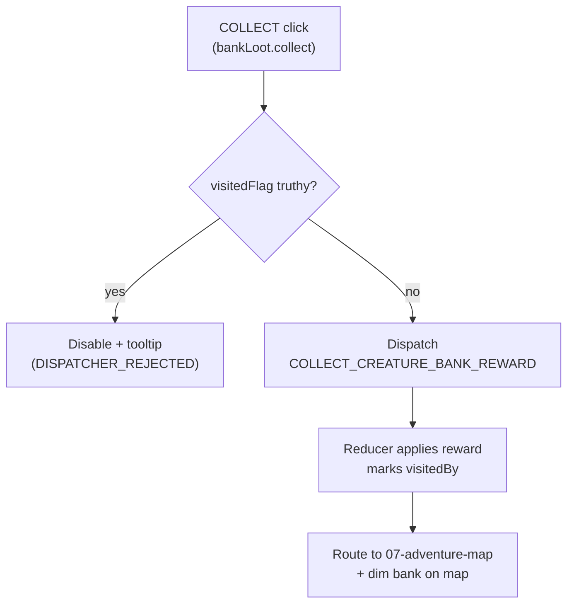
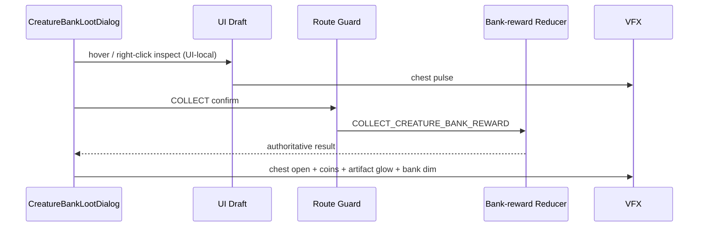
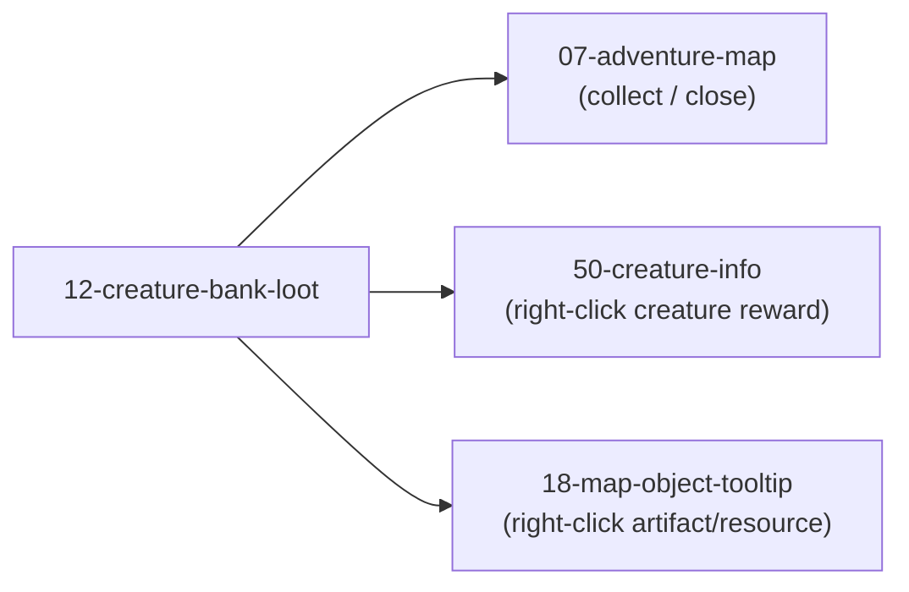

# Screen 12 Architecture: Creature Bank Loot

- System: `adventure`
- Screen ID: `creature-bank-loot`
- Visual Archetype: `curated-bank-loot`
- Curation Status: `curated-pass-3`

## Purpose
Post-combat creature-bank reward dialog: shows the cleared bank, hero
losses, the reward bundle, and the one-shot Collect action.

## Visual Direction
- Original internal UI contract. Do not use third-party captures,
  copied franchise art, or external product pixels as implementation
  input.

## Visual Composition

## Screen Load And Data Resolution

## Main Interaction Flow

## Animation Flow

## Outgoing Transitions

## State Inputs
- `bankId` ← `state.ui.adventure.pendingBankReward.bankId`
- `combatResult` ← `state.combat.lastResult`
- `rewardBundle` ← `selectors.creatureBanks.rewardBundle`
- `visitedFlag` ← `state.mapObjects.byId[bankId].visitedBy`
- `heroArmy` ← `state.heroes.byId[selected].army`

## Implementation Contract
- [`mockup.html`](./mockup.html) defines visible regions and data
  hooks only.
- [`spec.md`](./spec.md) defines the component / state contract.
- [`interactions.md`](./interactions.md) defines controls, timing,
  command routing, disabled states, and error behavior.
- [`data-contracts.md`](./data-contracts.md) defines schemas, config,
  localization, asset, audio, VFX, save, and replay references.
- The diagrams above are screen-specific summaries of the same
  contract and must not introduce hidden behavior.

---

## 🔍 Sync Check

- **UI: ✔** — Component tree, state inputs, and route targets match
  sibling [`spec.md`](./spec.md) § Component Tree / State Bindings
  and [`interactions.md`](./interactions.md) § Navigation Outcomes.
- **Schema: ✔** — `COLLECT_CREATURE_BANK_REWARD` is the only
  schema-backed command on this screen; defined in
  [`command.schema.json`](../../../../../content-schema/schemas/command.schema.json)
  `$defs.collectCreatureBankReward`. UI-local prefix events
  (`OPEN_REWARD_DETAILS`, `CLOSE_BANK_REWARD`) match
  [`screen-command-coverage.json`](../../../screen-command-coverage.json).
- **Tasks: ✔** — Screen owned by
  `phase-2.07-ui-screen-backlog.12-creature-bank-loot-screen`;
  reducer owned by
  `mvp.05-adventure-map.14-collect-creature-bank-reward-command`.

## ⚠ Issues

- **Missing `command-schema.md` section for `COLLECT_CREATURE_BANK_REWARD`.**
  See sibling [`spec.md`](./spec.md) § Issues — aligned. Reducer task
  `mvp.05-adventure-map.14-collect-creature-bank-reward-command` is
  the suggested owner.
