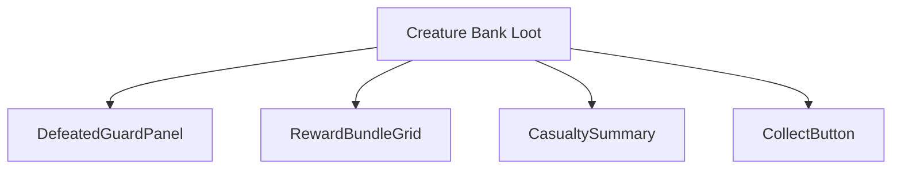
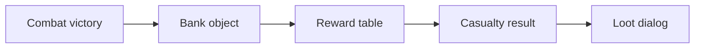
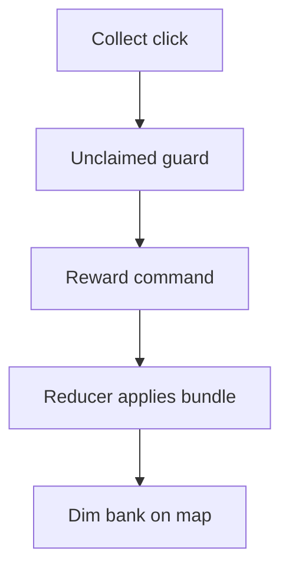
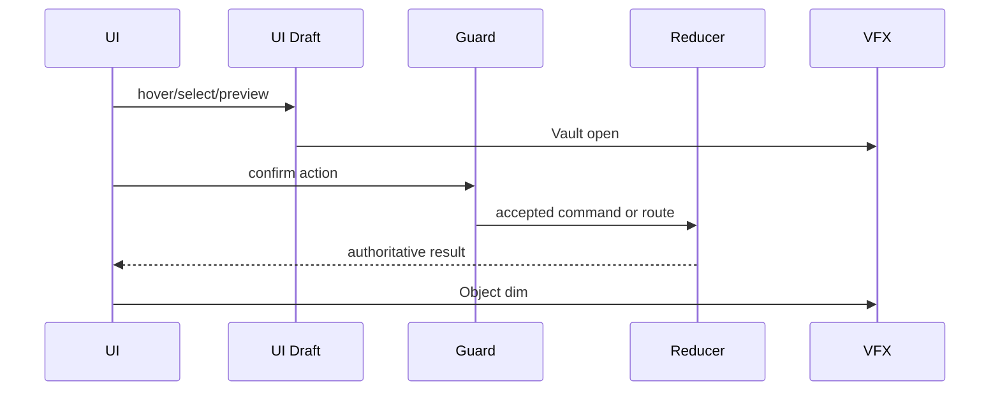
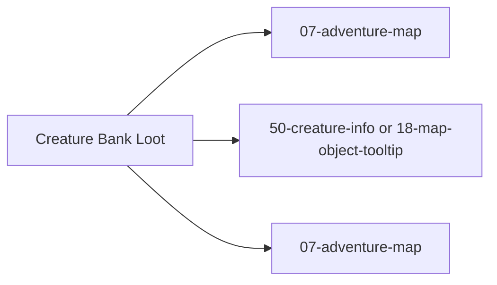

# Screen 12 Architecture: Creature Bank Loot

System: adventure
Screen ID: creature-bank-loot
Visual Archetype: curated-bank-loot
Curation Status: curated-pass-3

## Purpose
Post-combat creature bank reward dialog showing cleared bank state, losses, reward bundles, and collection result.

## Visual Direction
- Original internal UI contract. Do not use third-party captures,
  copied franchise art, or external product pixels as implementation input.

## Visual Composition

## Screen Load And Data Resolution

## Main Interaction Flow

## Animation Flow

## Outgoing Transitions

## State Inputs
- bankId -> state.ui.adventure.pendingBankReward.bankId
- combatResult -> state.combat.lastResult
- rewardBundle -> selectors.creatureBanks.rewardBundle
- visitedFlag -> state.mapObjects.byId[bankId].visitedBy
- heroArmy -> state.heroes.byId[selected].army

## Implementation Contract
- Mockup defines visual regions and data hooks only.
- Spec defines the component/state contract.
- Interactions define controls, timing, command routing, disabled states, and error behavior.
- Data contracts define schemas, config, localization, asset, audio, VFX, save, and replay references.
- Diagrams are screen-specific summaries of the same contract and must not introduce hidden behavior.
