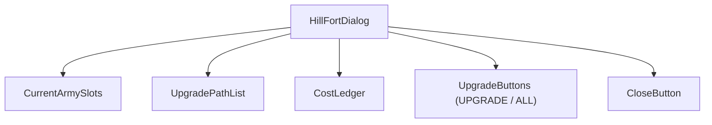
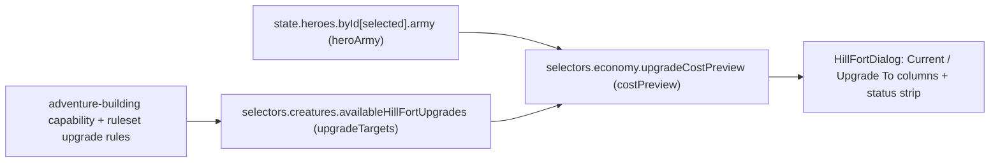
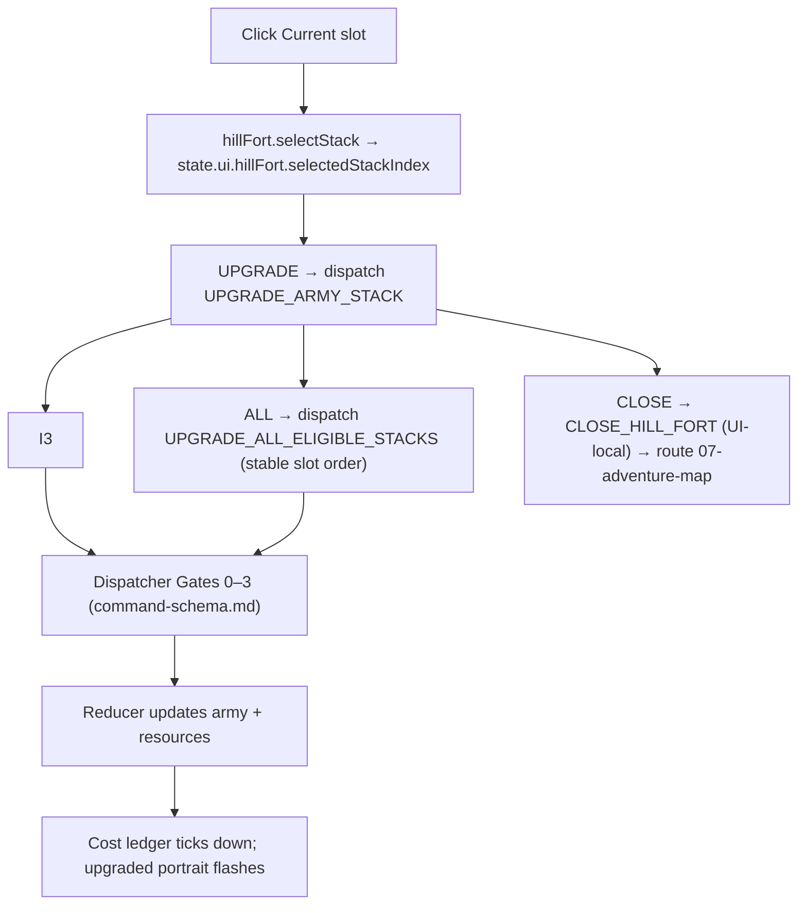
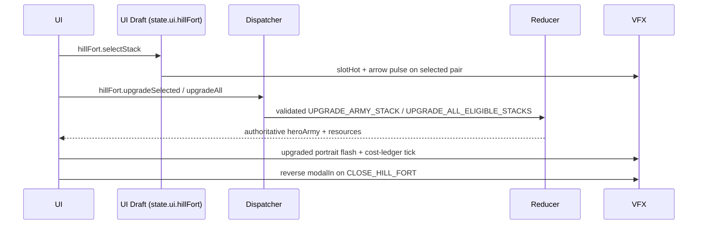

# Screen 13 Architecture: Hill Fort

System: adventure
Screen ID: hill-fort
Visual Archetype: curated-hill-fort
Curation Status: curated-pass-3

## Purpose
Adventure-map service modal that upgrades eligible hero army stacks
for a ruleset-defined resource cost. Two of the four control tokens
(`UPGRADE_ARMY_STACK`, `UPGRADE_ALL_ELIGIBLE_STACKS`) dispatch
schema-backed engine commands; the other two
(`SELECT_HILL_FORT_STACK`, `CLOSE_HILL_FORT`) are UI-local by prefix.

## Visual Direction
- Original internal UI contract. Do not use third-party captures,
  copied franchise art, or external product pixels as implementation
  input.

## Companion docs
- [`spec.md`](./spec.md) — component tree and state bindings.
- [`interactions.md`](./interactions.md) — per-control routing,
  timing, and disabled states.
- [`data-contracts.md`](./data-contracts.md) — schemas, selectors,
  localization, assets, save/replay.
- [`mockup.html`](./mockup.html) — visual reference only.

## Visual Composition


## Screen Load And Data Resolution


## Main Interaction Flow


## Animation Flow


## Outgoing Transitions
```mermaid
flowchart LR
  Current["Hill Fort"]
  Current -->|hillFort.close (CLOSE_HILL_FORT)| T0["07-adventure-map"]
```

`hillFort.upgradeSelected` and `hillFort.upgradeAll` keep the modal
open so the player can chain upgrades; only `hillFort.close`
navigates.

## State Inputs
- `heroArmy` → `state.heroes.byId[selected].army`
- `upgradeTargets` → `selectors.creatures.availableHillFortUpgrades`
- `selectedStack` → `state.ui.hillFort.selectedStackIndex`
- `costPreview` → `selectors.economy.upgradeCostPreview`
- `resources` → `state.players.active.resources`

The two `selectors.*` paths and the `UPGRADE_ARMY_STACK` /
`UPGRADE_ALL_ELIGIBLE_STACKS` reducers are produced by
[`mvp.05-adventure-map.20-upgrade-army-stack-command`](../../../../../tasks/mvp/05-adventure-map/20-upgrade-army-stack-command.md).

## Implementation Contract
- `mockup.html` defines visual regions and data hooks only.
- [`spec.md`](./spec.md) owns the component / state contract.
- [`interactions.md`](./interactions.md) owns controls, timing,
  command routing, disabled states, and error behavior.
- [`data-contracts.md`](./data-contracts.md) owns schema, config,
  localization, asset, audio, VFX, save, and replay references.
- Diagrams above are screen-specific summaries of the same contract
  and must not introduce hidden behavior.

---

## 🔍 Sync Check

- **UI: ✔** — Visual Composition component names (`HillFortDialog`,
  `CurrentArmySlots`, `UpgradePathList`, `CostLedger`,
  `UpgradeButtons`, `CloseButton`) match the component tree in
  sibling [`spec.md`](./spec.md). Outgoing-transition label
  `hillFort.close` and the dispatch labels on
  `hillFort.upgradeSelected` / `hillFort.upgradeAll` match the Action
  IDs in sibling [`interactions.md`](./interactions.md).
- **Schema: ✔** — `UPGRADE_ARMY_STACK` and
  `UPGRADE_ALL_ELIGIBLE_STACKS` are present in
  [`command.schema.json`](../../../../../content-schema/schemas/command.schema.json);
  the UI-local tokens clear via `SELECT_` / `CLOSE_` prefix in
  [`screen-command-coverage.json`](../../../screen-command-coverage.json).
  State inputs match the selector / state-path list in sibling
  [`data-contracts.md`](./data-contracts.md).
- **Tasks: ✔** — Owning UI task
  [`phase-2.07-ui-screen-backlog.13-hill-fort-screen`](../../../../../tasks/phase-2/07-ui-screen-backlog/13-hill-fort-screen.md)
  reads this file first; upstream reducer task
  [`mvp.05-adventure-map.20-upgrade-army-stack-command`](../../../../../tasks/mvp/05-adventure-map/20-upgrade-army-stack-command.md)
  reads sibling [`interactions.md`](./interactions.md) first.

## ⚠ Issues

_None._
