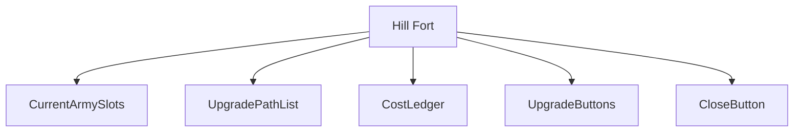
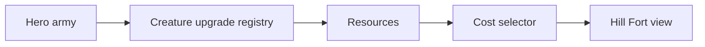
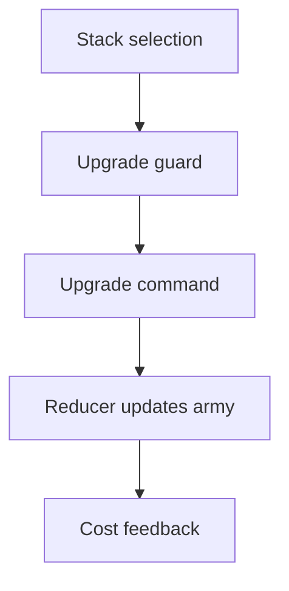
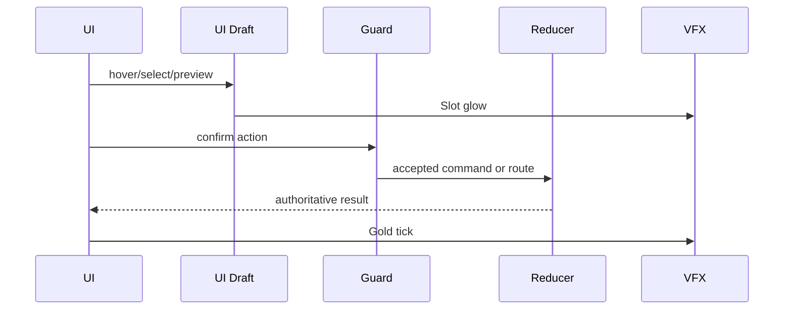
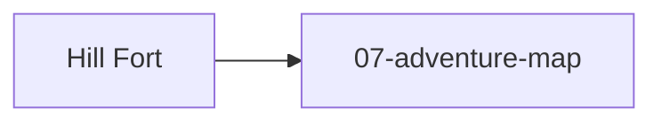

# Screen 13 Architecture: Hill Fort

System: adventure
Screen ID: hill-fort
Visual Archetype: curated-hill-fort
Curation Status: curated-pass-3

## Purpose
Hill Fort upgrade service where eligible hero stacks can be upgraded for calculated resource costs.

## Visual Direction
- Original internal UI contract. Do not use third-party captures,
  copied franchise art, or external product pixels as implementation input.

## Visual Composition

## Screen Load And Data Resolution

## Main Interaction Flow

## Animation Flow

## Outgoing Transitions

## State Inputs
- heroArmy -> state.heroes.byId[selected].army
- upgradeTargets -> selectors.creatures.availableHillFortUpgrades
- selectedStack -> state.ui.hillFort.selectedStackIndex
- costPreview -> selectors.economy.upgradeCostPreview
- resources -> state.players.active.resources

## Implementation Contract
- Mockup defines visual regions and data hooks only.
- Spec defines the component/state contract.
- Interactions define controls, timing, command routing, disabled states, and error behavior.
- Data contracts define schemas, config, localization, asset, audio, VFX, save, and replay references.
- Diagrams are screen-specific summaries of the same contract and must not introduce hidden behavior.
