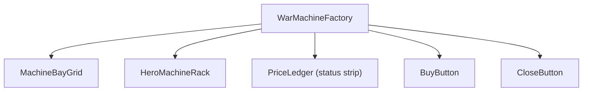
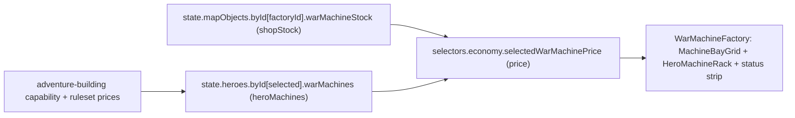
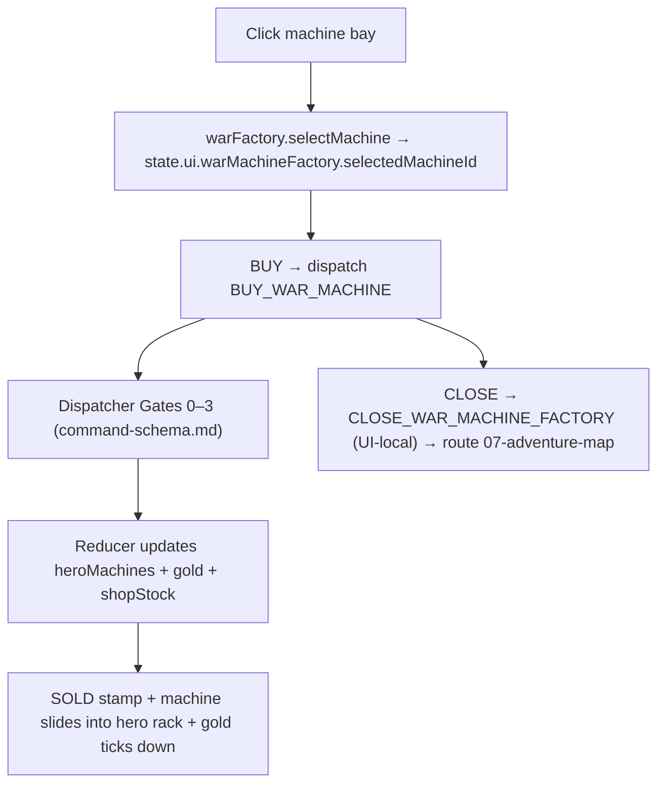
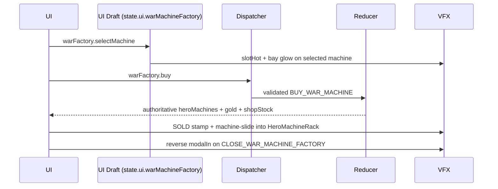

# Screen 14 Architecture: War Machine Factory

System: adventure
Screen ID: war-machine-factory
Visual Archetype: curated-war-machine-factory
Curation Status: curated-pass-3

## Purpose
Adventure-map service modal that lets the visiting hero buy war
machines (ballista, ammo cart, first-aid tent, catapult) for gold
and equip them into hero rack slots. One of the three control
tokens (`BUY_WAR_MACHINE`) dispatches a schema-backed engine
command; the other two (`SELECT_WAR_MACHINE`,
`CLOSE_WAR_MACHINE_FACTORY`) are UI-local by prefix.

## Visual Direction
- Original internal UI contract. Do not use third-party captures,
  copied franchise art, or external product pixels as implementation
  input.

## Companion docs
- [`spec.md`](./spec.md) — component tree and state bindings.
- [`interactions.md`](./interactions.md) — per-control routing,
  timing, and disabled states.
- [`data-contracts.md`](./data-contracts.md) — schemas, selectors,
  localization, assets, save/replay.
- [`mockup.html`](./mockup.html) — visual reference only.

## Visual Composition


## Screen Load And Data Resolution


## Main Interaction Flow


## Animation Flow


## Outgoing Transitions
```mermaid
flowchart LR
  Current["War Machine Factory"]
  Current -->|warFactory.close (CLOSE_WAR_MACHINE_FACTORY)| T0["07-adventure-map"]
```

`warFactory.buy` keeps the modal open so the player can chain
purchases; only `warFactory.close` navigates.

## State Inputs
- `shopStock` → `state.mapObjects.byId[factoryId].warMachineStock`
- `heroMachines` → `state.heroes.byId[selected].warMachines`
- `selectedMachine` → `state.ui.warMachineFactory.selectedMachineId`
- `price` → `selectors.economy.selectedWarMachinePrice`
- `resources` → `state.players.active.resources.gold`

The `selectors.economy.selectedWarMachinePrice` selector and the
`BUY_WAR_MACHINE` reducer are produced by
[`phase-2.01-spells-artifacts.11-buy-war-machine-command`](../../../../../tasks/phase-2/01-spells-artifacts/11-buy-war-machine-command.md).

## Implementation Contract
- `mockup.html` defines visual regions and data hooks only.
- [`spec.md`](./spec.md) owns the component / state contract.
- [`interactions.md`](./interactions.md) owns controls, timing,
  command routing, disabled states, and error behavior.
- [`data-contracts.md`](./data-contracts.md) owns schema, config,
  localization, asset, audio, VFX, save, and replay references.
- Diagrams above are screen-specific summaries of the same contract
  and must not introduce hidden behavior.

---

## 🔍 Sync Check

- **UI: ✔** — Visual Composition component names
  (`WarMachineFactory`, `MachineBayGrid`, `HeroMachineRack`,
  `PriceLedger`, `BuyButton`, `CloseButton`) match the component
  tree in sibling [`spec.md`](./spec.md). Outgoing-transition label
  `warFactory.close` and the dispatch label on `warFactory.buy`
  match the Action IDs in sibling [`interactions.md`](./interactions.md).
- **Schema: ✔** — `BUY_WAR_MACHINE` is present in
  [`command.schema.json`](../../../../../content-schema/schemas/command.schema.json)
  (`$defs.buyWarMachine`); the UI-local tokens clear via `SELECT_` /
  `CLOSE_` prefix in
  [`screen-command-coverage.json`](../../../screen-command-coverage.json).
  State inputs match the selector / state-path list in sibling
  [`data-contracts.md`](./data-contracts.md).
- **Tasks: ✔** — Owning UI task
  [`phase-2.07-ui-screen-backlog.14-war-machine-factory-screen`](../../../../../tasks/phase-2/07-ui-screen-backlog/14-war-machine-factory-screen.md)
  reads this file first; upstream reducer task
  [`phase-2.01-spells-artifacts.11-buy-war-machine-command`](../../../../../tasks/phase-2/01-spells-artifacts/11-buy-war-machine-command.md)
  reads sibling [`interactions.md`](./interactions.md) first.

## ⚠ Issues

_None._
