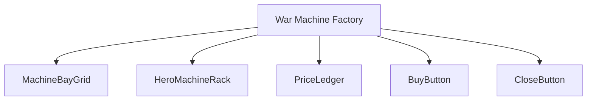
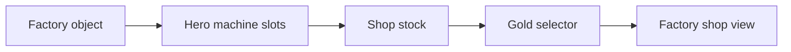
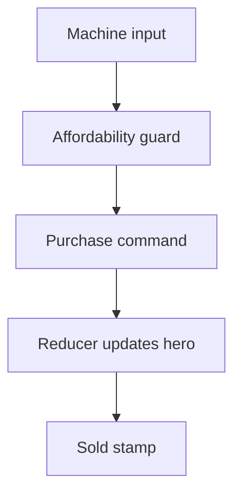
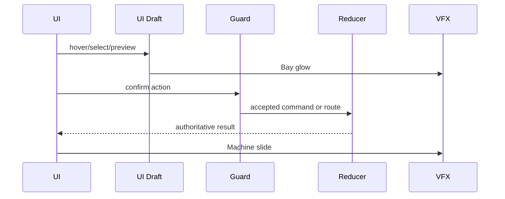
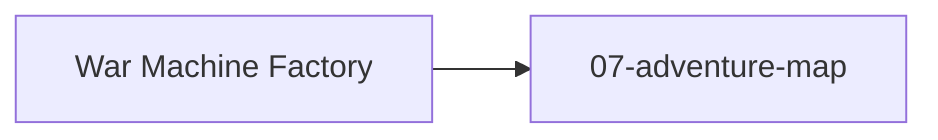

# Screen 14 Architecture: War Machine Factory

System: adventure
Screen ID: war-machine-factory
Visual Archetype: curated-war-machine-factory
Curation Status: curated-pass-3

## Purpose
Adventure shop for buying ballista, ammo cart, first aid tent, or catapult-related war machine services where rules allow.

## Visual Direction
- Original internal UI contract. Do not use third-party captures,
  copied franchise art, or external product pixels as implementation input.

## Visual Composition

## Screen Load And Data Resolution

## Main Interaction Flow

## Animation Flow

## Outgoing Transitions

## State Inputs
- shopStock -> state.mapObjects.byId[factoryId].warMachineStock
- heroMachines -> state.heroes.byId[selected].warMachines
- selectedMachine -> state.ui.warMachineFactory.selectedMachineId
- price -> selectors.economy.selectedWarMachinePrice
- resources -> state.players.active.resources.gold

## Implementation Contract
- Mockup defines visual regions and data hooks only.
- Spec defines the component/state contract.
- Interactions define controls, timing, command routing, disabled states, and error behavior.
- Data contracts define schemas, config, localization, asset, audio, VFX, save, and replay references.
- Diagrams are screen-specific summaries of the same contract and must not introduce hidden behavior.
