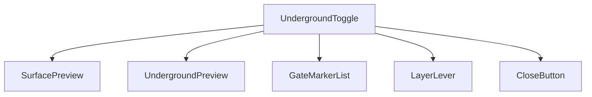
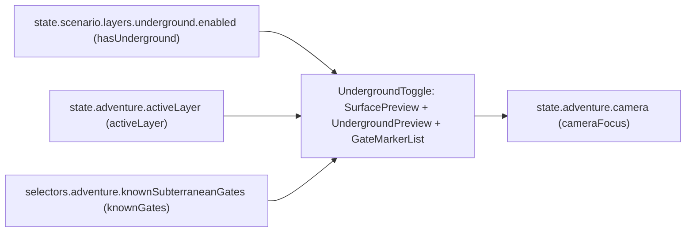
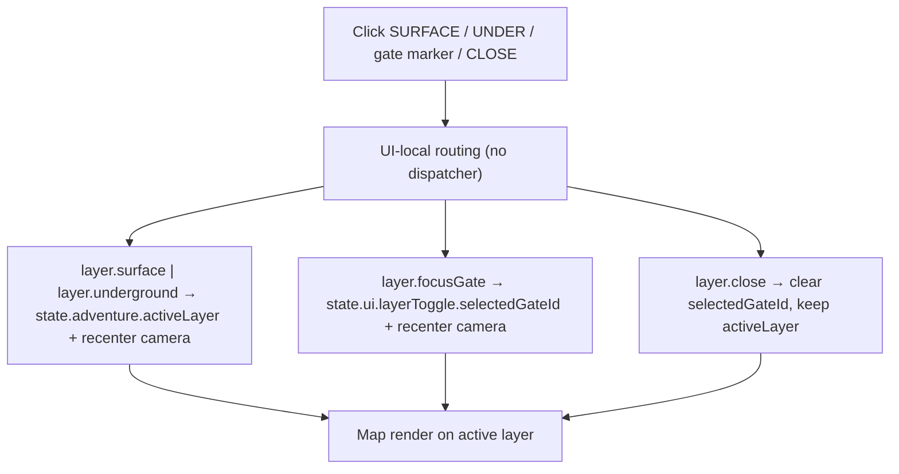
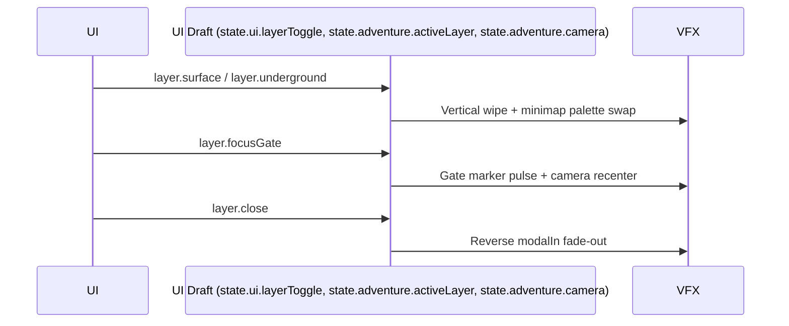

# Screen 15 Architecture: Underground Layer Toggle

System: adventure
Screen ID: underground-toggle
Visual Archetype: curated-layer-toggle
Curation Status: curated-pass-3

## Purpose
Adventure-map view-layer switcher. Lets the active player flip the
rendered map between surface and underground, focus a known
subterranean gate, or close the modal. All four control tokens are
**UI-local** by prefix; none mutates deterministic gameplay state.
Hero relocation between layers still requires walking onto a valid
subterranean gate or monolith, owned by
[`mvp.03-map-system.10-underground-layer-support`](../../../../../tasks/mvp/03-map-system/10-underground-layer-support.md).

## Visual Direction
- Original internal UI contract. Do not use third-party captures,
  copied franchise art, or external product pixels as implementation
  input.

## Companion docs
- [`spec.md`](./spec.md) — component tree and state bindings.
- [`interactions.md`](./interactions.md) — per-control routing,
  timing, and disabled states.
- [`data-contracts.md`](./data-contracts.md) — schemas, selectors,
  localization, assets, save/replay.
- [`mockup.html`](./mockup.html) — visual reference only.

## Visual Composition


## Screen Load And Data Resolution


## Main Interaction Flow


## Animation Flow


## Outgoing Transitions
```mermaid
flowchart LR
  Current["Underground Layer Toggle"]
  Current -->|layer.surface (SET_ADVENTURE_LAYER)| T0["07-adventure-map"]
  Current -->|layer.underground (SET_ADVENTURE_LAYER)| T0
  Current -->|layer.focusGate (FOCUS_SUBTERRANEAN_GATE)| T0
  Current -->|layer.close (CLOSE_LAYER_TOGGLE)| T0
```

All four exits return to `07-adventure-map`; the modal is
non-blocking and closing it without picking a layer leaves the
prior view-layer intact.

## State Inputs
- `activeLayer` → `state.adventure.activeLayer`
- `hasUnderground` → `state.scenario.layers.underground.enabled`
- `knownGates` → `selectors.adventure.knownSubterraneanGates`
- `selectedGate` → `state.ui.layerToggle.selectedGateId`
- `cameraFocus` → `state.adventure.camera`

`selectors.adventure.knownSubterraneanGates` and the
`state.adventure.activeLayer` view-layer write surface are produced
by
[`mvp.03-map-system.10-underground-layer-support`](../../../../../tasks/mvp/03-map-system/10-underground-layer-support.md).

## Implementation Contract
- [`mockup.html`](./mockup.html) defines visual regions and data
  hooks only.
- [`spec.md`](./spec.md) owns the component / state contract.
- [`interactions.md`](./interactions.md) owns controls, timing,
  command routing, disabled states, and error behavior.
- [`data-contracts.md`](./data-contracts.md) owns schema, config,
  localization, asset, audio, VFX, save, and replay references.
- Diagrams above are screen-specific summaries of the same contract
  and must not introduce hidden behavior.

---

## 🔍 Sync Check

- **UI: ✔** — Visual Composition component names
  (`UndergroundToggle`, `SurfacePreview`, `UndergroundPreview`,
  `GateMarkerList`, `LayerLever`, `CloseButton`) match the component
  tree in sibling [`spec.md`](./spec.md). Outgoing-transition labels
  (`layer.surface`, `layer.underground`, `layer.focusGate`,
  `layer.close`) and their tokens match the Action IDs in sibling
  [`interactions.md`](./interactions.md).
- **Schema: ✔** — All four control tokens clear via the `SET_` /
  `FOCUS_` / `CLOSE_` UI-local prefix policy in
  [`screen-command-coverage.json`](../../../screen-command-coverage.json);
  none requires a row in
  [`command.schema.json`](../../../../../content-schema/schemas/command.schema.json).
  State inputs match the selector / state-path list in sibling
  [`data-contracts.md`](./data-contracts.md).
- **Tasks: ✔** — UI owner
  [`phase-2.07-ui-screen-backlog.15-underground-toggle-screen`](../../../../../tasks/phase-2/07-ui-screen-backlog/15-underground-toggle-screen.md)
  reads this file first; engine owner
  [`mvp.03-map-system.10-underground-layer-support`](../../../../../tasks/mvp/03-map-system/10-underground-layer-support.md)
  reads sibling [`interactions.md`](./interactions.md) first.

## ⚠ Issues

_None._
