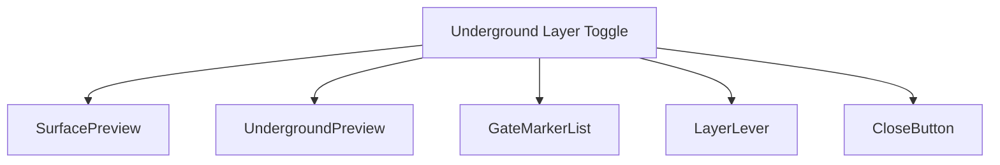
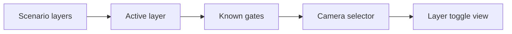
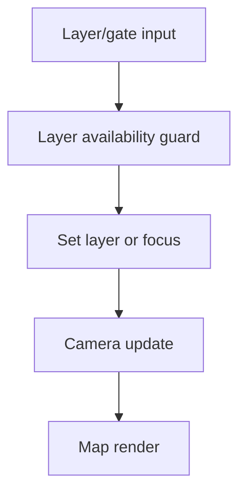
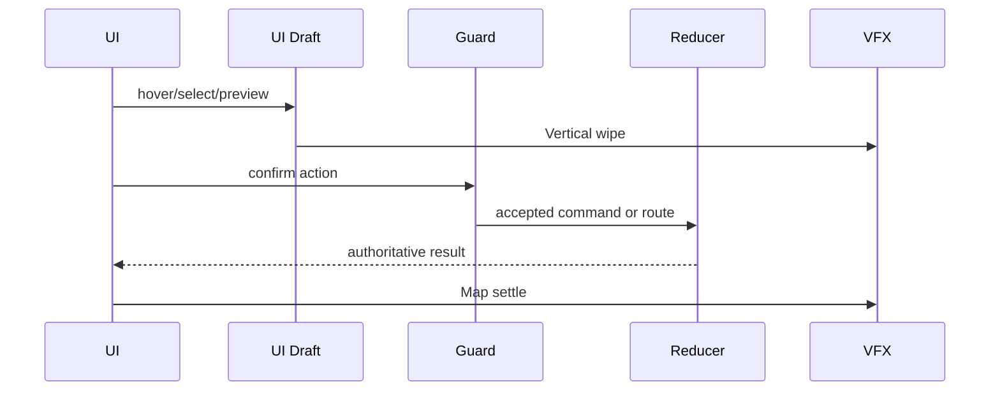
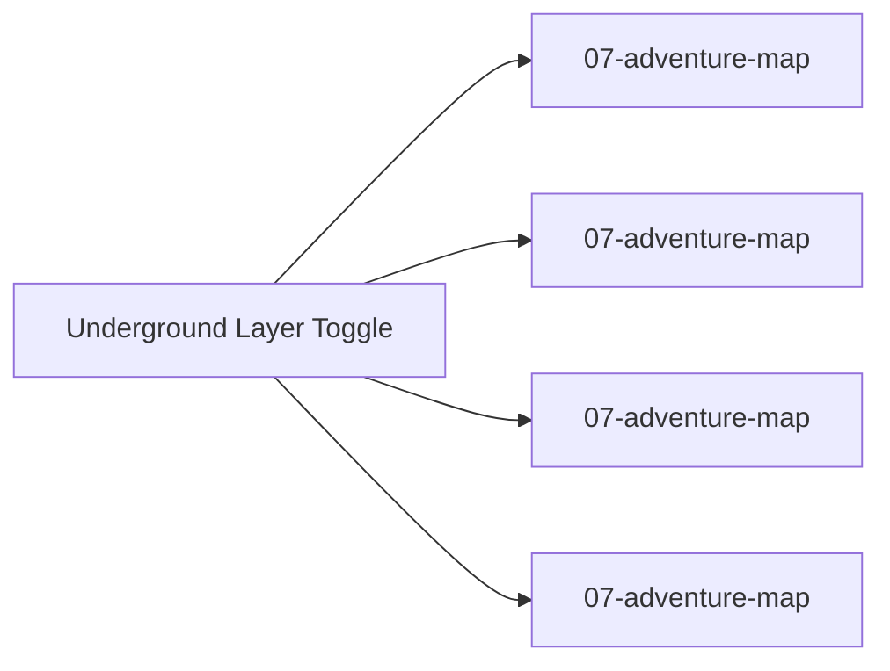

# Screen 15 Architecture: Underground Layer Toggle

System: adventure
Screen ID: underground-toggle
Visual Archetype: curated-layer-toggle
Curation Status: curated-pass-3

## Purpose
Adventure map layer switcher for surface and underground views, including gate focus and known subterranean entrance state.

## Visual Direction
- Original internal UI contract. Do not use third-party captures,
  copied franchise art, or external product pixels as implementation input.

## Visual Composition

## Screen Load And Data Resolution

## Main Interaction Flow

## Animation Flow

## Outgoing Transitions

## State Inputs
- activeLayer -> state.adventure.activeLayer
- hasUnderground -> state.scenario.layers.underground.enabled
- knownGates -> selectors.adventure.knownSubterraneanGates
- selectedGate -> state.ui.layerToggle.selectedGateId
- cameraFocus -> state.adventure.camera

## Implementation Contract
- Mockup defines visual regions and data hooks only.
- Spec defines the component/state contract.
- Interactions define controls, timing, command routing, disabled states, and error behavior.
- Data contracts define schemas, config, localization, asset, audio, VFX, save, and replay references.
- Diagrams are screen-specific summaries of the same contract and must not introduce hidden behavior.
