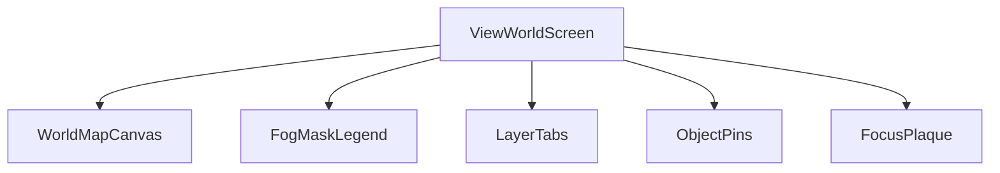
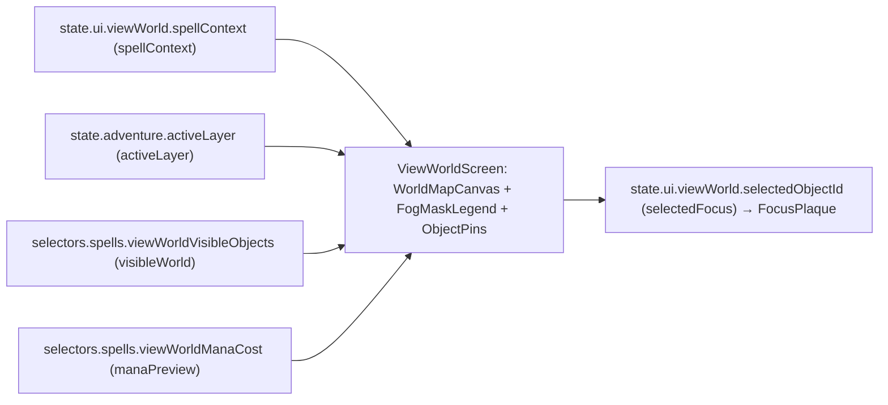
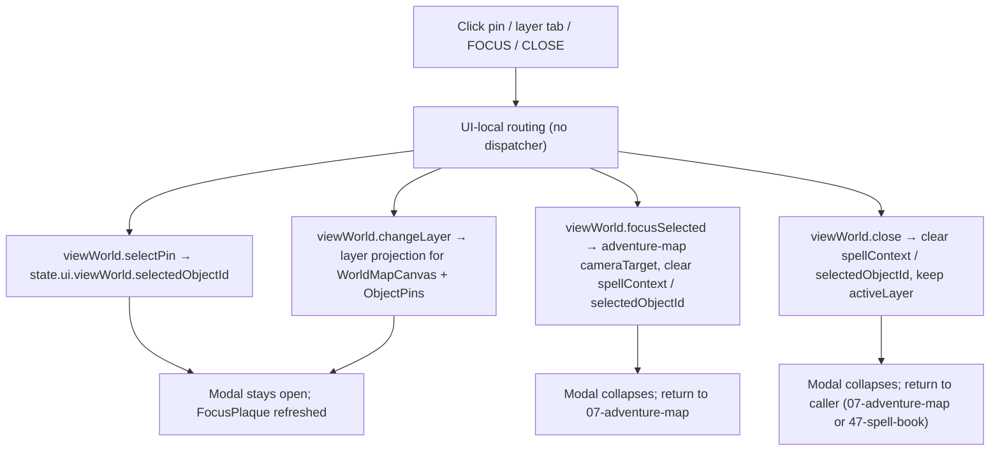
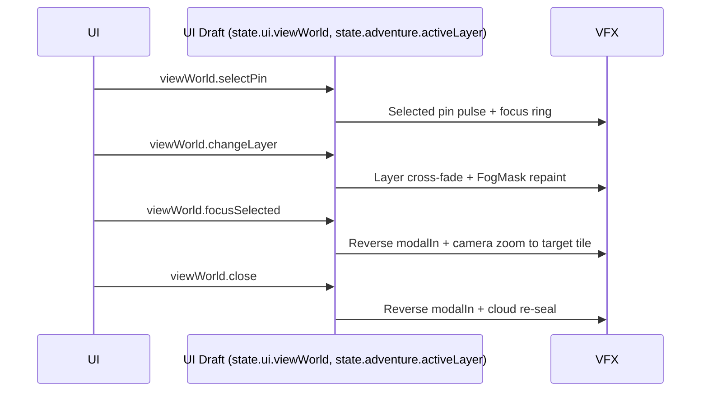

# Screen 16 Architecture: View World

System: adventure
Screen ID: view-world
Visual Archetype: curated-view-world
Curation Status: curated-pass-3

## Purpose
Full-world overview rendered for **View Air / View Earth** style
spells and for strategic map scanning. The modal paints the entire
world parchment, applies fog and spell-visibility rules, lets the
caster inspect or focus a revealed object, and returns control to
the caller (the adventure map or the spell book). All four control
tokens are **UI-local** by prefix; none mutates deterministic
gameplay state, per
[`mvp.03-map-system.10-underground-layer-support`](../../../../../tasks/mvp/03-map-system/10-underground-layer-support.md)
("Screen 15 and 16 selectors can switch view layer without mutating
gameplay state").

## Visual Direction
- Original internal UI contract. Do not use third-party captures,
  copied franchise art, or external product pixels as implementation
  input.

## Companion docs
- [`spec.md`](./spec.md) — component tree and state bindings.
- [`interactions.md`](./interactions.md) — per-control routing,
  timing, and disabled states.
- [`data-contracts.md`](./data-contracts.md) — schemas, selectors,
  localization, assets, save/replay.
- [`mockup.html`](./mockup.html) — visual reference only.

## Visual Composition


## Screen Load And Data Resolution


## Main Interaction Flow


## Animation Flow


## Outgoing Transitions
```mermaid
flowchart LR
  Current["View World"]
  Current -->|viewWorld.selectPin (SELECT_VIEW_WORLD_PIN)| Current
  Current -->|viewWorld.changeLayer (SET_VIEW_WORLD_LAYER)| Current
  Current -->|viewWorld.focusSelected (FOCUS_VIEW_WORLD_TARGET)| T0["07-adventure-map"]
  Current -->|viewWorld.close (CLOSE_VIEW_WORLD)| T0
  Current -->|viewWorld.close (CLOSE_VIEW_WORLD)| T1["47-spell-book"]
```

`viewWorld.close` routes to `07-adventure-map` or `47-spell-book`
depending on which caller opened the modal (recorded in
`state.ui.viewWorld.spellContext`). The other three tokens either
stay on this screen (`viewWorld.selectPin`, `viewWorld.changeLayer`)
or always return to `07-adventure-map` (`viewWorld.focusSelected`).

## State Inputs
- `spellContext` → `state.ui.viewWorld.spellContext`
- `visibleWorld` → `selectors.spells.viewWorldVisibleObjects`
- `selectedFocus` → `state.ui.viewWorld.selectedObjectId`
- `activeLayer` → `state.adventure.activeLayer`
- `manaPreview` → `selectors.spells.viewWorldManaCost`
- `hasUnderground` → `state.scenario.layers.underground.enabled`

The visibility projection `selectors.spells.viewWorldVisibleObjects`
is produced by
[`mvp.03-map-system.05-fog-of-war`](../../../../../tasks/mvp/03-map-system/05-fog-of-war.md)
and is the canonical projection cited by
[`security-model.md`](../../../security-model.md) and
[`phase-3.01-multiplayer.12-visibility-preconditions-on-commands`](../../../../../tasks/phase-3/01-multiplayer/12-visibility-preconditions-on-commands.md).
The `state.adventure.activeLayer` slice is owned by
[`mvp.03-map-system.10-underground-layer-support`](../../../../../tasks/mvp/03-map-system/10-underground-layer-support.md)
and shared with sibling
[`15-underground-toggle`](../15-underground-toggle/architecture.md).

## Implementation Contract
- [`mockup.html`](./mockup.html) defines visual regions and data
  hooks only.
- [`spec.md`](./spec.md) owns the component / state contract.
- [`interactions.md`](./interactions.md) owns controls, timing,
  command routing, disabled states, and error behavior.
- [`data-contracts.md`](./data-contracts.md) owns schema, config,
  localization, asset, audio, VFX, save, and replay references.
- Diagrams above are screen-specific summaries of the same contract
  and must not introduce hidden behavior.

---

## 🔍 Sync Check

- **UI: ✔** — Visual Composition component names
  (`ViewWorldScreen`, `WorldMapCanvas`, `FogMaskLegend`, `LayerTabs`,
  `ObjectPins`, `FocusPlaque`) match the component tree in sibling
  [`spec.md`](./spec.md). Outgoing-transition labels
  (`viewWorld.selectPin`, `viewWorld.changeLayer`,
  `viewWorld.focusSelected`, `viewWorld.close`) and their tokens
  match the Action IDs in sibling
  [`interactions.md`](./interactions.md); the two next-screen
  targets (`07-adventure-map`, `47-spell-book`) match the
  interactions table's Next Screen column.
- **Schema: ✔** — All four control tokens clear via the `SELECT_` /
  `SET_` / `FOCUS_` / `CLOSE_` UI-local prefix policy in
  [`screen-command-coverage.json`](../../../screen-command-coverage.json);
  none requires a row in
  [`command.schema.json`](../../../../../content-schema/schemas/command.schema.json).
  State inputs match the selector / state-path list in sibling
  [`data-contracts.md`](./data-contracts.md).
- **Tasks: ✔** — UI owner
  [`phase-2.07-ui-screen-backlog.16-view-world-screen`](../../../../../tasks/phase-2/07-ui-screen-backlog/16-view-world-screen.md)
  reads this file first; engine owner
  [`mvp.03-map-system.10-underground-layer-support`](../../../../../tasks/mvp/03-map-system/10-underground-layer-support.md)
  reads sibling [`interactions.md`](./interactions.md) first;
  visibility projection owner
  [`mvp.03-map-system.05-fog-of-war`](../../../../../tasks/mvp/03-map-system/05-fog-of-war.md)
  produces `selectors.spells.viewWorldVisibleObjects`.

## ⚠ Issues

- **Outgoing-transition diagram now distinguishes self-loops from
  external returns.** Previous revision rendered two undifferentiated
  arrows to `07-adventure-map` / `07-adventure-map or 47-spell-book`
  without labelling the firing token; rewrote the diagram so each
  arrow names the action ID and its UI-local token. Meaning
  preserved: every routing claim is already present in sibling
  [`interactions.md`](./interactions.md). No code change implied.
- **Layer-toggle token diverges from sibling 15.** This screen uses
  `SET_VIEW_WORLD_LAYER` while sibling
  [`15-underground-toggle`](../15-underground-toggle/architecture.md)
  uses canonical `SET_ADVENTURE_LAYER` for the same
  `state.adventure.activeLayer` write surface. Already flagged from
  sibling [`spec.md`](./spec.md). No code change implied here.
