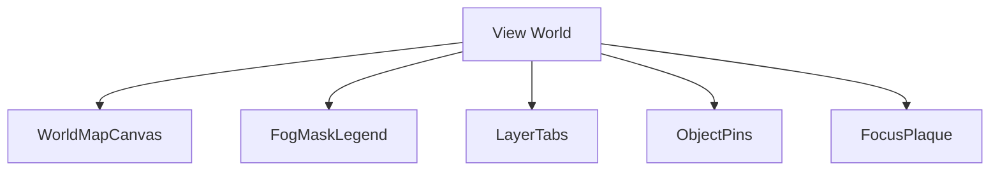
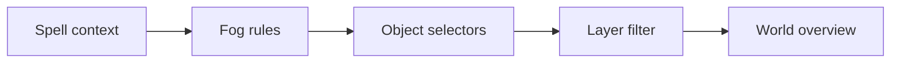
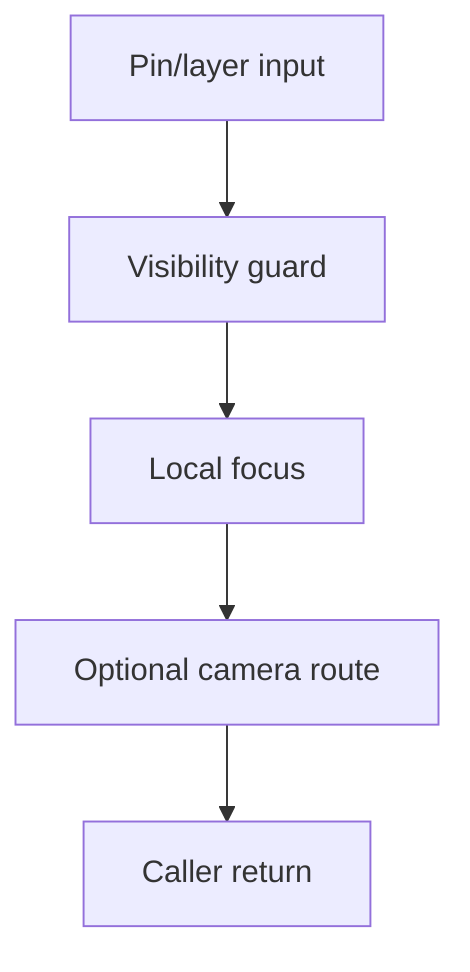
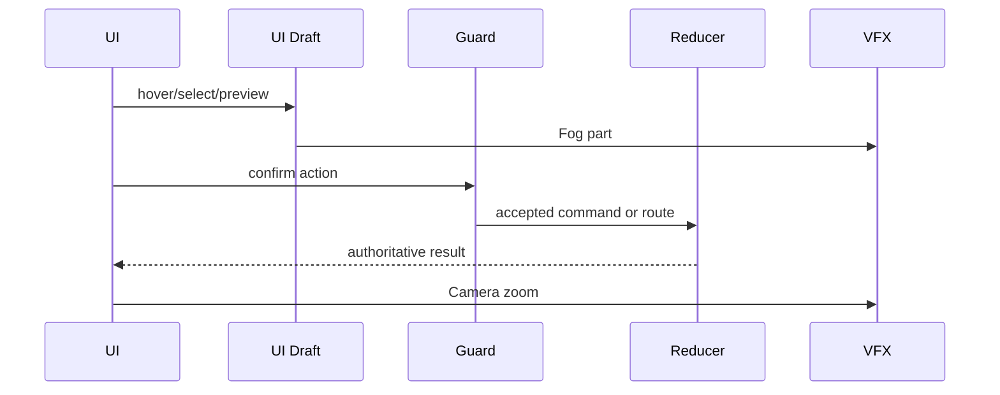
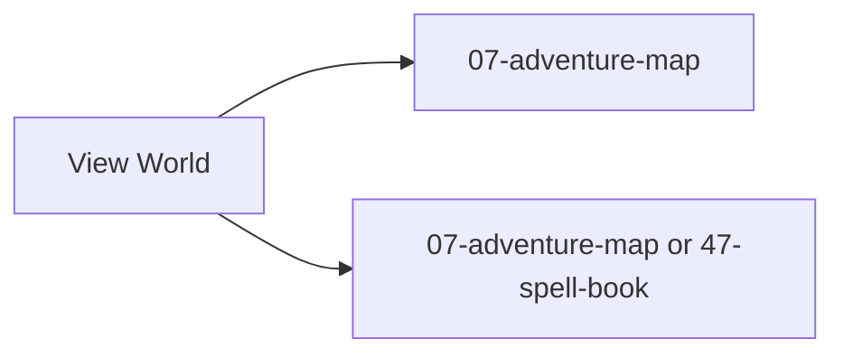

# Screen 16 Architecture: View World

System: adventure
Screen ID: view-world
Visual Archetype: curated-view-world
Curation Status: curated-pass-3

## Purpose
Full-world overview for View Air/View Earth style spells and strategic map scanning.

## Visual Direction
- Original internal UI contract. Do not use third-party captures,
  copied franchise art, or external product pixels as implementation input.

## Visual Composition

## Screen Load And Data Resolution

## Main Interaction Flow

## Animation Flow

## Outgoing Transitions

## State Inputs
- spellContext -> state.ui.viewWorld.spellContext
- visibleWorld -> selectors.spells.viewWorldVisibleObjects
- selectedFocus -> state.ui.viewWorld.selectedObjectId
- activeLayer -> state.adventure.activeLayer
- manaPreview -> selectors.spells.viewWorldManaCost

## Implementation Contract
- Mockup defines visual regions and data hooks only.
- Spec defines the component/state contract.
- Interactions define controls, timing, command routing, disabled states, and error behavior.
- Data contracts define schemas, config, localization, asset, audio, VFX, save, and replay references.
- Diagrams are screen-specific summaries of the same contract and must not introduce hidden behavior.
