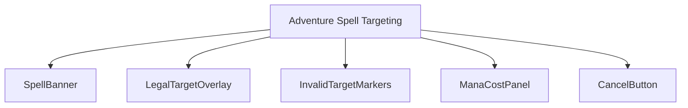
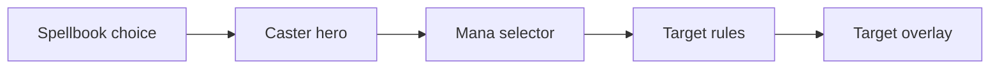
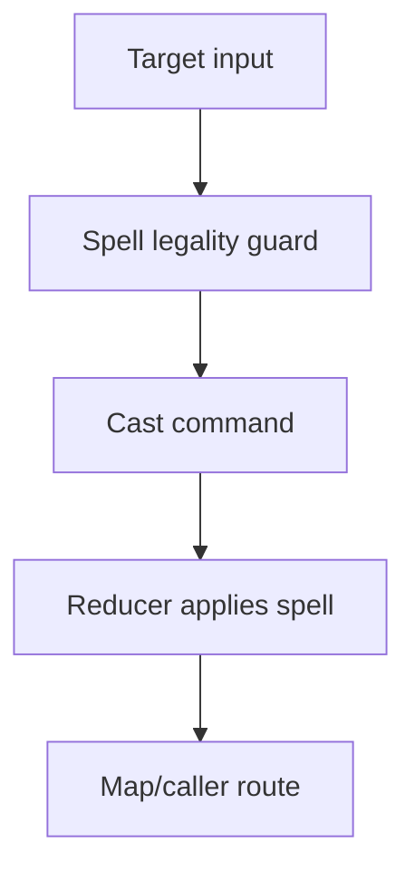
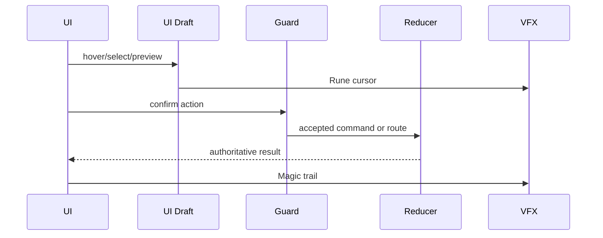
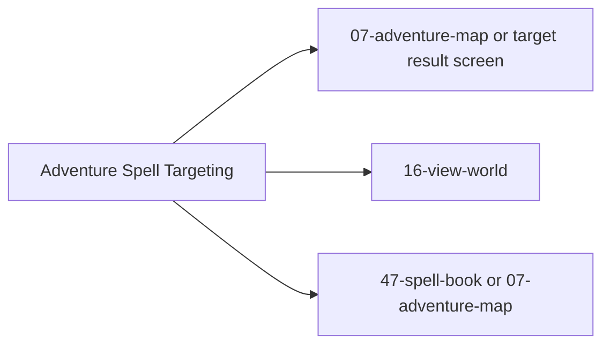

# Screen 17 Architecture: Adventure Spell Targeting

System: adventure
Screen ID: adventure-spell-targeting
Visual Archetype: curated-adventure-spell-targeting
Curation Status: curated-pass-3

## Purpose
Adventure map targeting overlay for map spells such as Town Portal, Dimension Door, Fly, Water Walk, View Air, and View Earth.

## Visual Direction
- Original internal UI contract. Do not use third-party captures,
  copied franchise art, or external product pixels as implementation input.

## Visual Composition

## Screen Load And Data Resolution

## Main Interaction Flow

## Animation Flow

## Outgoing Transitions

## State Inputs
- selectedSpell -> state.ui.spellTargeting.spellId
- casterHero -> state.adventure.selectedHeroId
- legalTargets -> selectors.spells.adventureLegalTargets
- mana -> state.heroes.byId[caster].mana
- targetDraft -> state.ui.spellTargeting.hoverTarget

## Implementation Contract
- Mockup defines visual regions and data hooks only.
- Spec defines the component/state contract.
- Interactions define controls, timing, command routing, disabled states, and error behavior.
- Data contracts define schemas, config, localization, asset, audio, VFX, save, and replay references.
- Diagrams are screen-specific summaries of the same contract and must not introduce hidden behavior.
