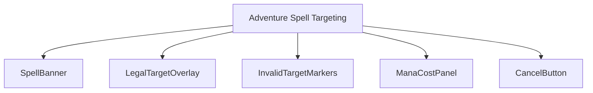
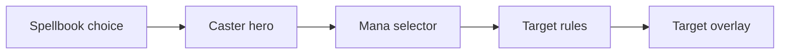
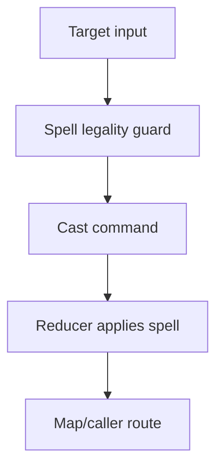
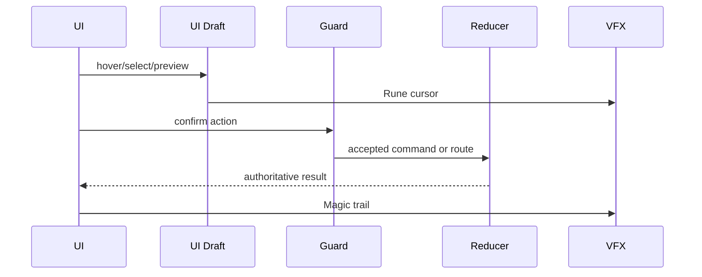
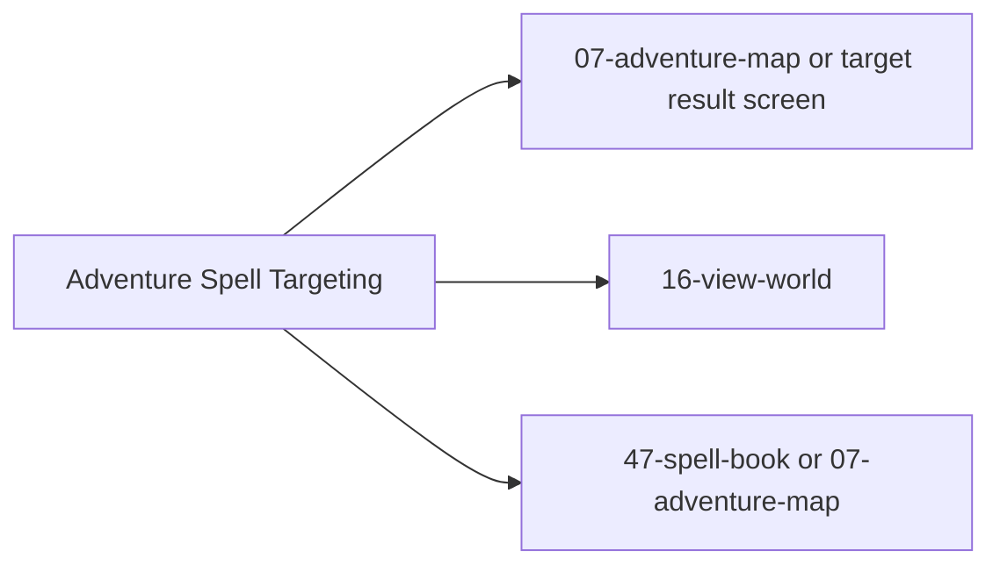

# Screen 17 Architecture: Adventure Spell Targeting

- System: `adventure`
- Screen ID: `adventure-spell-targeting`
- Visual Archetype: `curated-adventure-spell-targeting`
- Curation Status: `curated-pass-3`

## Purpose
Adventure-map targeting overlay for map spells (Town Portal,
Dimension Door, Fly, Water Walk, View Air, View Earth). Mounts on
top of `07-adventure-map` after the spell book dispatches
`BEGIN_SPELL_TARGETING`.

## Visual Direction
- Original internal UI contract. Do not use third-party captures,
  copied franchise art, or external product pixels as
  implementation input.

## Visual Composition
Overlay-only component tree; the underlying map chrome
(`MapViewport`, `FogMask`, `RightCommandPanel`, `ResourceDateBar`)
belongs to screen 07.

## Screen Load And Data Resolution

## Main Interaction Flow

## Animation Flow

## Outgoing Transitions

## State Inputs
- `selectedSpell` → `state.ui.spellTargeting.spellId`
- `casterHero` → `state.adventure.selectedHeroId`
- `legalTargets` → `selectors.spells.adventureLegalTargets`
- `mana` → `state.heroes.byId[caster].mana`
- `targetDraft` → `state.ui.spellTargeting.hoverTarget`

## Implementation Contract
- Mockup defines visual regions and data hooks only.
- Spec defines the component / state contract.
- Interactions own controls, timing, command routing, disabled
  states, and error behavior.
- Data contracts list schemas, config, localization, asset,
  audio, VFX, save, and replay references.
- Diagrams above are screen-specific summaries of the same
  contract and must not introduce hidden behavior.

---

## 🔍 Sync Check

- **UI: ✔** — `Visual Composition` matches the overlay components
  named in sibling [`spec.md`](./spec.md) §Component Tree; the
  diagram correctly excludes screen-07-owned chrome.
- **Schema: ✔** — The flow's `Spell legality guard` and
  `Reducer applies spell` resolve through
  [`spell.schema.json`](../../../../../content-schema/schemas/spell.schema.json)
  and the `SPELL_CAST` kind in
  [`command.schema.json`](../../../../../content-schema/schemas/command.schema.json)
  (alias `CAST_ADVENTURE_SPELL` per
  [`screen-command-coverage.json`](../../../screen-command-coverage.json)).
  Full schema list in [`data-contracts.md`](./data-contracts.md) —
  aligned.
- **Tasks: ✔** — Owning UI task
  [`phase-2.07-ui-screen-backlog.17-adventure-spell-targeting-screen`](../../../../../tasks/phase-2/07-ui-screen-backlog/17-adventure-spell-targeting-screen.md)
  Reads First this file; engine logic referenced by the flow is
  owned upstream by
  `phase-2.01-spells-artifacts.03-adventure-map-spells`.

## ⚠ Issues

_None._ See sibling [`spec.md`](./spec.md) §Issues for the
`ManaCostPanel` vs. mockup discrepancy and sibling
[`interactions.md`](./interactions.md) §Issues for the
`advSpell.viewWorld` affordance question; both are also reflected
in this file's `Visual Composition` and `Outgoing Transitions`
diagrams and resolve when the package siblings resolve.
