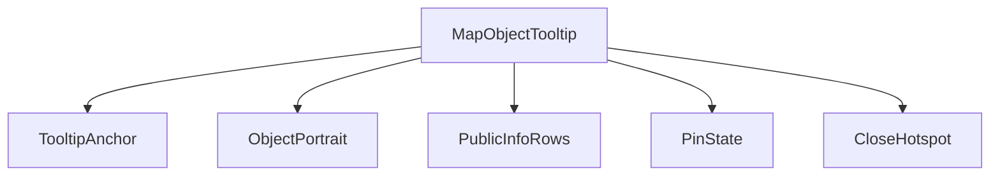
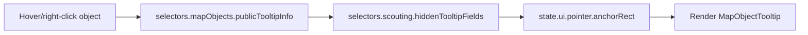
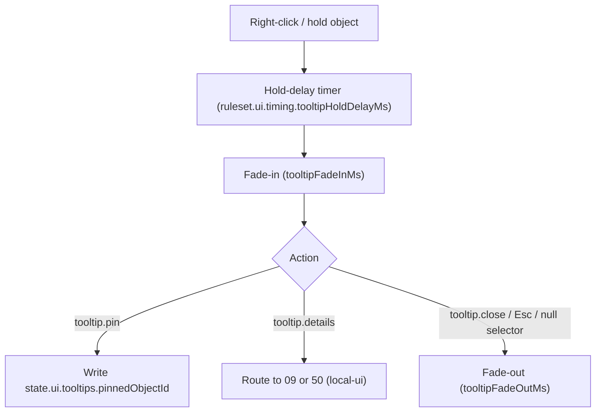
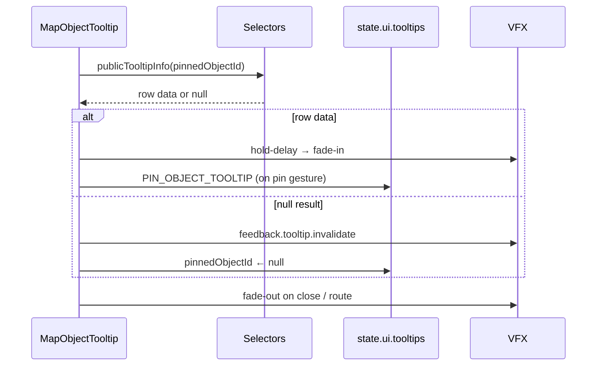
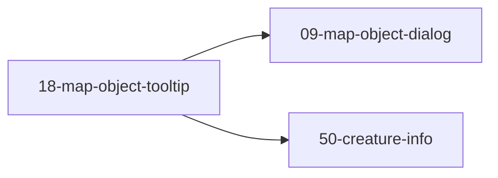

# Screen 18 Architecture: Map Object Tooltip

System: adventure
Screen ID: map-object-tooltip
Visual Archetype: curated-object-tooltip
Curation Status: curated-pass-3

## Companion Docs
- [`ui-state-contract.md` § Tooltip Lifecycle](../../../ui-state-contract.md#tooltip-lifecycle) — owns per-tick re-resolution, auto-dismiss on null, ownership-change re-render, and the `ruleset.ui.timing` constants.
- [`screen-command-coverage.json`](../../../screen-command-coverage.json) — confirms the four tooltip tokens are local-ui by prefix match.
- Sibling `spec.md` (component tree + state bindings), `interactions.md` (per-gesture behavior + animation/audio), `data-contracts.md` (schemas + tokens).

## Purpose
Right-click informational tooltip for adventure map objects — heroes, towns, mines, resources, neutral stacks, treasures. Presentation-only; no gameplay state mutates here.

## Visual Direction
Original internal UI contract. Do not use third-party captures, copied franchise art, or external product pixels as implementation input.

## Visual Composition

## Screen Load And Data Resolution

## Main Interaction Flow

## Animation Flow

## Outgoing Transitions

`tooltip.details` routes to `09-map-object-dialog` for towns / mines / generic interactables, and to `50-creature-info` for neutral stacks and army units. The route is local-ui; gameplay commands fire from the destination screen, not from this tooltip.

## State Inputs
- `hoverObject` → `state.ui.adventure.hoverObjectId`
- `publicInfo` → `selectors.mapObjects.publicTooltipInfo`
- `hiddenGuard` → `selectors.scouting.hiddenTooltipFields`
- `pinState` → `state.ui.tooltips.pinnedObjectId`
- `anchorPosition` → `state.ui.pointer.anchorRect`

## Implementation Contract
- The mockup defines visible regions and data hooks only.
- `spec.md` owns the component / state contract.
- `interactions.md` owns gestures, animation durations, route targets, and dismissal paths.
- `data-contracts.md` owns schemas, tokens, config, localization, asset, audio, VFX, and save/replay references.
- Per-tick re-resolution, auto-dismiss on `null`, and ownership-change re-render are owned by [`ui-state-contract.md § Tooltip Lifecycle`](../../../ui-state-contract.md#tooltip-lifecycle); these diagrams summarize that contract and must not introduce hidden behavior.

---

## 🔍 Sync Check

- **UI: ✔** — Component nodes and state inputs match sibling `spec.md` § Component Tree / State Bindings. Outgoing transitions (`09-map-object-dialog`, `50-creature-info`) match sibling `interactions.md` § Navigation Outcomes.
- **Schema: ✔** — Timing constants (`tooltipHoldDelayMs`, `tooltipFadeInMs`, `tooltipFadeOutMs`) cited in the Main Interaction Flow exist in [`ruleset.schema.json`](../../../../../content-schema/schemas/ruleset.schema.json) (lines 111–113); selectors are declared in [`ui-state-contract.md § Tooltip Lifecycle`](../../../ui-state-contract.md#tooltip-lifecycle).
- **Tasks: ✔** — Runtime owner `mvp.05-adventure-map.09-map-object-dialogs` ships `MapObjectTooltip.tsx`. Lifecycle/constants owner `mvp.07-ui-shell.17-tooltip-lifecycle` ships the `ui.timing` block and the per-tick re-resolution invariant these diagrams reference.

## ⚠ Issues

_None._
