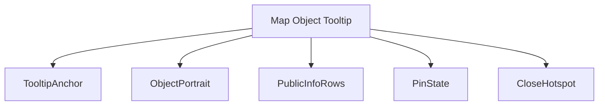
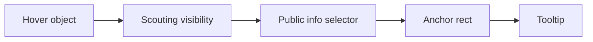
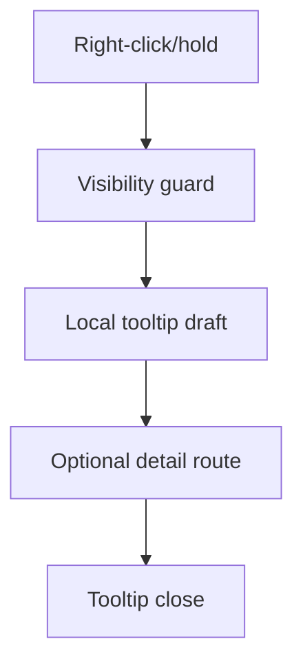
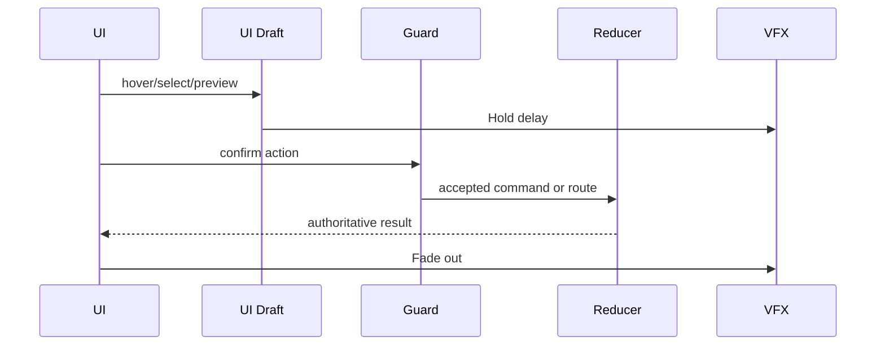
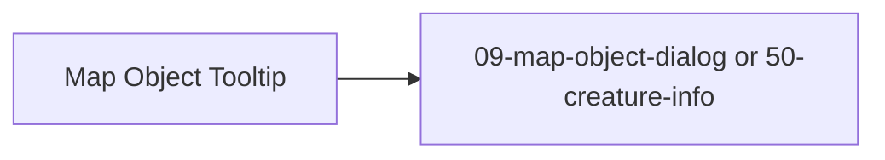

# Screen 18 Architecture: Map Object Tooltip

System: adventure
Screen ID: map-object-tooltip
Visual Archetype: curated-object-tooltip
Curation Status: curated-pass-3

## Purpose
Right-click informational tooltip for adventure map objects, heroes, towns, resources, and guarded encounters.

## Visual Direction
- Original internal UI contract. Do not use third-party captures,
  copied franchise art, or external product pixels as implementation input.

## Visual Composition

## Screen Load And Data Resolution

## Main Interaction Flow

## Animation Flow

## Outgoing Transitions

## State Inputs
- hoverObject -> state.ui.adventure.hoverObjectId
- publicInfo -> selectors.mapObjects.publicTooltipInfo
- hiddenGuard -> selectors.scouting.hiddenTooltipFields
- pinState -> state.ui.tooltips.pinnedObjectId
- anchorPosition -> state.ui.pointer.anchorRect

## Implementation Contract
- Mockup defines visual regions and data hooks only.
- Spec defines the component/state contract.
- Interactions define controls, timing, command routing, disabled states, and error behavior.
- Data contracts define schemas, config, localization, asset, audio, VFX, save, and replay references.
- Diagrams are screen-specific summaries of the same contract and must not introduce hidden behavior.
