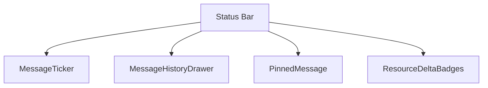
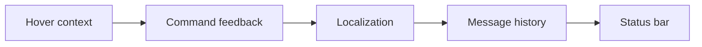
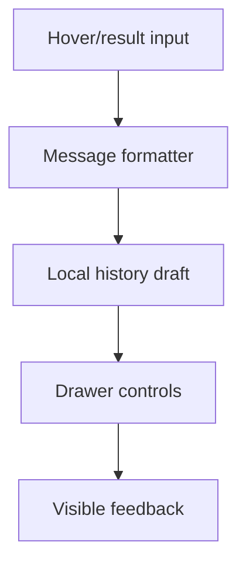
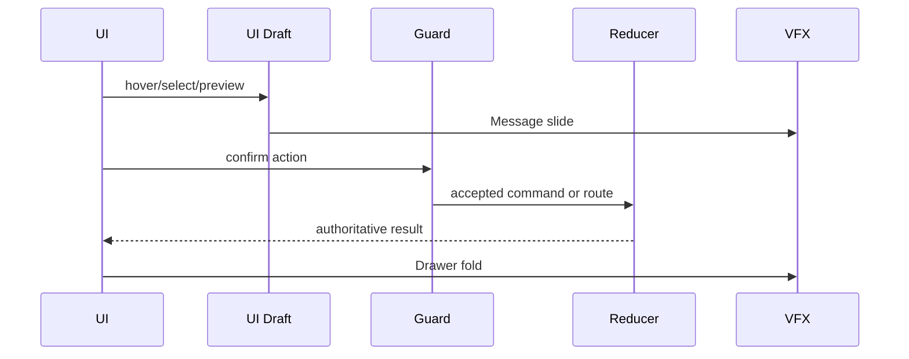
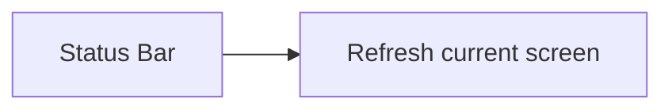

# Screen 19 Architecture: Status Bar

System: adventure
Screen ID: status-bar
Visual Archetype: curated-status-bar
Curation Status: curated-pass-3

## Purpose
Adventure status line and message history strip showing hover descriptions, command feedback, resource changes, and disabled reasons.

## Visual Direction
- Original internal UI contract. Do not use third-party captures,
  copied franchise art, or external product pixels as implementation input.

## Visual Composition

## Screen Load And Data Resolution

## Main Interaction Flow

## Animation Flow

## Outgoing Transitions

## State Inputs
- hoverContext -> state.ui.adventure.hoverContext
- latestMessage -> state.ui.messages.latest
- messageHistory -> state.ui.messages.history
- resourceDeltas -> selectors.economy.lastVisibleDeltas
- drawerOpen -> state.ui.statusBar.drawerOpen

## Implementation Contract
- Mockup defines visual regions and data hooks only.
- Spec defines the component/state contract.
- Interactions define controls, timing, command routing, disabled states, and error behavior.
- Data contracts define schemas, config, localization, asset, audio, VFX, save, and replay references.
- Diagrams are screen-specific summaries of the same contract and must not introduce hidden behavior.
