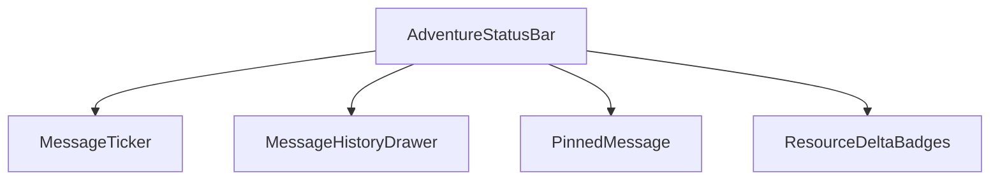
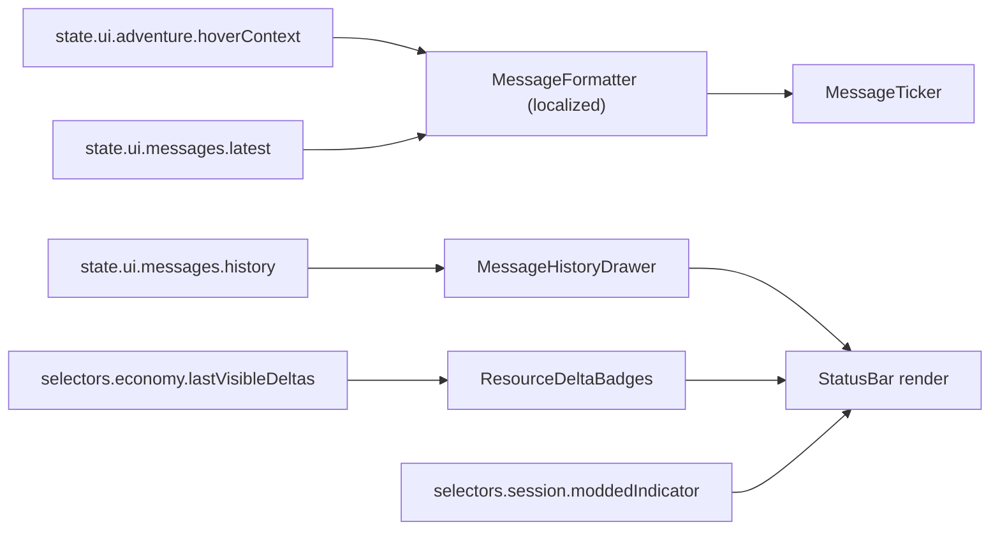
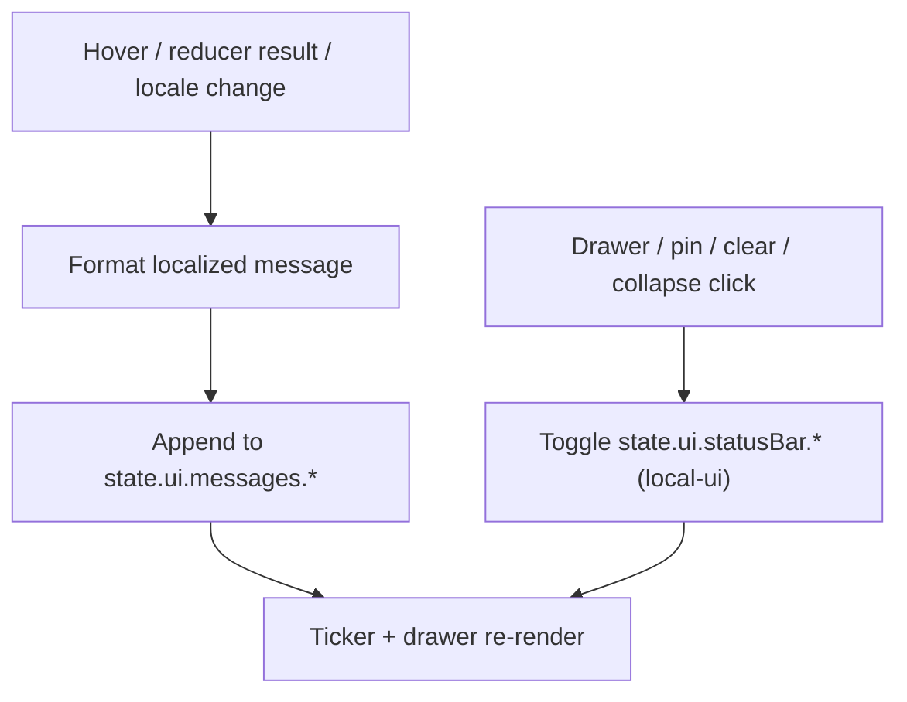
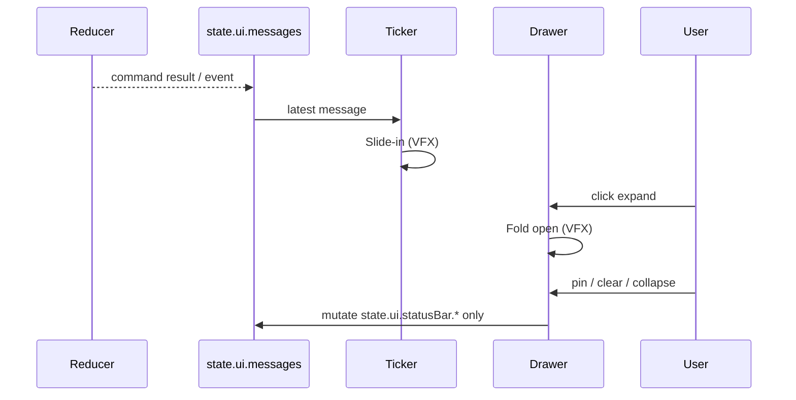
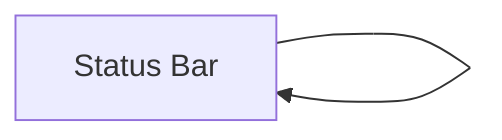

# Screen 19 Architecture: Status Bar

System: adventure
Screen ID: status-bar
Visual Archetype: curated-status-bar
Curation Status: curated-pass-3

## Purpose
Adventure status line plus expandable message-history drawer.
Surfaces hover descriptions, command results, resource deltas, and
disabled reasons. Pure presentation — never dispatches reducer
commands.

## Visual Direction
Original internal UI contract. Do not use third-party captures or
external product pixels as implementation input.

## Visual Composition

## Data Resolution

## Interaction Flow

## Animation Sequence
All four actions are local-ui — no reducer involvement.

## Outgoing Transitions

No navigation. All actions stay on the current screen.

## State Inputs
| Binding | Source |
| --- | --- |
| `hoverContext` | `state.ui.adventure.hoverContext` |
| `latestMessage` | `state.ui.messages.latest` |
| `messageHistory` | `state.ui.messages.history` |
| `resourceDeltas` | `selectors.economy.lastVisibleDeltas` |
| `drawerOpen` | `state.ui.statusBar.drawerOpen` |
| `moddedIndicator` | `selectors.session.moddedIndicator` |

## Implementation Contract
- `mockup.html` defines visual regions and data hooks only.
- `spec.md` defines component tree and state bindings.
- `interactions.md` owns per-control behavior, animation, disabled
  reasons, and error surfacing.
- `data-contracts.md` lists schemas, config, localization, asset,
  audio, VFX, save, and replay references.
- Diagrams here summarize the same contract — they must not invent
  hidden behavior.

## 🔍 Sync Check
- Sibling `spec.md` § Component Tree — aligned (4 children of
  `AdventureStatusBar`).
- Sibling `spec.md` § State Bindings — aligned, includes
  `moddedIndicator`.
- Sibling `interactions.md` § Actions — aligned; all four tokens
  remain local-ui (no reducer routing).
- Sibling `data-contracts.md` § Runtime State Selectors — aligned
  (same six bindings).
- `mockup.html` data-action attributes (`status.clear`,
  `status.collapse`) — present; drawer-expanded form is visible.
- `screen-command-coverage.json` — `EXPAND_/PIN_/CLEAR_/COLLAPSE_`
  prefixes all in `localUiPrefixes`, no schema entry required.
- `pack-trust.md` § 6 Modded Indicator — selector path matches.

## ⚠ Issues
- None blocking. The animation diagram now correctly omits Reducer
  routing for the user-initiated branches; reducer involvement is
  inbound-only (command result → `state.ui.messages.latest`),
  matching the local-ui nature of every listed action.
