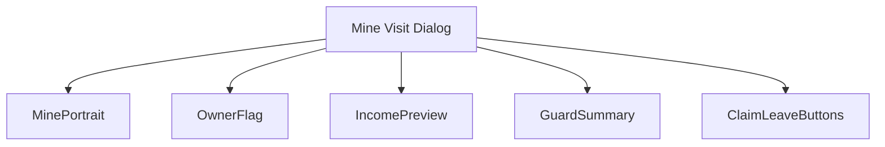
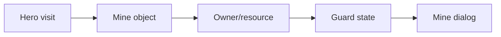
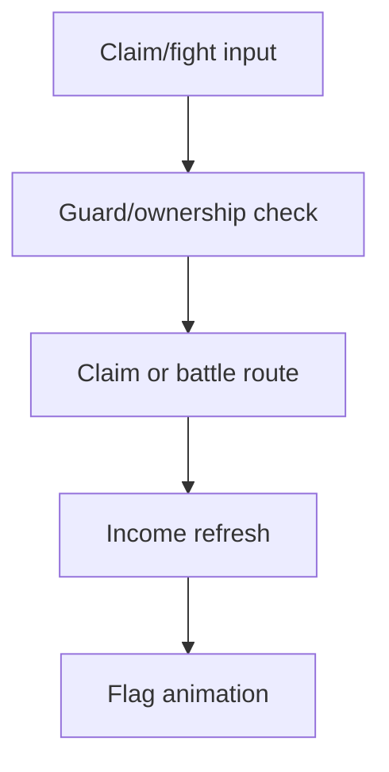
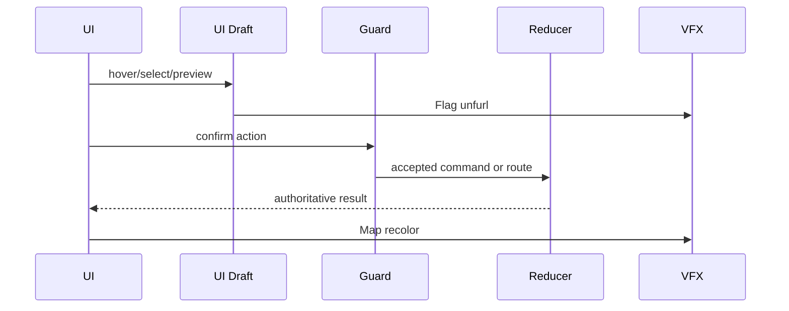
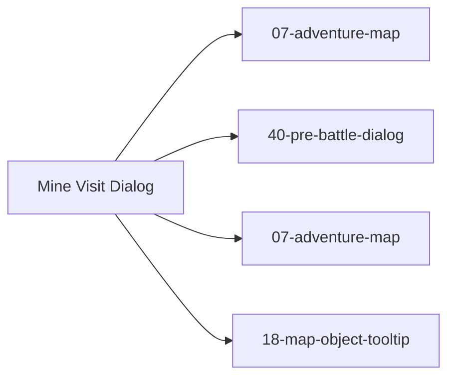

# Screen 20 Architecture: Mine Visit Dialog

System: adventure
Screen ID: mine-visit-dialog
Visual Archetype: curated-mine-visit
Curation Status: curated-pass-3

## Purpose
Mine capture or visit dialog showing resource type, current owner, guard state, income, and flagging outcome.

## Visual Direction
- Original internal UI contract. Do not use third-party captures,
  copied franchise art, or external product pixels as implementation input.

## Visual Composition

## Screen Load And Data Resolution

## Main Interaction Flow

## Animation Flow

## Outgoing Transitions

## State Inputs
- mineId -> state.ui.adventure.pendingMineVisit.mineId
- mineRecord -> state.mapObjects.byId[mineId]
- activePlayer -> state.turn.activePlayerId
- dailyIncome -> selectors.economy.mineIncomePreview
- guardState -> selectors.mapObjects.mineGuardState

## Implementation Contract
- Mockup defines visual regions and data hooks only.
- Spec defines the component/state contract.
- Interactions define controls, timing, command routing, disabled states, and error behavior.
- Data contracts define schemas, config, localization, asset, audio, VFX, save, and replay references.
- Diagrams are screen-specific summaries of the same contract and must not introduce hidden behavior.
