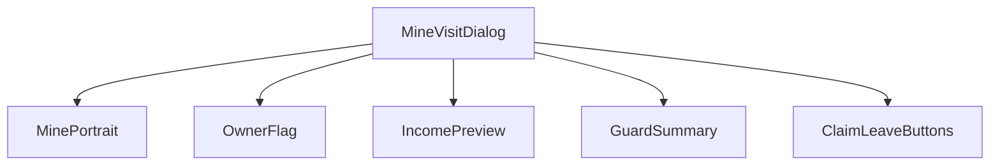
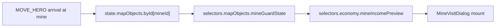
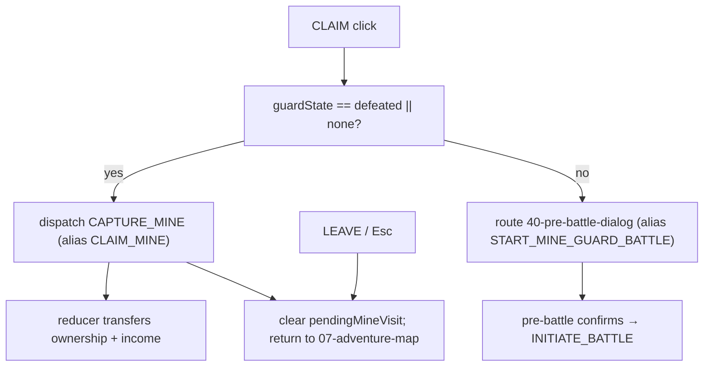
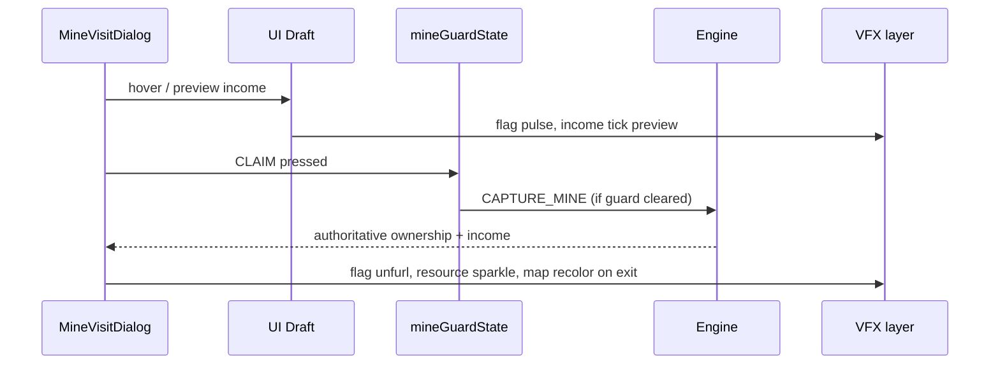
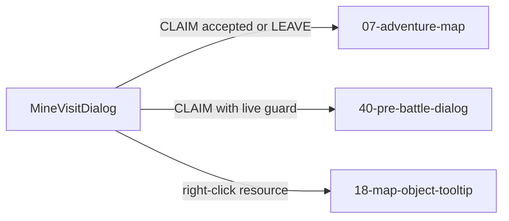

# Screen 20 Architecture: Mine Visit Dialog

- System: `adventure`
- Screen ID: `mine-visit-dialog`
- Visual Archetype: `curated-mine-visit`
- Curation Status: `curated-pass-3`

## Purpose
Mine capture or visit dialog showing resource type, current owner,
guard state, daily income preview, and flagging outcome. The diagrams
below summarize the contract owned by sibling `spec.md`,
`interactions.md`, and `data-contracts.md`; they must not introduce
behavior absent from those files.

## Visual Direction
- Original internal UI contract. Do not use third-party captures,
  copied franchise art, or external product pixels as implementation
  input.

## Visual Composition

## Screen Load And Data Resolution

## Main Interaction Flow

## Animation Flow

## Outgoing Transitions

## State Inputs
| Binding | Source |
| --- | --- |
| `mineId` | `state.ui.adventure.pendingMineVisit.mineId` |
| `mineRecord` | `state.mapObjects.byId[mineId]` |
| `activePlayer` | `state.turn.activePlayerId` |
| `dailyIncome` | `selectors.economy.mineIncomePreview` |
| `guardState` | `selectors.mapObjects.mineGuardState` |

## Implementation Contract
- `mockup.html` defines visible regions and data hooks only.
- `spec.md` owns the component / state contract.
- `interactions.md` owns controls, timing, command routing, disabled
  states, and error behavior.
- `data-contracts.md` enumerates schemas, config, localization,
  asset, sound, VFX, save, and replay references.
- These diagrams summarize the same contract and must not introduce
  hidden behavior.

---

## 🔍 Sync Check

- **UI: ✔** — Component tree mirrors sibling `spec.md` § Component
  Tree; outgoing transitions match the four-row Actions table in
  sibling `interactions.md` (`07-adventure-map`,
  `40-pre-battle-dialog`, `18-map-object-tooltip`).
- **Schema: ✔** — `CAPTURE_MINE` and `INITIATE_BATTLE` nodes in the
  Main Interaction Flow are closed-enum kinds defined in
  [`command.schema.json`](../../../../../content-schema/schemas/command.schema.json)
  and documented in
  [`command-schema.md`](../../../command-schema.md#capture_mine);
  the screen-side aliases `CLAIM_MINE` and `START_MINE_GUARD_BATTLE`
  are registered in
  [`screen-command-coverage.json`](../../../screen-command-coverage.json).
- **Tasks: ✔** — Owning task
  [`mvp.05-adventure-map.09-map-object-dialogs`](../../../../../tasks/mvp/05-adventure-map/09-map-object-dialogs.md)
  reads this file; reducers for `CAPTURE_MINE` and `INITIATE_BATTLE`
  are owned by
  [`mvp.05-adventure-map.21-map-object-visit-and-battle-initiation-commands`](../../../../../tasks/mvp/05-adventure-map/21-map-object-visit-and-battle-initiation-commands.md),
  which reads sibling `interactions.md`.

## ⚠ Issues

_None._
