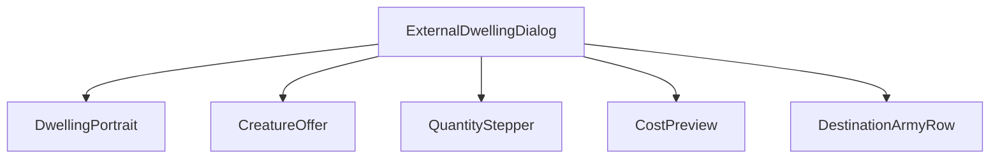
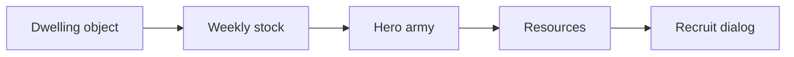
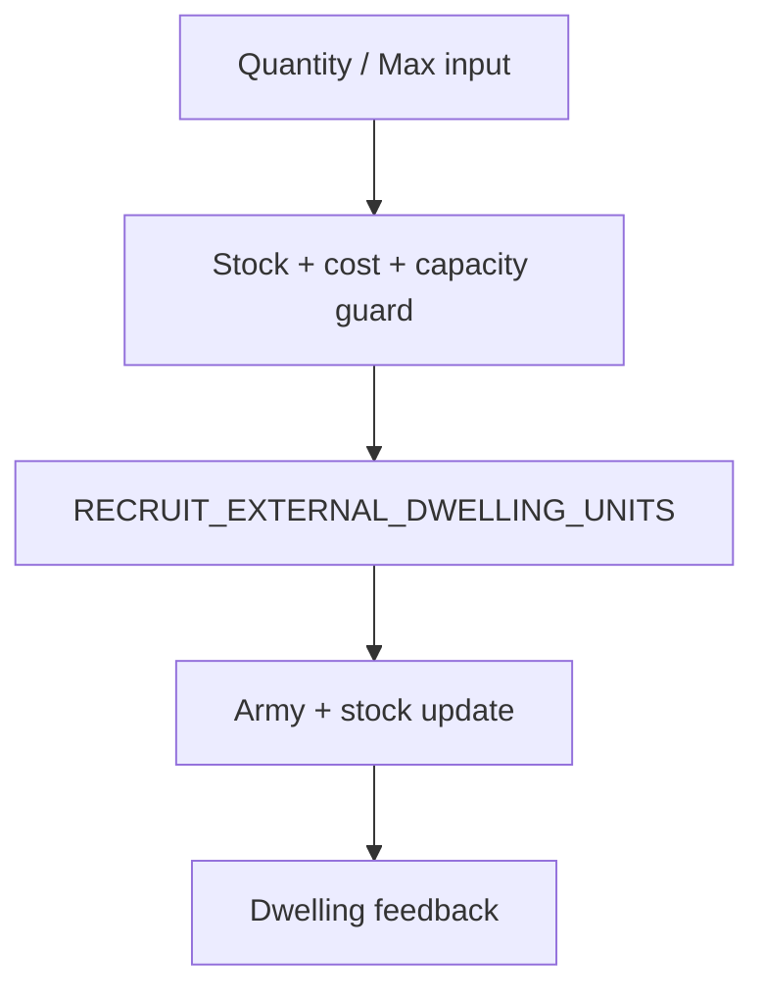
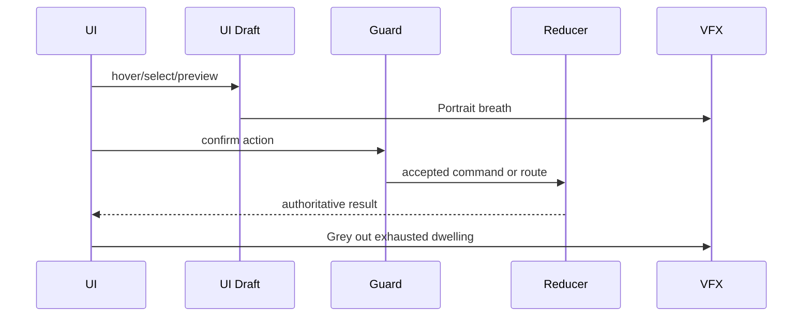
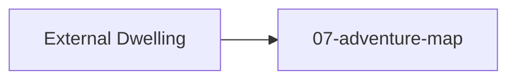

# Screen 21 Architecture: External Dwelling

System: adventure
Screen ID: external-dwelling
Visual Archetype: curated-external-dwelling
Curation Status: curated-pass-3

### Source Files
- Mockup: `mockup.html`
- Spec: `spec.md`
- Interactions: `interactions.md`
- Data Contracts: `data-contracts.md`

## Purpose
Adventure-map dialog for recruiting creatures from a dwelling that
sits outside any town. Opens when the active hero visits the
dwelling; closes back to `07-adventure-map`.

## Visual Direction
- Original internal UI contract. Do not use third-party captures,
  copied franchise art, or external product pixels as implementation
  input.

## Visual Composition

## Screen Load And Data Resolution

## Main Interaction Flow

## Animation Flow

## Outgoing Transitions

## State Inputs
- `dwellingId` ← `state.ui.adventure.pendingDwellingId`
- `dwellingStock` ← `state.mapObjects.byId[dwellingId].stock`
- `selectedQuantity` ← `state.ui.externalDwelling.quantity`
- `destinationArmy` ← `state.heroes.byId[selected].army`
- `costPreview` ← `selectors.economy.externalDwellingCost`

## Implementation Contract
- `mockup.html` defines visible regions and data hooks only.
- `spec.md` owns the component tree and state bindings.
- `interactions.md` owns control behavior, command routing, disabled
  states, and the error-surface table.
- `data-contracts.md` owns schema, config, localization, asset,
  audio, VFX, save, and replay references.
- These diagrams are screen-specific summaries of the same contract;
  they must not introduce hidden behavior.

---

## 🔍 Sync Check

- **UI: ✔** — Component tree matches sibling `spec.md` § Component Tree (root `ExternalDwellingDialog` now explicit in both); interaction flow names the same single reducer-backed command as `interactions.md` § Actions.
- **Schema: ✔** — `RECRUIT_EXTERNAL_DWELLING_UNITS` is defined in [`content-schema/schemas/command.schema.json`](../../../../../content-schema/schemas/command.schema.json); state inputs match the selector table in sibling `data-contracts.md` § Runtime State Selectors.
- **Tasks: ✔** — Owning UI task `phase-2.07-ui-screen-backlog.21-external-dwelling-screen` reads this file from its Read First; engine command task `mvp.05-adventure-map.13-recruit-external-dwelling-command` owns the reducer node `RECRUIT_EXTERNAL_DWELLING_UNITS` in the interaction-flow diagram.

## ⚠ Issues

_None._
