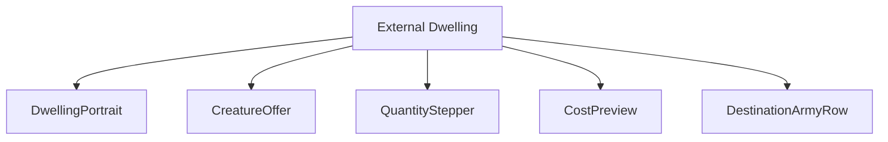
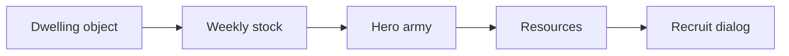
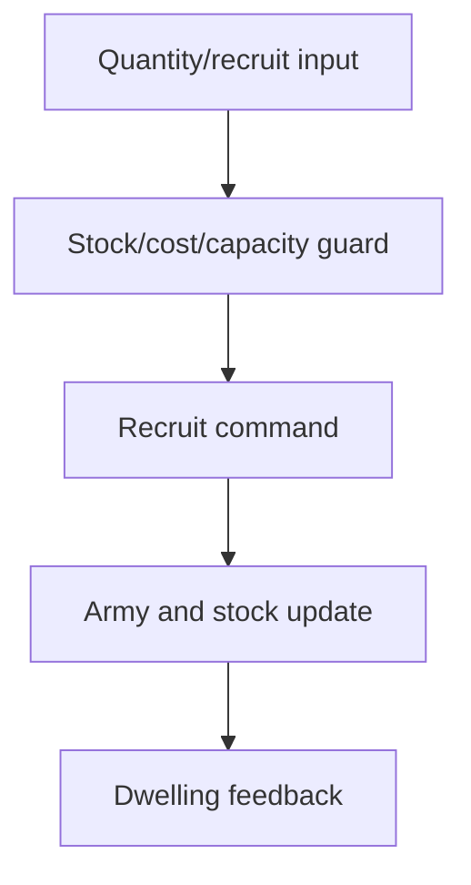
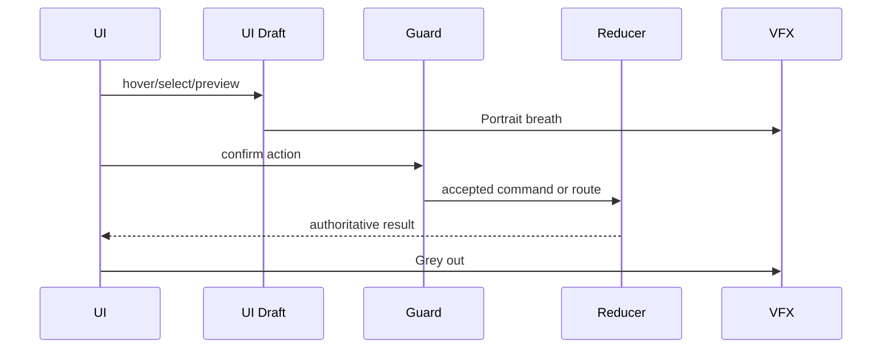
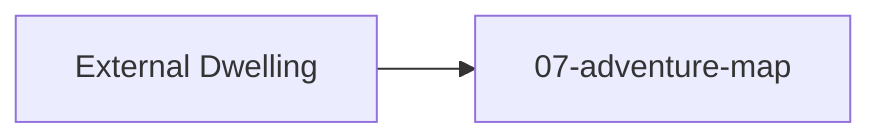

# Screen 21 Architecture: External Dwelling

System: adventure
Screen ID: external-dwelling
Visual Archetype: curated-external-dwelling
Curation Status: curated-pass-3

## Purpose
Adventure creature dwelling recruitment window for map dwellings outside towns.

## Visual Direction
- Original internal UI contract. Do not use third-party captures,
  copied franchise art, or external product pixels as implementation input.

## Visual Composition

## Screen Load And Data Resolution

## Main Interaction Flow

## Animation Flow

## Outgoing Transitions

## State Inputs
- dwellingId -> state.ui.adventure.pendingDwellingId
- dwellingStock -> state.mapObjects.byId[dwellingId].stock
- selectedQuantity -> state.ui.externalDwelling.quantity
- destinationArmy -> state.heroes.byId[selected].army
- costPreview -> selectors.economy.externalDwellingCost

## Implementation Contract
- Mockup defines visual regions and data hooks only.
- Spec defines the component/state contract.
- Interactions define controls, timing, command routing, disabled states, and error behavior.
- Data contracts define schemas, config, localization, asset, audio, VFX, save, and replay references.
- Diagrams are screen-specific summaries of the same contract and must not introduce hidden behavior.
