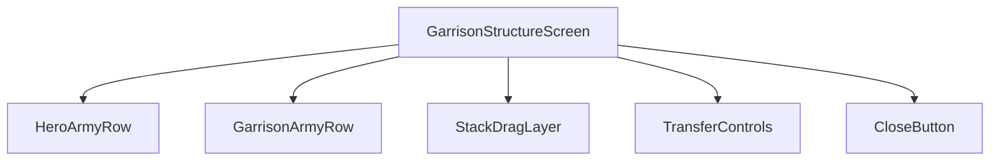
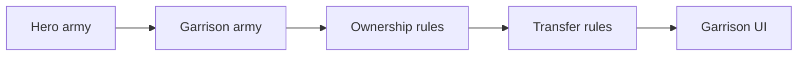
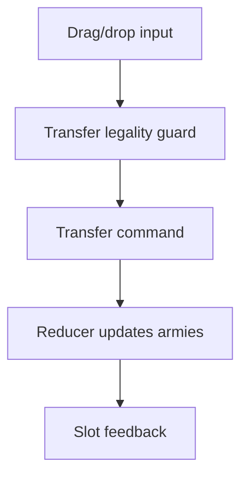
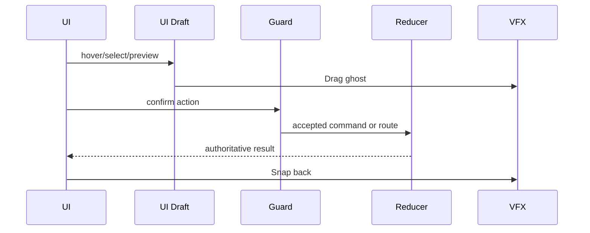
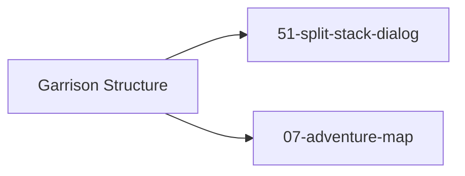

# Screen 22 Architecture: Garrison Structure

- System: `adventure`
- Screen ID: `garrison-structure`
- Visual Archetype: `curated-garrison-structure`
- Curation Status: `curated-pass-3`

Companion files:
[`spec.md`](./spec.md),
[`interactions.md`](./interactions.md),
[`data-contracts.md`](./data-contracts.md),
[`mockup.html`](./mockup.html).

## Purpose

Adventure-map garrison transfer modal. Moves stacks between a
visiting hero and a **standalone garrison structure** (a map object,
not a town). Hero ↔ town garrison transfers live in
[`24-town-screen`](../24-town-screen/).

## Visual Direction

Original internal UI contract. Do not use third-party captures,
copied franchise art, or external product pixels as implementation
input.

## 1. Visual Composition

## 2. Screen Load And Data Resolution

## 3. Main Interaction Flow

## 4. Animation Flow

## 5. Outgoing Transitions

## 6. State Inputs

| Binding | Source | Notes |
| --- | --- | --- |
| `heroArmy` | `state.heroes.byId[selected].army` | Visiting hero stack row. |
| `garrisonArmy` | `state.mapObjects.byId[garrisonId].army` | Structure stack row. |
| `selectedStack` | `state.ui.garrisonTransfer.selectedStackRef` | Local drag/click selection. |
| `transferRules` | `selectors.armies.garrisonTransferRules` | Ownership, lock, capacity, and merge legality. |
| `splitDraft` | `state.ui.garrisonTransfer.splitQuantity` | Local split quantity before command. |

Canonical binding definitions live in
[`spec.md` § State Bindings](./spec.md#state-bindings) and
[`data-contracts.md` § Runtime State Selectors](./data-contracts.md#runtime-state-selectors).

## 7. Implementation Contract

- `mockup.html` defines visual regions and data hooks only.
- `spec.md` owns components and state bindings.
- `interactions.md` owns controls, timing, command routing, disabled
  states, and error surfaces.
- `data-contracts.md` owns schemas, config, localization, asset,
  audio, VFX, save, and replay references.
- Diagrams in this file are screen-specific summaries of those
  contracts and must not introduce hidden behavior.

---

## 🔍 Sync Check

- **UI: ✔** — Components (`HeroArmyRow`, `GarrisonArmyRow`, `StackDragLayer`, `TransferControls`, `CloseButton`) match `spec.md` § Component Tree and the `data-component` / `data-action` hooks in [`mockup.html`](./mockup.html) (SPLIT, CLOSE buttons; Hero Army / Garrison Army groups).
- **Schema: ✔** — `TRANSFER_GARRISON_STACK` is defined in [`command.schema.json`](../../../../../content-schema/schemas/command.schema.json) (line 1454); the three UI-local tokens (`START_GARRISON_STACK_DRAG`, `OPEN_SPLIT_STACK_DIALOG`, `CLOSE_GARRISON_STRUCTURE`) match the `START_` / `OPEN_` / `CLOSE_` prefixes in [`screen-command-coverage.json`](../../../screen-command-coverage.json) `localUiPrefixes`.
- **Tasks: ✔** — Owning UI task [`tasks/phase-2/07-ui-screen-backlog/22-garrison-structure-screen.md`](../../../../../tasks/phase-2/07-ui-screen-backlog/22-garrison-structure-screen.md) Reads First this file; owning reducer task [`tasks/mvp/05-adventure-map/18-transfer-stack-commands.md`](../../../../../tasks/mvp/05-adventure-map/18-transfer-stack-commands.md) names `TRANSFER_GARRISON_STACK` in its Outputs.

## ⚠ Issues

- **Sibling `spec.md` lists three town-only state bindings that do not belong on this screen.** `spec.md` § State Bindings as authored carried `garrisonHeroId`, `visitingHeroId`, and `swapEnabled` (the two-hero-per-town protocol owned by [`24-town-screen/spec.md`](../24-town-screen/spec.md) and [`tasks/mvp/05-adventure-map/18-transfer-stack-commands.md`](../../../../../tasks/mvp/05-adventure-map/18-transfer-stack-commands.md) `SWAP_TOWN_HEROES`). This screen targets a standalone garrison structure (a map object, not a town), and neither this file nor `data-contracts.md` references those slices. Reconciled in `spec.md` by dropping those rows; flagged here so the same removal is visible across the package.
