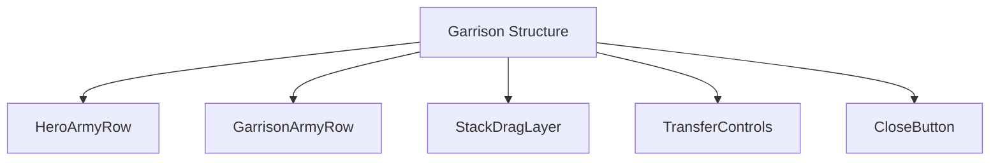
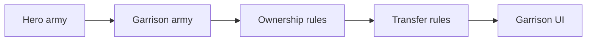
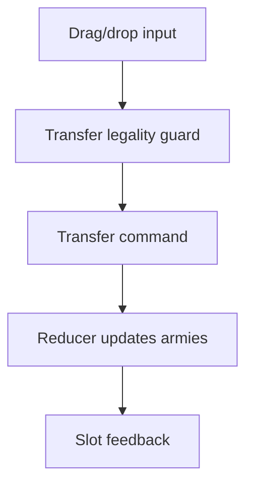
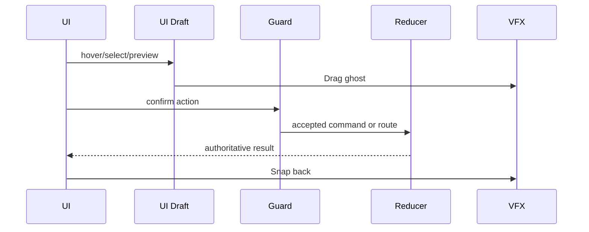
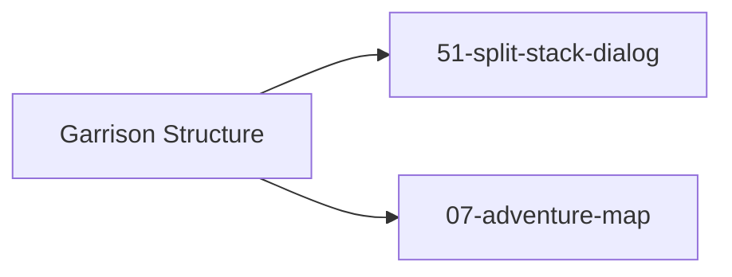

# Screen 22 Architecture: Garrison Structure

System: adventure
Screen ID: garrison-structure
Visual Archetype: curated-garrison-structure
Curation Status: curated-pass-3

## Purpose
Adventure garrison transfer screen for moving stacks between visiting hero and standalone garrison structure.

## Visual Direction
- Original internal UI contract. Do not use third-party captures,
  copied franchise art, or external product pixels as implementation input.

## Visual Composition

## Screen Load And Data Resolution

## Main Interaction Flow

## Animation Flow

## Outgoing Transitions

## State Inputs
- heroArmy -> state.heroes.byId[selected].army
- garrisonArmy -> state.mapObjects.byId[garrisonId].army
- selectedStack -> state.ui.garrisonTransfer.selectedStackRef
- transferRules -> selectors.armies.garrisonTransferRules
- splitDraft -> state.ui.garrisonTransfer.splitQuantity

## Implementation Contract
- Mockup defines visual regions and data hooks only.
- Spec defines the component/state contract.
- Interactions define controls, timing, command routing, disabled states, and error behavior.
- Data contracts define schemas, config, localization, asset, audio, VFX, save, and replay references.
- Diagrams are screen-specific summaries of the same contract and must not introduce hidden behavior.
