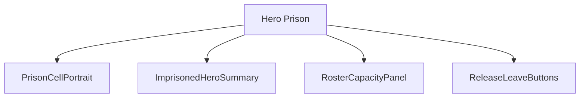
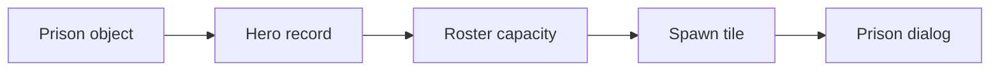
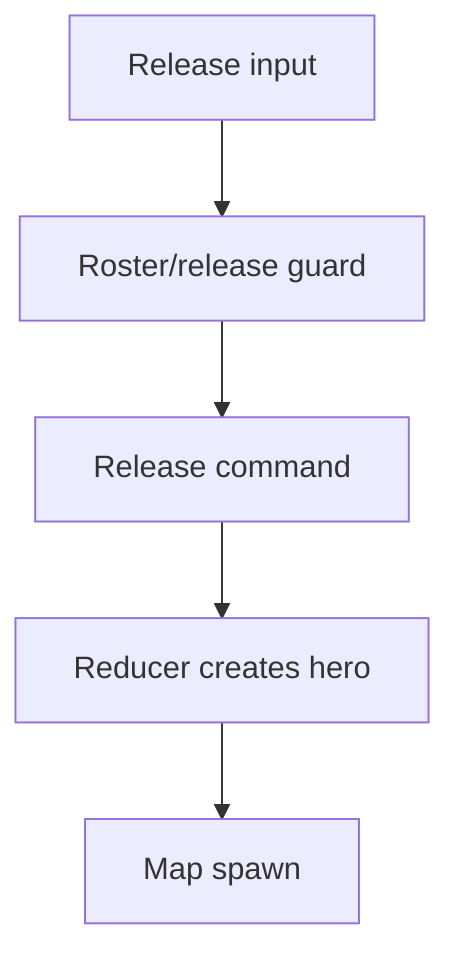
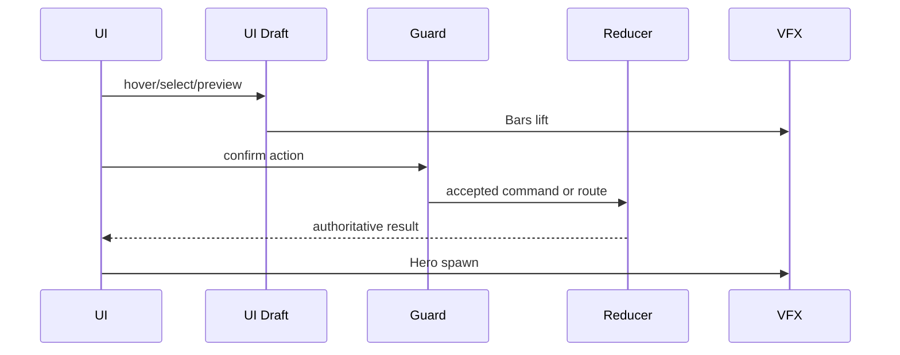
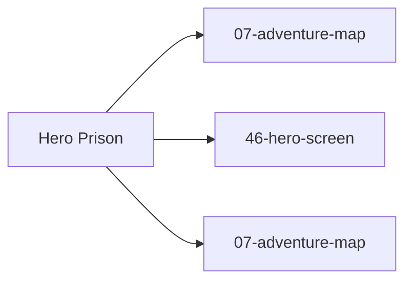

# Screen 23 Architecture: Hero Prison

System: adventure
Screen ID: hero-prison
Visual Archetype: curated-hero-prison
Curation Status: curated-pass-3

## Purpose
Adventure prison dialog for releasing an imprisoned hero into the player's roster when limits and ownership rules allow.

## Visual Direction
- Original internal UI contract. Do not use third-party captures,
  copied franchise art, or external product pixels as implementation input.

## Visual Composition

## Screen Load And Data Resolution

## Main Interaction Flow

## Animation Flow

## Outgoing Transitions

## State Inputs
- prisonId -> state.ui.adventure.pendingPrisonId
- imprisonedHero -> state.mapObjects.byId[prisonId].heroId
- rosterSlots -> selectors.heroes.availableRosterSlots
- releaseGuard -> selectors.heroes.prisonReleaseGuard
- spawnTile -> selectors.mapObjects.prisonReleaseTile

## Implementation Contract
- Mockup defines visual regions and data hooks only.
- Spec defines the component/state contract.
- Interactions define controls, timing, command routing, disabled states, and error behavior.
- Data contracts define schemas, config, localization, asset, audio, VFX, save, and replay references.
- Diagrams are screen-specific summaries of the same contract and must not introduce hidden behavior.
