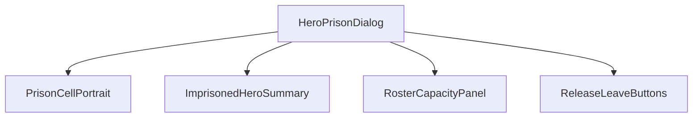
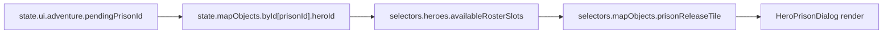
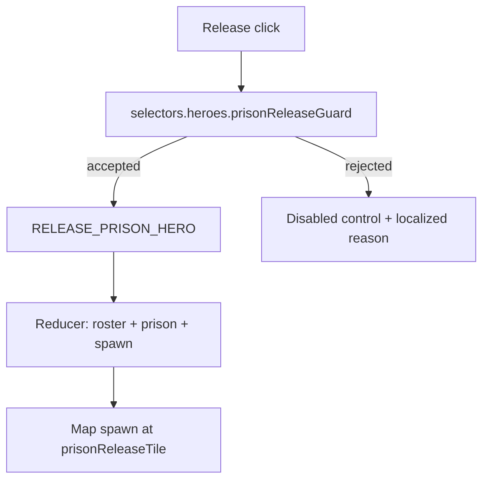
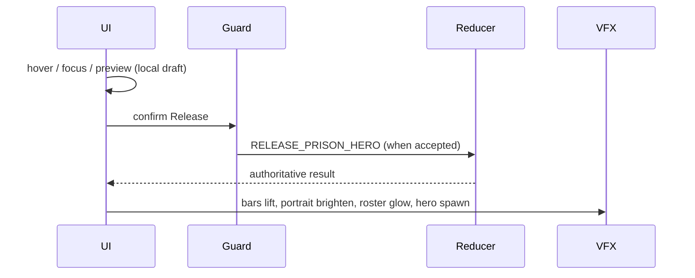
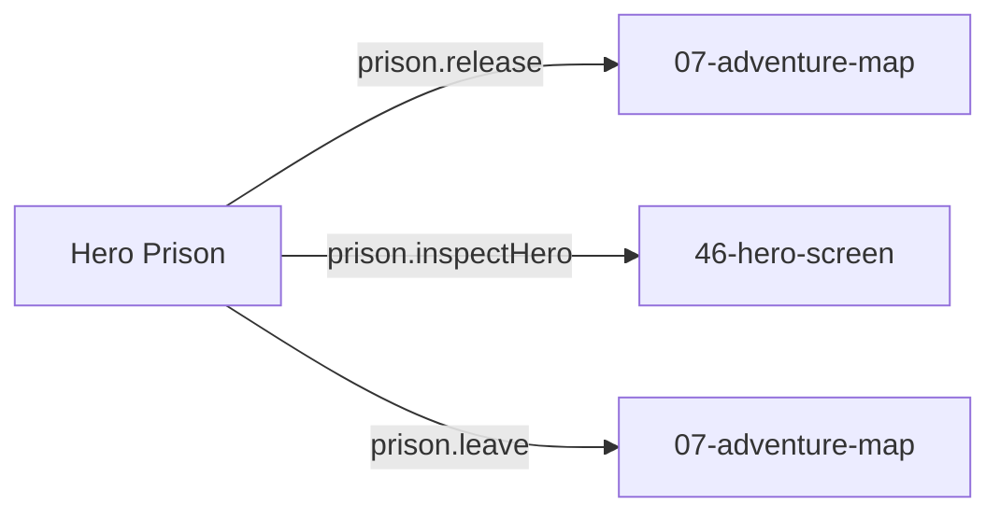

# Screen 23 Architecture: Hero Prison

- System: `adventure`
- Screen ID: `hero-prison`
- Visual Archetype: `curated-hero-prison`
- Curation Status: `curated-pass-3`

## Companion Docs
- [`spec.md`](./spec.md) — components, bindings.
- [`interactions.md`](./interactions.md) — controls, commands,
  navigation.
- [`data-contracts.md`](./data-contracts.md) — schemas, selectors,
  commands.
- [`mockup.html`](./mockup.html) — visual reference.

## Purpose
Adventure prison dialog. Releases an imprisoned hero into the visiting
player's roster when capacity, ownership, and spawn-tile rules pass.

## Visual Direction
- Original internal UI contract. Do not use third-party captures,
  copied franchise art, or external product pixels as implementation
  input.

## Visual Composition

## Screen Load And Data Resolution

## Main Interaction Flow

## Animation Flow

## Outgoing Transitions

## State Inputs
| Symbol | Source | Notes |
| --- | --- | --- |
| `prisonId` | `state.ui.adventure.pendingPrisonId` | UI-local route state. |
| `imprisonedHero` | `state.mapObjects.byId[prisonId].heroId` | Hero record locked inside the prison. |
| `rosterSlots` | `selectors.heroes.availableRosterSlots` | Active player capacity. |
| `releaseGuard` | `selectors.heroes.prisonReleaseGuard` | Eligibility + reason. |
| `spawnTile` | `selectors.mapObjects.prisonReleaseTile` | Released-hero spawn tile. |

## Implementation Contract
- [`mockup.html`](./mockup.html) defines visual regions and data hooks
  only.
- [`spec.md`](./spec.md) defines the component / state contract.
- [`interactions.md`](./interactions.md) defines controls, timing,
  command routing, disabled states, and error behaviour.
- [`data-contracts.md`](./data-contracts.md) defines schemas, config,
  localization, assets, audio, VFX, save, and replay references.
- These diagrams are screen-specific summaries of the same contract
  and must not introduce hidden behaviour.

---

## 🔍 Sync Check

- **UI: ⚠** — Diagrams mirror
  [`spec.md`](./spec.md) and [`interactions.md`](./interactions.md).
  The `prison.inspectHero` arrow in *Outgoing Transitions* is not
  reflected by a control in [`mockup.html`](./mockup.html); flagged
  in sibling [`spec.md`](./spec.md) Issues.
- **Schema: ⚠** — `RELEASE_PRISON_HERO` is registered with
  [`mvp.05-adventure-map.12-release-prison-hero-command`](../../../../../tasks/mvp/05-adventure-map/12-release-prison-hero-command.md)
  per [`command-schema.md`](../../../command-schema.md);
  `OPEN_IMPRISONED_HERO_PREVIEW` and `CLOSE_HERO_PRISON` are not
  defined there. See sibling
  [`data-contracts.md`](./data-contracts.md) Issues.
- **Tasks: ✔** — UI surface owned by
  [`phase-2.07-ui-screen-backlog.23-hero-prison-screen`](../../../../../tasks/phase-2/07-ui-screen-backlog/23-hero-prison-screen.md);
  release reducer owned by
  [`mvp.05-adventure-map.12-release-prison-hero-command`](../../../../../tasks/mvp/05-adventure-map/12-release-prison-hero-command.md).
  Both list this screen package in Read First.

## ⚠ Issues

- **Inspect-hero transition has no mockup control.** *Outgoing
  Transitions* shows the `prison.inspectHero → 46-hero-screen` edge,
  but [`mockup.html`](./mockup.html) renders only RELEASE and LEAVE.
  See sibling [`spec.md`](./spec.md) Issues for the canonical
  statement; reconciler is
  [`phase-2.07-ui-screen-backlog.23-hero-prison-screen`](../../../../../tasks/phase-2/07-ui-screen-backlog/23-hero-prison-screen.md).
