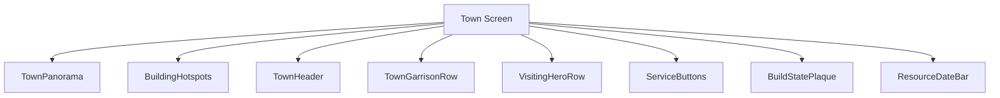
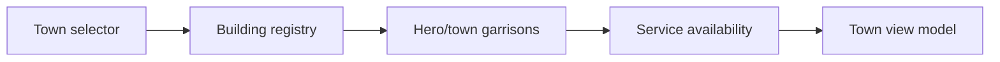
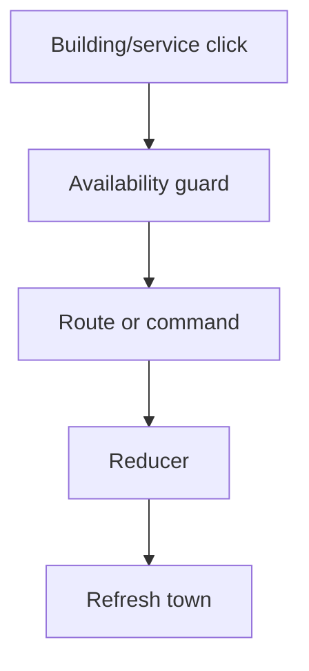
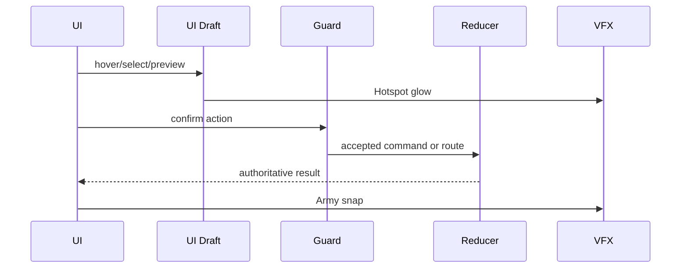
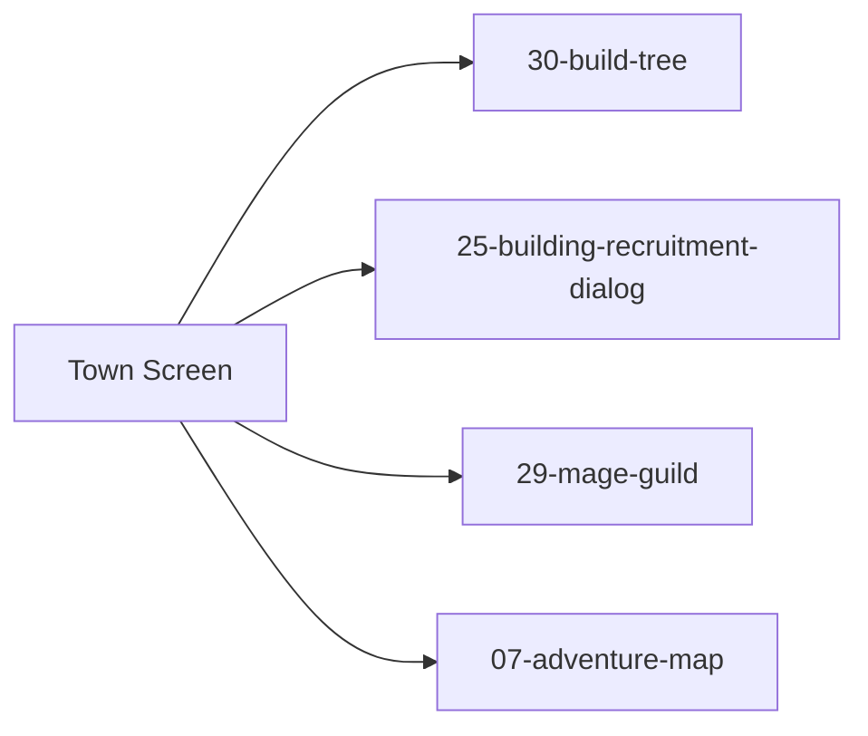

# Screen 24 Architecture: Town Screen

System: town
Screen ID: town-screen
Visual Archetype: curated-town
Curation Status: anchor-v1

## Purpose
Town management panorama with clickable building hotspots, town/visiting hero armies, construction state, recruit/service entry points, resources, and exit back to adventure.

## Visual Direction
- Original internal UI contract. Do not use third-party captures,
  copied franchise art, or external product pixels as implementation input.

## Visual Composition

## Screen Load And Data Resolution

## Main Interaction Flow

## Animation Flow

## Outgoing Transitions

## State Inputs
- town.id -> state.towns.selectedTownId
- town.buildings -> state.towns.byId[selected].buildings
- dailyBuild -> state.towns.byId[selected].builtToday
- garrison -> state.towns.byId[selected].garrison
- visitingHero -> state.adventure.visitingHeroId

## Implementation Contract
- Mockup defines visual regions and data hooks only.
- Spec defines the component/state contract.
- Interactions define controls, timing, command routing, disabled states, and error behavior.
- Data contracts define schemas, config, localization, asset, audio, VFX, save, and replay references.
- Diagrams are screen-specific summaries of the same contract and must not introduce hidden behavior.
