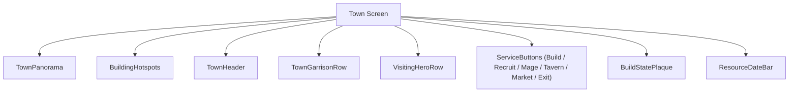
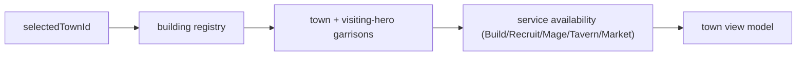
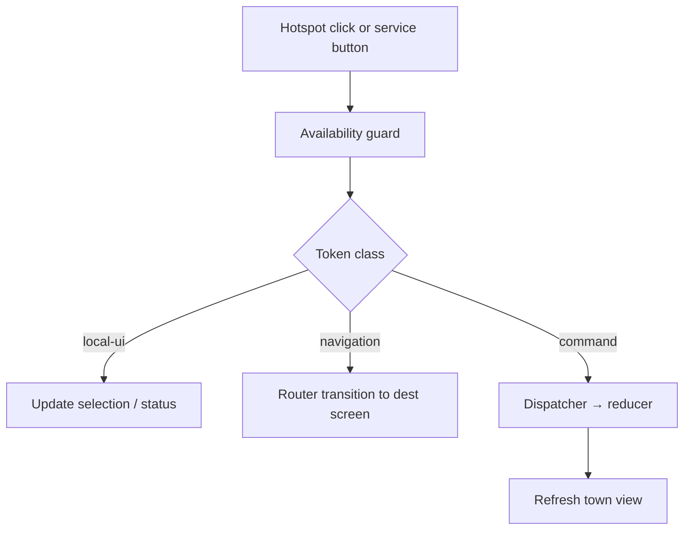
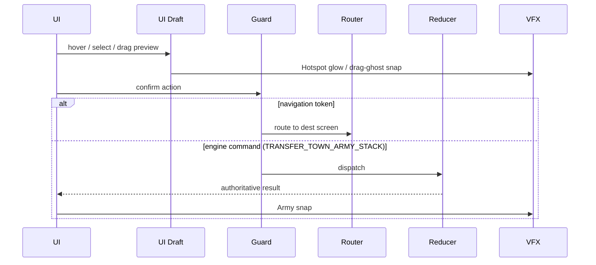
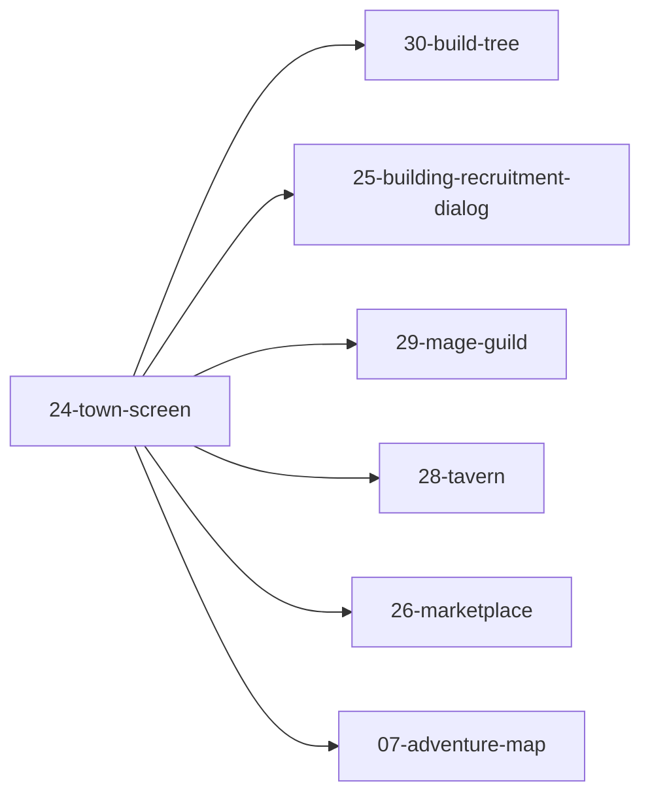

# Screen 24 Architecture: Town Screen

System: town
Screen ID: town-screen
Visual Archetype: curated-town
Curation Status: anchor-v1

## Purpose
Town management panorama with clickable building hotspots, town and
visiting-hero army rows, daily-build state, service entry points
(build / recruit / mage / tavern / market), resource strip, and exit
back to the adventure map.

## Visual Direction
- Original internal UI contract. Do not use third-party captures,
  copied franchise art, or external product pixels as implementation
  input.

## Visual Composition

## Screen Load And Data Resolution

## Main Interaction Flow

## Animation Flow

## Outgoing Transitions

## State Inputs
- `town.id` → `state.towns.selectedTownId`
- `town.buildings` → `state.towns.byId[selected].buildings`
- `dailyBuild` → `state.towns.byId[selected].builtToday`
- `garrison` → `state.towns.byId[selected].garrison`
- `visitingHero` → `state.adventure.visitingHeroId`

## Implementation Contract
- `mockup.html` defines visual regions and data hooks only.
- `spec.md` defines the component tree and state contract.
- `interactions.md` owns controls, timing, token-to-command routing,
  disabled cases, and error surfaces.
- `data-contracts.md` defines schemas, config, localization, asset,
  audio, VFX, save, and replay references.
- This file's diagrams summarize the same contract and must not
  introduce hidden behavior. Sibling `interactions.md` § Actions
  and `data-contracts.md` § Commands And Events are the canonical
  per-token contract; the `## Main Interaction Flow` diagram above
  classifies tokens, it does not enumerate them.

---

## 🔍 Sync Check

- **UI: ✔** — Component nodes match sibling `spec.md` § Component
  Tree; outgoing-transition diagram mirrors the six navigation
  targets named in sibling `interactions.md` § Actions and
  `data-contracts.md` § Commands And Events.
- **Schema: ✔** — Only `TRANSFER_TOWN_ARMY_STACK` is dispatched as
  an engine command on this screen and is defined in
  [`content-schema/schemas/command.schema.json`](../../../../../content-schema/schemas/command.schema.json)
  (line 1490); all other tokens are navigation / local-ui per
  sibling `data-contracts.md`.
- **Tasks: ✔** — Owning task
  [`tasks/mvp/07-ui-shell/04-town-screen-modal.md`](../../../../../tasks/mvp/07-ui-shell/04-town-screen-modal.md)
  Reads First all four package files; the transfer command is
  owned by
  [`tasks/mvp/05-adventure-map/18-transfer-stack-commands.md`](../../../../../tasks/mvp/05-adventure-map/18-transfer-stack-commands.md)
  (declared dependency).

## ⚠ Issues

- **Outgoing edges missing from `screen-transition-graph.json`.**
  The six `Current → …` edges shown in `## Outgoing Transitions`
  (`30`, `25`, `29`, `28`, `26`, `07`) are not registered in
  [`docs/architecture/screen-transition-graph.json`](../../../screen-transition-graph.json),
  which today only contains `07-adventure-map → 24-town-screen`.
  Per `ui-routing.md`, the graph is regenerated by
  `npm run generate:screen-transition-graph`. Owner:
  [`tasks/mvp/07-ui-shell/13-screen-package-contract-sweep.md`](../../../../../tasks/mvp/07-ui-shell/13-screen-package-contract-sweep.md).
- See sibling `interactions.md` § ⚠ Issues — aligned (same
  screen-command-coverage gap, raised once on the canonical
  per-token sibling).
