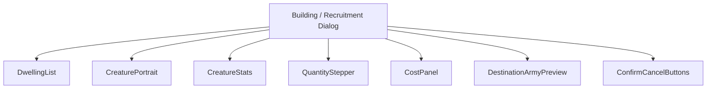
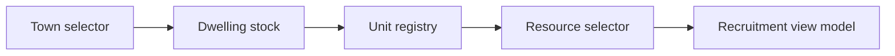
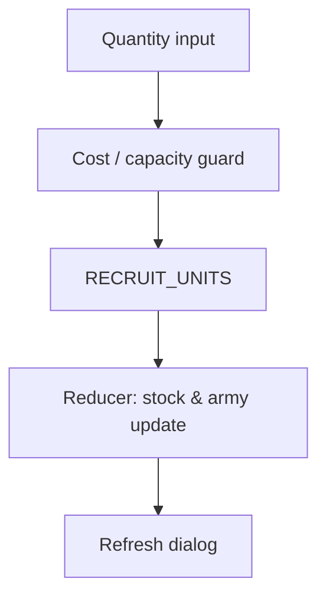
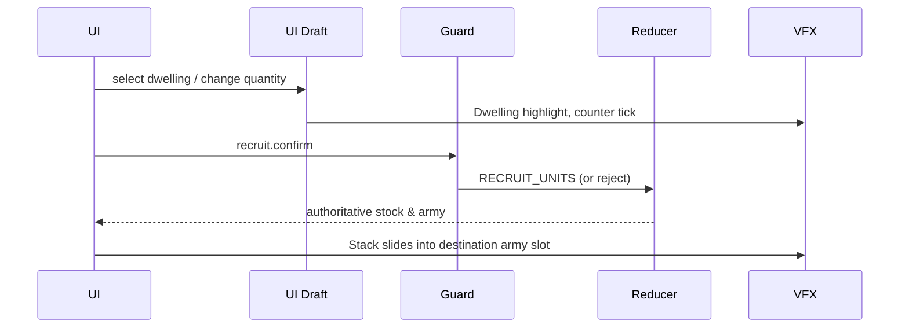
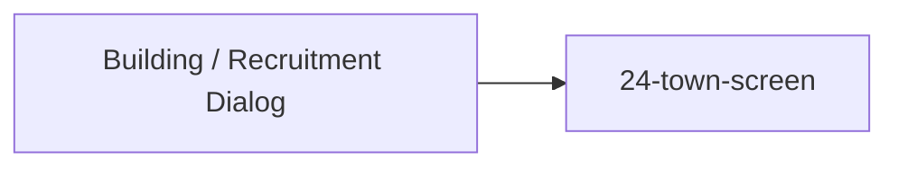

# Screen 25 Architecture: Building / Recruitment Dialog

System: town
Screen ID: building-recruitment-dialog
Visual Archetype: curated-town-recruitment
Curation Status: curated-pass-2

## Purpose
Town dwelling recruitment dialog: dwelling list, creature portrait
and stats, quantity stepper with MAX, total cost, and destination
army preview. Single gameplay command: `RECRUIT_UNITS`.

## Visual Direction
- Original internal UI contract. Do not use third-party captures,
  copied franchise art, or external product pixels as implementation
  input.

## Visual Composition

## Screen Load And Data Resolution

## Main Interaction Flow

## Animation Flow

## Outgoing Transitions

Cancel (`recruit.cancel` → `CLOSE_RECRUITMENT_DIALOG`) is the only
navigation edge; `recruit.confirm` stays on the current screen and
refreshes its readouts from the reducer result.

## State Bindings
Authoritative table lives in `data-contracts.md` § Runtime State
Selectors and `spec.md` § State Bindings. The five bindings are:
`state.towns.selectedTownId`,
`state.towns.byId[selected].dwellingStock`,
`state.ui.town.selectedDwellingId`,
`state.ui.town.recruitQuantity`, and
`state.townRecruit.destinationArmy`.

## Implementation Contract
- `mockup.html` defines visible regions and data hooks only.
- `spec.md` defines the component / state contract.
- `interactions.md` defines controls, timing, command routing,
  disabled states, and error behavior.
- `data-contracts.md` defines schemas, config, localization, assets,
  audio, VFX, and save / replay references.
- Diagrams above are screen-specific summaries of the same contract;
  they must not introduce hidden behavior.

---

## 🔍 Sync Check

- **UI: ✔** — Component tree, interaction flow, and outgoing transitions match sibling `spec.md`, `interactions.md`, and `data-contracts.md`; route target `24-town-screen` exists.
- **Schema: ✔** — `RECRUIT_UNITS` defined in [`content-schema/schemas/command.schema.json`](../../../../../content-schema/schemas/command.schema.json) and [`command-schema.md` § RECRUIT_UNITS](../../../command-schema.md); UI-local tokens covered by `localUiPrefixes` in [`screen-command-coverage.json`](../../../screen-command-coverage.json).
- **Tasks: ✔** — Owning task [`tasks/phase-2/07-ui-screen-backlog/25-building-recruitment-dialog-screen.md`](../../../../../tasks/phase-2/07-ui-screen-backlog/25-building-recruitment-dialog-screen.md) reads this file; engine reducer owned by `mvp.05-adventure-map.05-town-visit-recruit-build-mage-guild`.

## ⚠ Issues

- **State-bindings duplication demoted.** The prior revision restated all five state bindings in this file, duplicating `data-contracts.md` § Runtime State Selectors and `spec.md` § State Bindings. Per `doc-audit` § 7 ("no duplicated logic"), the canonical table now lives in `data-contracts.md`; this file points to it. No bindings were removed. See sibling `data-contracts.md` § Runtime State Selectors — aligned.
- **`state.townRecruit` slice naming.** Same flag as `spec.md` and `data-contracts.md`: the top-level `state.townRecruit.destinationArmy` slice should be confirmed or moved under `state.ui.town.recruit.*` by the owning task. Surfaced here so the diagrams stay accurate after the rename. See sibling `data-contracts.md` § ⚠ Issues — aligned.
