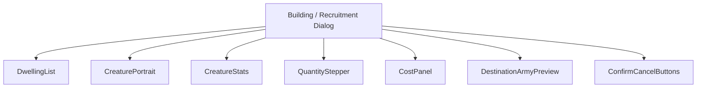
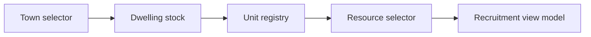
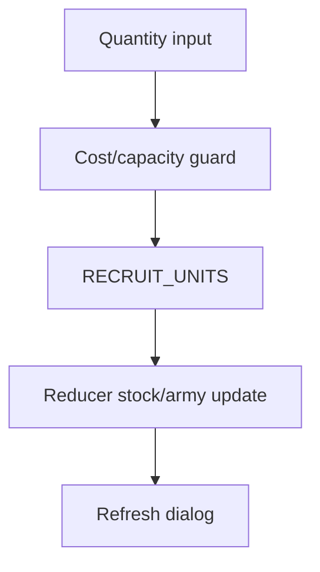
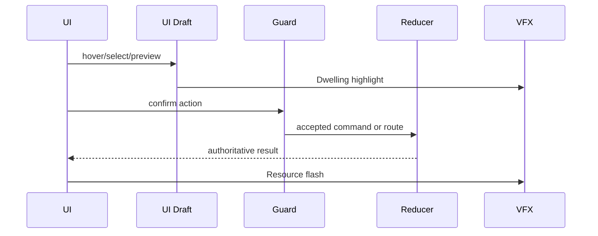
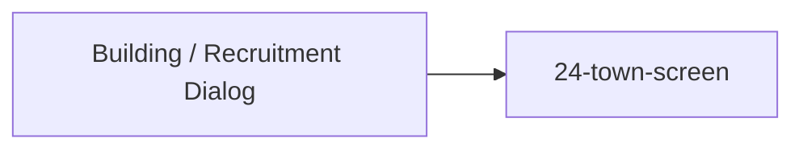

# Screen 25 Architecture: Building / Recruitment Dialog

System: town
Screen ID: building-recruitment-dialog
Visual Archetype: curated-town-recruitment
Curation Status: curated-pass-2

## Purpose
Town dwelling recruitment dialog with creature portrait, dwelling selection, available growth, quantity controls, total cost, and destination stack preview.

## Visual Direction
- Original internal UI contract. Do not use third-party captures,
  copied franchise art, or external product pixels as implementation input.

## Visual Composition

## Screen Load And Data Resolution

## Main Interaction Flow

## Animation Flow

## Outgoing Transitions

## State Inputs
- town.id -> state.towns.selectedTownId
- dwelling.stock -> state.towns.byId[selected].dwellingStock
- selectedDwelling -> state.ui.town.selectedDwellingId
- recruitQuantity -> state.ui.town.recruitQuantity
- destinationArmy -> state.townRecruit.destinationArmy

## Implementation Contract
- Mockup defines visual regions and data hooks only.
- Spec defines the component/state contract.
- Interactions define controls, timing, command routing, disabled states, and error behavior.
- Data contracts define schemas, config, localization, asset, audio, VFX, save, and replay references.
- Diagrams are screen-specific summaries of the same contract and must not introduce hidden behavior.
