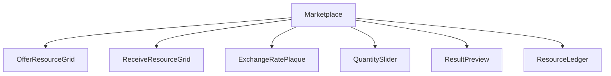
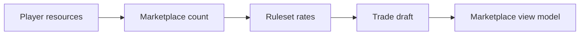
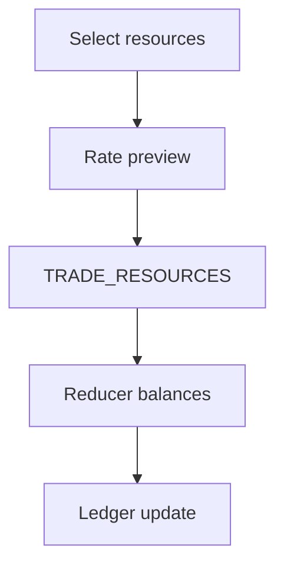
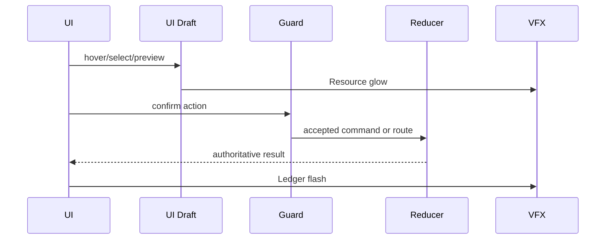
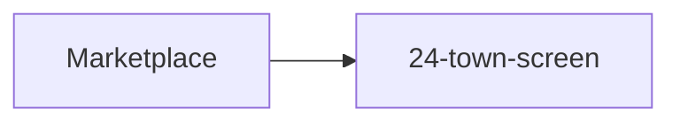

# Screen 26 Architecture: Marketplace

System: town
Screen ID: marketplace
Visual Archetype: curated-town-marketplace
Curation Status: curated-pass-2

## Purpose
Resource exchange screen with offer resource, receive resource, rate calculation, quantity slider, resource ledger, and trade confirmation.

## Visual Direction
- Original internal UI contract. Do not use third-party captures,
  copied franchise art, or external product pixels as implementation input.

## Visual Composition

## Screen Load And Data Resolution

## Main Interaction Flow

## Animation Flow

## Outgoing Transitions

## State Inputs
- player.resources -> state.players.active.resources
- market.rates -> state.marketplace.currentRates
- selectedOffer -> state.ui.marketplace.offerResource
- selectedReceive -> state.ui.marketplace.receiveResource
- tradeAmount -> state.ui.marketplace.amount

## Implementation Contract
- Mockup defines visual regions and data hooks only.
- Spec defines the component/state contract.
- Interactions define controls, timing, command routing, disabled states, and error behavior.
- Data contracts define schemas, config, localization, asset, audio, VFX, save, and replay references.
- Diagrams are screen-specific summaries of the same contract and must not introduce hidden behavior.
