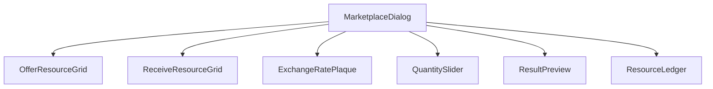
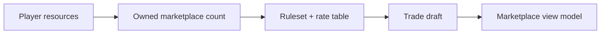
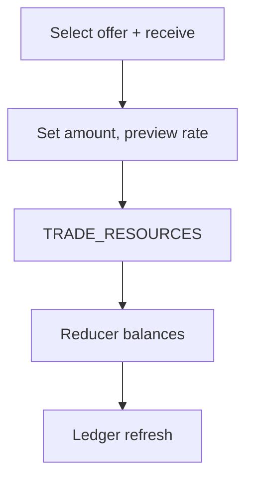
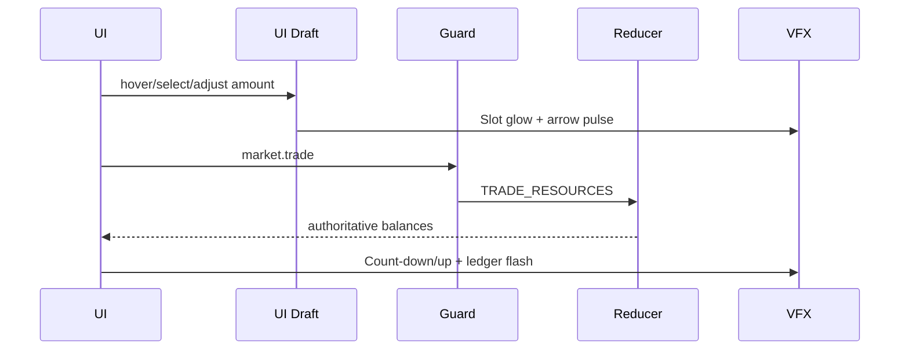
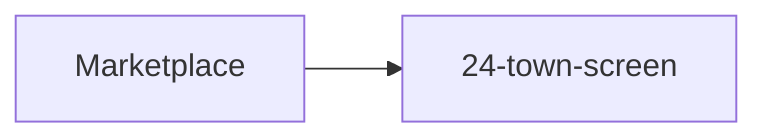

# Screen 26 Architecture: Marketplace

System: town
Screen ID: marketplace
Visual Archetype: curated-town-marketplace
Curation Status: curated-pass-2

## Purpose
Resource exchange screen: offer + receive grids, rate plaque,
quantity slider, ledger preview, and `TRADE_RESOURCES`
confirmation.

## Visual Direction
- Original internal UI contract. Do not use third-party captures,
  copied franchise art, or external product pixels as
  implementation input.

## Visual Composition

## Screen Load And Data Resolution

## Main Interaction Flow

## Animation Flow

## Outgoing Transitions

## State Inputs
- `player.resources` ← `state.players.active.resources`
- `market.rates` ← `state.marketplace.currentRates`
- `selectedOffer` ← `state.ui.marketplace.offerResource`
- `selectedReceive` ← `state.ui.marketplace.receiveResource`
- `tradeAmount` ← `state.ui.marketplace.amount`

## Implementation Contract
- Mockup defines visual regions and data hooks only.
- Spec defines the component/state contract.
- Interactions define controls, timing, command routing, disabled
  states, and error behavior.
- Data contracts define schemas, config, localization, asset,
  audio, VFX, save, and replay references.
- Diagrams in this file summarize the same contract; they must
  not introduce hidden behavior.

---

## 🔍 Sync Check

- **UI: ✔** — Visual Composition matches `spec.md` § Component Tree; Main Interaction Flow matches the five action IDs in `interactions.md` § Actions; Outgoing Transitions target `24-town-screen` per the `market.close` row.
- **Schema: ✔** — `TRADE_RESOURCES` resolves to the `tradeResources` definition in [`command.schema.json`](../../../../../content-schema/schemas/command.schema.json); state paths align with `data-contracts.md` § Runtime State Selectors.
- **Tasks: ✔** — Diagrams cover the surfaces owned by [`tasks/phase-2/07-ui-screen-backlog/26-marketplace-screen.md`](../../../../../tasks/phase-2/07-ui-screen-backlog/26-marketplace-screen.md) and the reducer task [`tasks/mvp/05-adventure-map/10-trade-resources-command.md`](../../../../../tasks/mvp/05-adventure-map/10-trade-resources-command.md).

## ⚠ Issues

- **State Inputs do not show `marketplaceId`.** Mirrors the gap flagged in `data-contracts.md` § ⚠ Issues — the `TRADE_RESOURCES` command accepts an optional `marketplaceId` field that has no diagrammed source here. Owner: `mvp.05-adventure-map.10-trade-resources-command` Acceptance Criteria.
- **Sibling-aligned** with `spec.md` § Component Tree and `interactions.md` § Actions (same component set and command list).
