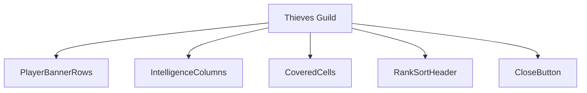
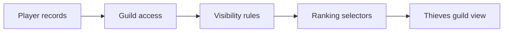
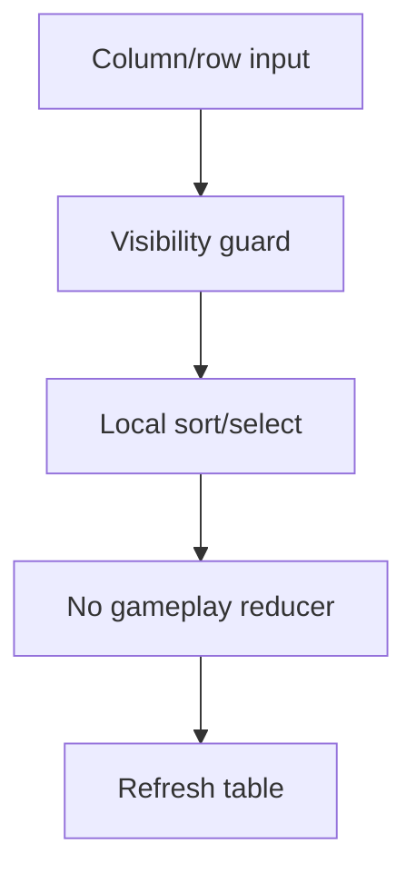
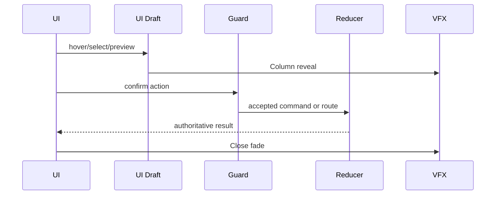
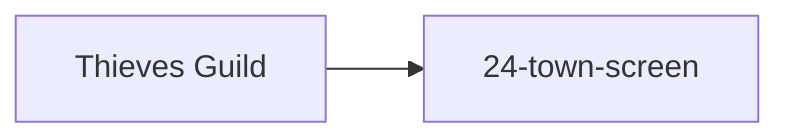

# Screen 27 Architecture: Thieves Guild

System: town
Screen ID: thieves-guild
Visual Archetype: curated-thieves-guild
Curation Status: curated-pass-2

## Purpose
Information ranking screen showing opponents, towns, heroes, resources, artifacts, army strength, and intelligence columns allowed by guild access.

## Visual Direction
- Original internal UI contract. Do not use third-party captures,
  copied franchise art, or external product pixels as implementation input.

## Visual Composition

## Screen Load And Data Resolution

## Main Interaction Flow

## Animation Flow

## Outgoing Transitions

## State Inputs
- players -> state.players.all
- intelligenceLevel -> state.townServices.thievesGuildLevel
- rankings -> state.intelligence.rankings
- selectedPlayer -> state.ui.thievesGuild.selectedPlayerId

## Implementation Contract
- Mockup defines visual regions and data hooks only.
- Spec defines the component/state contract.
- Interactions define controls, timing, command routing, disabled states, and error behavior.
- Data contracts define schemas, config, localization, asset, audio, VFX, save, and replay references.
- Diagrams are screen-specific summaries of the same contract and must not introduce hidden behavior.
