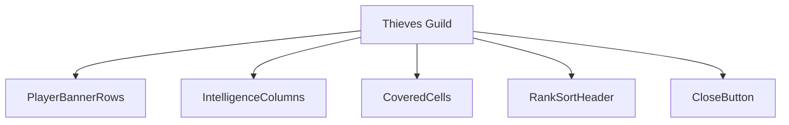
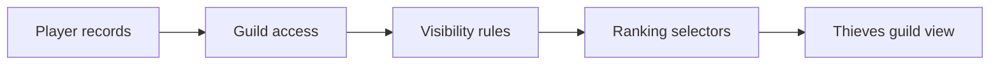
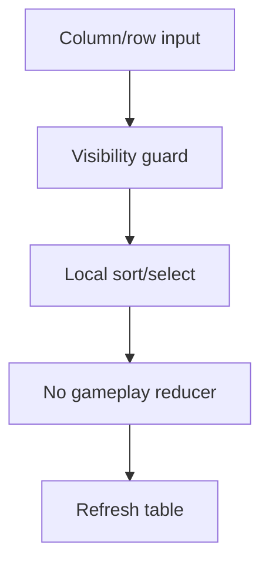
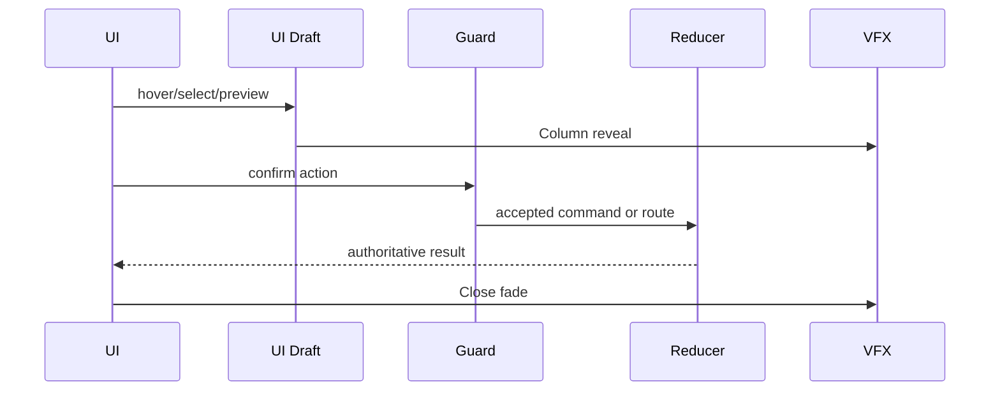
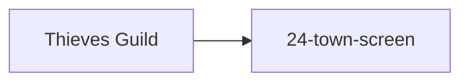

# Screen 27 Architecture: Thieves Guild

| Field | Value |
| --- | --- |
| System | `town` |
| Screen ID | `thieves-guild` |
| Visual Archetype | `curated-thieves-guild` |
| Curation Status | `curated-pass-2` |

## Source Files
- Mockup: `mockup.html`
- Spec: `spec.md`
- Interactions: `interactions.md`
- Data Contracts: `data-contracts.md`

## Purpose
Read-only intelligence ranking screen. Player rows (left) cross
with intelligence columns (top); cells that exceed the player's
guild access stay covered. The screen never mutates gameplay
state — sorting and selection are local UI only.

## Visual Direction
Original internal UI contract. Never seed implementation from
third-party captures, copied franchise art, or external product
pixels.

## Visual Composition

## Screen Load And Data Resolution

## Main Interaction Flow

All three actions (`thieves.selectPlayer`, `thieves.sort`,
`thieves.close`) are `local-ui` per
[`screen-command-coverage.json`](../../../screen-command-coverage.json)
(`SELECT_`, `SORT_`, `CLOSE_` are listed `localUiPrefixes`). They
never enter the deterministic command log.

## Animation Flow

## Outgoing Transitions

## State Inputs
| UI Element | Selector |
| --- | --- |
| `players` | `state.players.all` |
| `intelligenceLevel` | `state.townServices.thievesGuildLevel` |
| `rankings` | `state.intelligence.rankings` |
| `selectedPlayer` | `state.ui.thievesGuild.selectedPlayerId` |

## Implementation Contract
- `mockup.html` defines visible regions and data hooks only.
- `spec.md` defines the component / state contract.
- `interactions.md` owns controls, timing, command routing,
  disabled states, and error behavior.
- `data-contracts.md` defines schemas, config, localization,
  asset, audio, VFX, save, and replay references.
- Diagrams above are screen-specific summaries of the same
  contract; they must not introduce hidden behavior.

---

## 🔍 Sync Check

- **UI: ✔** — Component tree, columns, rows, and `CLOSE` button match `mockup.html` (player banners Red/Blue/Tan/Green/Orange; columns Player/Towns/Heroes/Gold/Army/Arts); sibling `spec.md` § Component Tree and `interactions.md` § Actions agree.
- **Schema: ✔** — `state.players.all`, `state.townServices.thievesGuildLevel`, `state.intelligence.rankings`, `state.ui.thievesGuild.selectedPlayerId` agree across sibling `spec.md` § State Bindings and `data-contracts.md` § Runtime State Selectors.
- **Tasks: ✔** — Owning task `phase-2.07-ui-screen-backlog.27-thieves-guild-screen` ([`tasks/phase-2/07-ui-screen-backlog/27-thieves-guild-screen.md`](../../../../../tasks/phase-2/07-ui-screen-backlog/27-thieves-guild-screen.md)) reads all four targets in its Read First.

## ⚠ Issues

_None._
