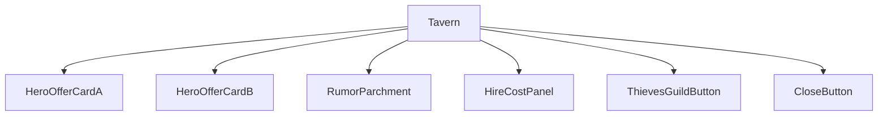
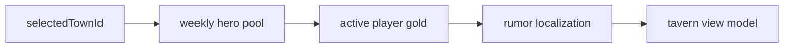
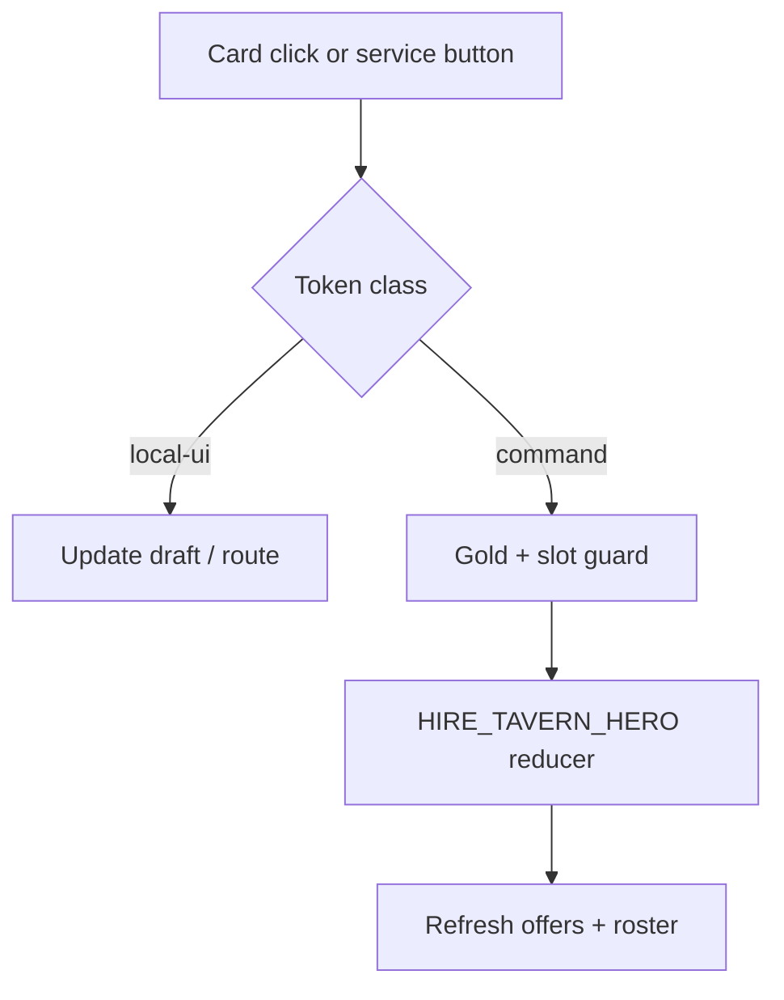
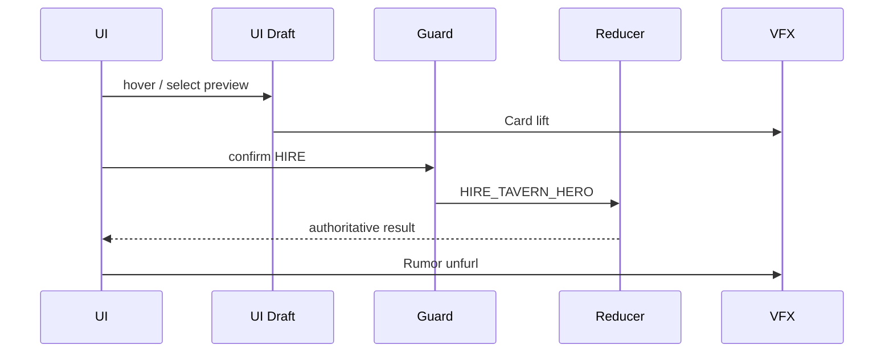
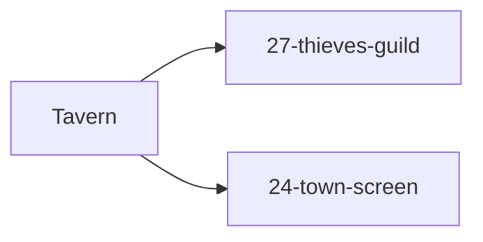

# Screen 28 Architecture: Tavern

| Field | Value |
| --- | --- |
| System | `town` |
| Screen ID | `tavern` |
| Visual Archetype | `curated-tavern` |
| Curation Status | `curated-pass-2` |

## Source Files
- Mockup: `mockup.html`
- Spec: `spec.md`
- Interactions: `interactions.md`
- Data Contracts: `data-contracts.md`

## Purpose
Hero-recruitment surface for a visited town. Renders two weekly
hero offers with hire costs, a rumor parchment, an entry to the
Thieves Guild, and a close button back to the town screen. Only
`HIRE_TAVERN_HERO` mutates deterministic state; the other three
actions are `local-ui` per
[`screen-command-coverage.json`](../../../screen-command-coverage.json)
prefixes (`SELECT_`, `OPEN_`, `CLOSE_`).

## Visual Direction
Original internal UI contract. Never seed implementation from
third-party captures, copied franchise art, or external product
pixels.

## Visual Composition

## Screen Load And Data Resolution

## Main Interaction Flow

## Animation Flow

## Outgoing Transitions

## State Inputs
| UI Element | Selector |
| --- | --- |
| `heroPool` | `state.tavern.weeklyHeroOffers` |
| `playerGold` | `state.players.active.resources.gold` |
| `selectedOffer` | `state.ui.tavern.selectedHeroId` |
| `rumor` | `state.tavern.currentRumorId` |

## Implementation Contract
- `mockup.html` defines visible regions and data hooks only.
- `spec.md` defines the component / state contract.
- `interactions.md` owns controls, timing, command routing,
  disabled states, and error behavior.
- `data-contracts.md` defines schemas, config, localization,
  asset, audio, VFX, save, and replay references.
- Diagrams above are screen-specific summaries of the same
  contract; they must not introduce hidden behavior.

---

## 🔍 Sync Check

- **UI: ✔** — Component tree (two hero offer cards, rumor parchment, hire-cost, thieves-guild and close buttons) matches sibling [`spec.md`](./spec.md) § Component Tree and the buttons rendered in `mockup.html` (`data-action="tavern.hireHero"`, `tavern.thievesGuild`, `tavern.close`); outgoing transitions to `27-thieves-guild` and `24-town-screen` agree with [`24-town-screen/interactions.md`](../24-town-screen/interactions.md) `town.tavern` row.
- **Schema: ✔** — `HIRE_TAVERN_HERO` is the only reducer command (`hireTavernHero` def in [`content-schema/schemas/command.schema.json`](../../../../../content-schema/schemas/command.schema.json) line 891); `SELECT_TAVERN_HERO`, `OPEN_THIEVES_GUILD`, `CLOSE_TAVERN` correctly stay `local-ui` per the `SELECT_` / `OPEN_` / `CLOSE_` prefixes in [`screen-command-coverage.json`](../../../screen-command-coverage.json).
- **Tasks: ✔** — UI owner [`phase-2.07-ui-screen-backlog.28-tavern-screen`](../../../../../tasks/phase-2/07-ui-screen-backlog/28-tavern-screen.md) reads this file in its Read First; engine owner [`mvp.05-adventure-map.11-hire-tavern-hero-command`](../../../../../tasks/mvp/05-adventure-map/11-hire-tavern-hero-command.md) reads sibling `interactions.md`.

## ⚠ Issues

- **`HireCostPanel` is in the component tree but not in `mockup.html`.** Both this file and sibling [`spec.md`](./spec.md) list `HireCostPanel` as a sibling of the two hero offer cards; `mockup.html` renders the hire cost inline on each card (`Cost: 2500 gold`) with no separate panel region. Per Hard Prohibition B (never invent features), the skill kept the panel rather than silently dropping it. Owner: [`phase-2.07-ui-screen-backlog.28-tavern-screen`](../../../../../tasks/phase-2/07-ui-screen-backlog/28-tavern-screen.md). Suggested values: either fold the cost into each hero card and remove `HireCostPanel` from the spec, or add the panel region to `mockup.html` before implementation. Decide in that task, not here.
- **`tavern-offer.schema.json` is referenced by upstream task but not yet on disk.** Sibling [`data-contracts.md`](./data-contracts.md) currently sources weekly offers through `hero.schema.json`. Engine task [`mvp.05-adventure-map.11-hire-tavern-hero-command`](../../../../../tasks/mvp/05-adventure-map/11-hire-tavern-hero-command.md) and content task [`mvp.02-content-schemas.19-tavern-and-marketplace-tables`](../../../../../tasks/mvp/02-content-schemas/19-tavern-and-marketplace-tables.md) both declare `content-schema/schemas/tavern-offer.schema.json` as the canonical source, but no such file exists in [`content-schema/schemas/`](../../../../../content-schema/schemas/). Owner: `mvp.02-content-schemas.19-tavern-and-marketplace-tables`. Suggested values: land `tavern-offer.schema.json` before the UI task starts; then update sibling `data-contracts.md` to point at it. Skill did not create the schema (Hard Prohibition D).
