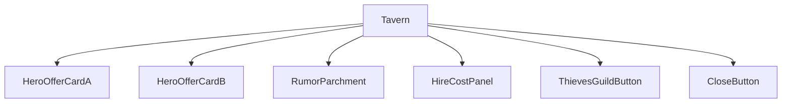
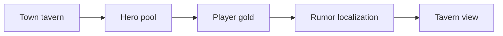
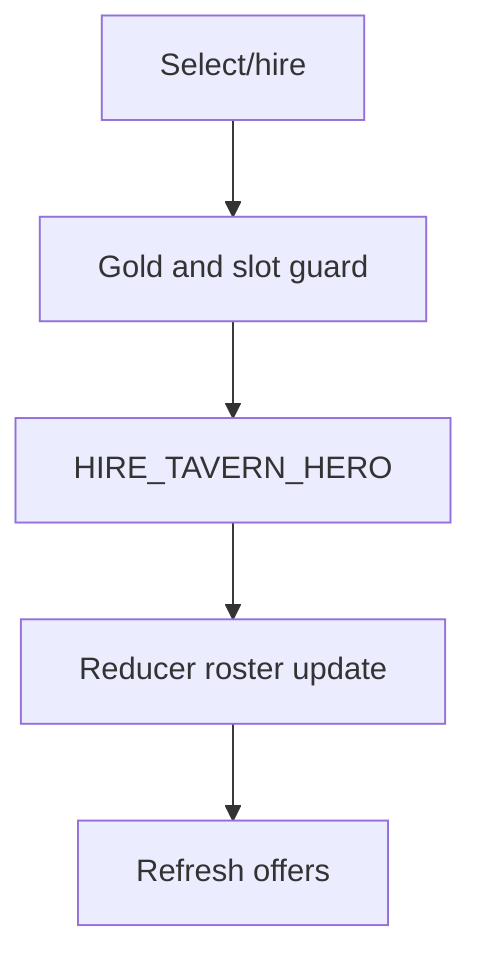
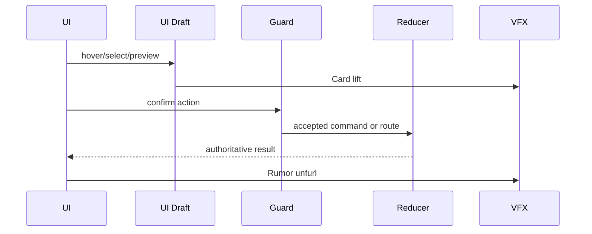
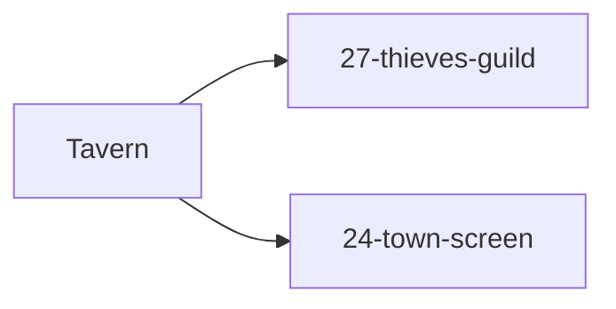

# Screen 28 Architecture: Tavern

System: town
Screen ID: tavern
Visual Archetype: curated-tavern
Curation Status: curated-pass-2

## Purpose
Tavern recruitment and rumor screen with two hero offer cards, hire cost, weekly hero pool, rumor text, and thieves guild entry.

## Visual Direction
- Original internal UI contract. Do not use third-party captures,
  copied franchise art, or external product pixels as implementation input.

## Visual Composition

## Screen Load And Data Resolution

## Main Interaction Flow

## Animation Flow

## Outgoing Transitions

## State Inputs
- heroPool -> state.tavern.weeklyHeroOffers
- playerGold -> state.players.active.resources.gold
- selectedOffer -> state.ui.tavern.selectedHeroId
- rumor -> state.tavern.currentRumorId

## Implementation Contract
- Mockup defines visual regions and data hooks only.
- Spec defines the component/state contract.
- Interactions define controls, timing, command routing, disabled states, and error behavior.
- Data contracts define schemas, config, localization, asset, audio, VFX, save, and replay references.
- Diagrams are screen-specific summaries of the same contract and must not introduce hidden behavior.
