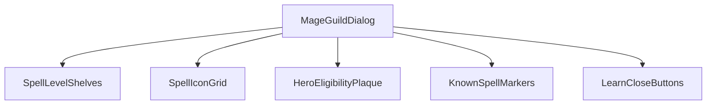
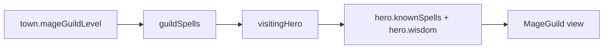
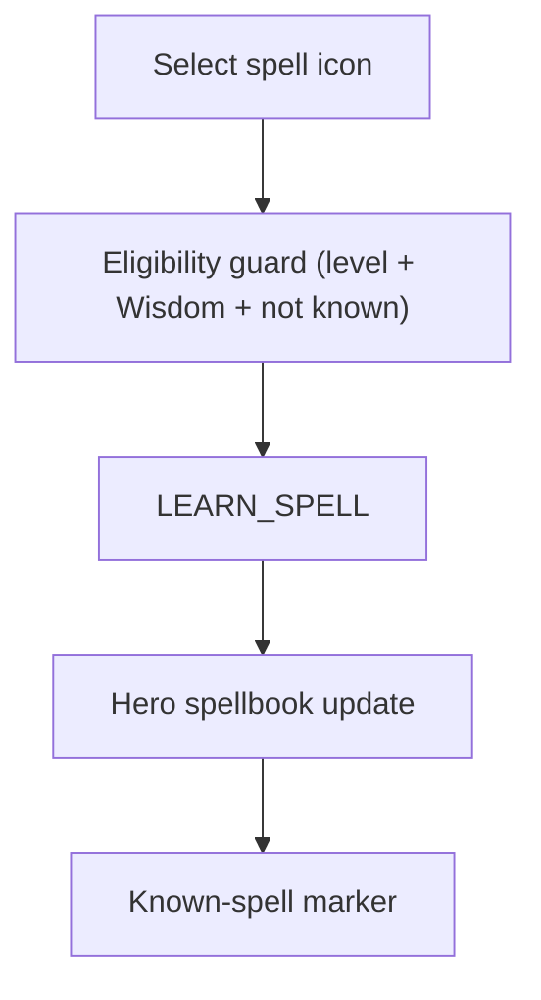
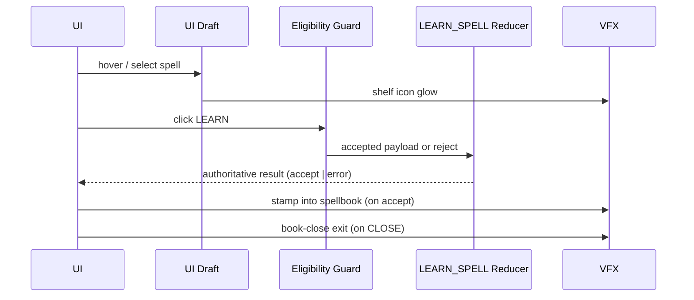
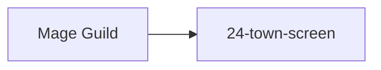

# Screen 29: Mage Guild — Architecture

System group: `town` · Screen slug: `mage-guild` · Archetype:
`curated-mage-guild` · Curation: `curated-pass-2`.

### Screen Package
- Mockup: [`mockup.html`](./mockup.html)
- Spec: [`spec.md`](./spec.md)
- Interactions: [`interactions.md`](./interactions.md)
- Data Contracts: [`data-contracts.md`](./data-contracts.md)
- Architecture Diagrams: `architecture.md`

## Purpose
Visual + logic summary for the Mage Guild spell-learning surface:
shelves by guild level, hero-eligibility plaque, known-spell markers,
and `LEARN`/`CLOSE` actions. Diagrams summarize the contract owned
by [`spec.md`](./spec.md) and [`interactions.md`](./interactions.md);
they must not introduce new behavior.

## Visual Direction
Original internal UI contract. Do **not** use third-party captures,
copied franchise art, or external product pixels as implementation
input.

## Visual Composition

## Screen Load And Data Resolution

## Main Interaction Flow

## Animation Flow

## Outgoing Transitions

## State Inputs
| Binding | State path |
| --- | --- |
| `town.mageGuildLevel` | `state.towns.byId[selected].mageGuildLevel` |
| `guildSpells` | `state.towns.byId[selected].mageGuildSpells` |
| `visitingHero` | `state.adventure.visitingHeroId` |
| `hero.knownSpells` | `state.heroes.byId[visiting].knownSpells` |
| `hero.wisdom` | `state.heroes.byId[visiting].skills.wisdom` |

See sibling [`spec.md`](./spec.md) and
[`data-contracts.md`](./data-contracts.md) for canonical descriptions
and the open drift recorded in `## ⚠ Issues` (Wisdom vs Knowledge;
selectors not in `AdventureState`).

## Implementation Contract
- [`mockup.html`](./mockup.html) defines visual regions and data
  hooks only.
- [`spec.md`](./spec.md) defines the component tree and state
  bindings.
- [`interactions.md`](./interactions.md) defines controls, timing,
  command routing, disabled states, and error surfaces.
- [`data-contracts.md`](./data-contracts.md) defines schemas,
  registries, config, localization, asset, audio, VFX, save, and
  replay references.
- The diagrams above are screen-specific summaries of the same
  contract and must not introduce hidden behavior.

---

## 🔍 Sync Check

- **UI: ✔** — Component tree, interaction flow, animation sequence,
  and outgoing transition match sibling [`spec.md`](./spec.md) and
  [`interactions.md`](./interactions.md) (next screen
  [`24-town-screen`](../24-town-screen/) aligned).
- **Schema: ⚠** — `LEARN_SPELL` matches
  [`command.schema.json`](../../../../../content-schema/schemas/command.schema.json)
  and
  [`command-schema.md` § `LEARN_SPELL`](../../../command-schema.md#learn_spell);
  this screen package's `Wisdom` gate label diverges from the
  `Knowledge` gate documented there and in
  [`spells-and-mage-guild.md` § 6](../../../spells-and-mage-guild.md#6-learning-a-spell).
  Detail in sibling [`spec.md ⚠ Issues`](./spec.md#-issues).
- **Tasks: ⚠** — Owning task
  [`phase-2/07-ui-screen-backlog/29-mage-guild-screen.md`](../../../../../tasks/phase-2/07-ui-screen-backlog/29-mage-guild-screen.md)
  Reads First all package files. State paths above target slices the
  [strategic-state-model task](../../../../../tasks/mvp/05-adventure-map/01-strategic-game-state-model.md)
  has not yet exposed. See sibling
  [`spec.md ⚠ Issues`](./spec.md#-issues).

## ⚠ Issues

- **Wisdom vs Knowledge gate (mirror).** See sibling
  [`spec.md ⚠ Issues`](./spec.md#-issues). The eligibility-guard node
  in the Main Interaction Flow names `Wisdom` to stay consistent with
  the package; canonical alignment is owed by the MVP task
  [`mvp/05-adventure-map/05-town-visit-recruit-build-mage-guild`](../../../../../tasks/mvp/05-adventure-map/05-town-visit-recruit-build-mage-guild.md).
- **State-path selectors not in `AdventureState` (mirror).** The
  bindings table above lists projections
  (`Town.mageGuildLevel`, `state.adventure.visitingHeroId`,
  `Hero.knownSpells`, `Hero.skills.wisdom`) that
  [`tasks/mvp/05-adventure-map/01-strategic-game-state-model.md`](../../../../../tasks/mvp/05-adventure-map/01-strategic-game-state-model.md)
  does not expose. Owner: the state-model task or a sibling
  UI-selector task. Full detail in
  [`spec.md ⚠ Issues`](./spec.md#-issues).
