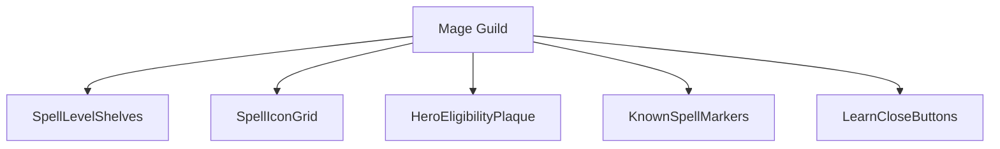
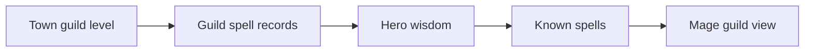
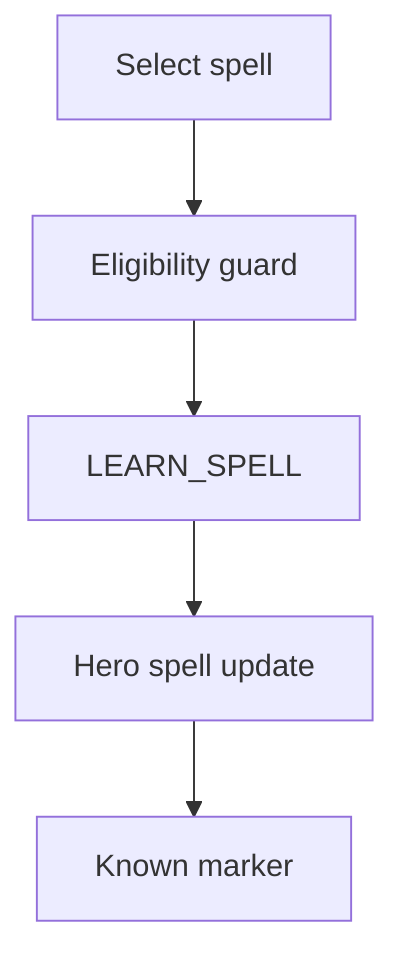
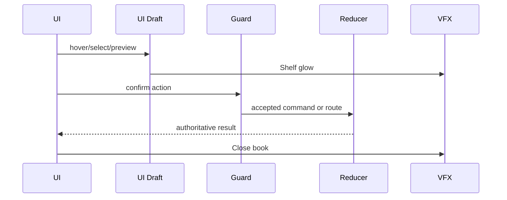
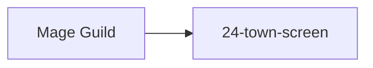

# Screen 29 Architecture: Mage Guild

System: town
Screen ID: mage-guild
Visual Archetype: curated-mage-guild
Curation Status: curated-pass-2

## Purpose
Mage guild spell learning screen with spell shelves by level, hero wisdom/magic-school eligibility, known spell state, and learn feedback.

## Visual Direction
- Original internal UI contract. Do not use third-party captures,
  copied franchise art, or external product pixels as implementation input.

## Visual Composition

## Screen Load And Data Resolution

## Main Interaction Flow

## Animation Flow

## Outgoing Transitions

## State Inputs
- town.mageGuildLevel -> state.towns.byId[selected].mageGuildLevel
- guildSpells -> state.towns.byId[selected].mageGuildSpells
- visitingHero -> state.adventure.visitingHeroId
- hero.knownSpells -> state.heroes.byId[visiting].knownSpells
- hero.wisdom -> state.heroes.byId[visiting].skills.wisdom

## Implementation Contract
- Mockup defines visual regions and data hooks only.
- Spec defines the component/state contract.
- Interactions define controls, timing, command routing, disabled states, and error behavior.
- Data contracts define schemas, config, localization, asset, audio, VFX, save, and replay references.
- Diagrams are screen-specific summaries of the same contract and must not introduce hidden behavior.
