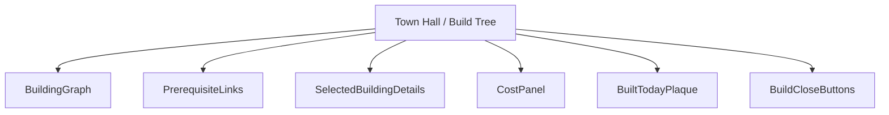
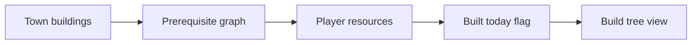
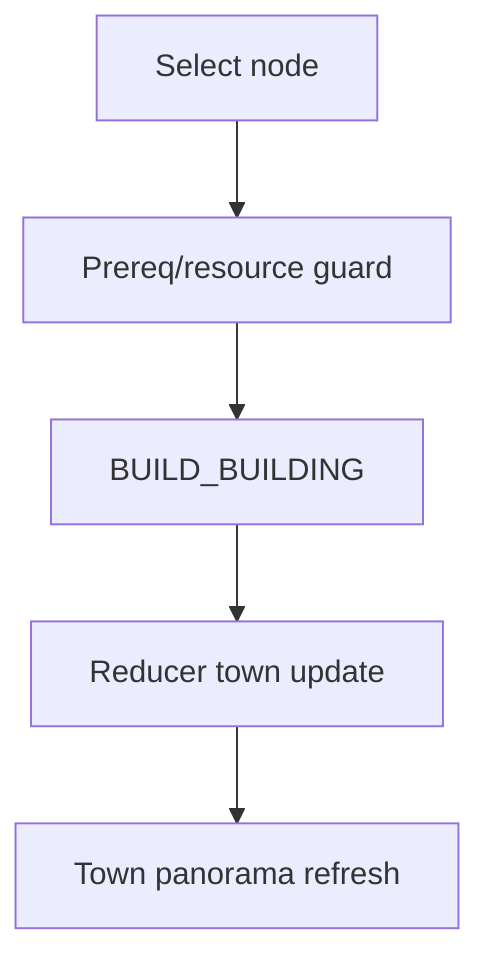
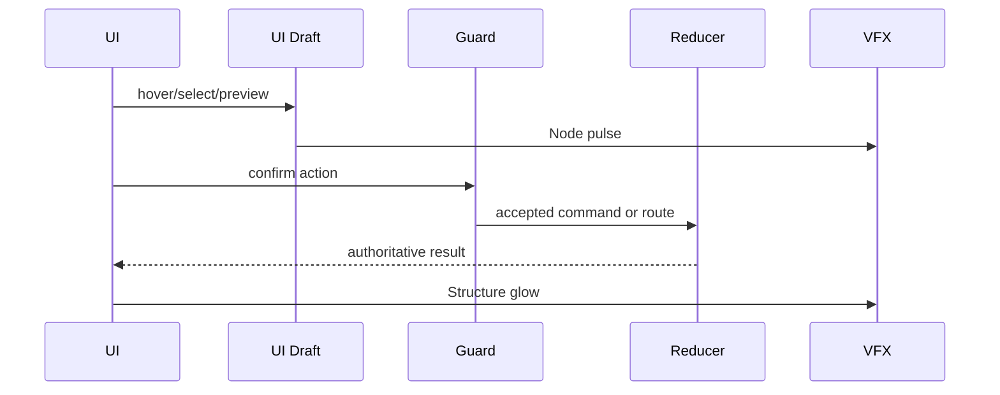
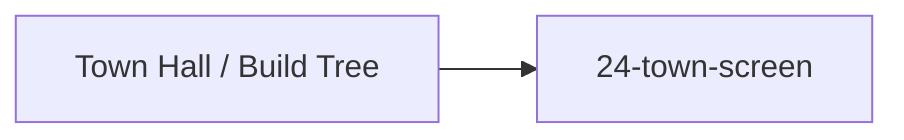

# Screen 30 Architecture: Town Hall / Build Tree

- System: `town`
- Screen ID: `build-tree`
- Visual Archetype: `curated-build-tree`
- Curation Status: `curated-pass-2`

## Companion Files
- `mockup.html` — visual reference
- `spec.md` — components and state bindings
- `interactions.md` — controls, commands, error surfaces
- `data-contracts.md` — schemas, config, localization, assets

## Purpose
Town construction graph: built / available / locked / selected
building nodes, prerequisite links, resource cost panel, and the
one-build-per-day guard.

## Visual Direction
Original internal UI contract. Never source third-party captures,
copied franchise art, or external product pixels as implementation
input.

## Visual Composition

## Screen Load And Data Resolution

## Main Interaction Flow

## Animation Flow

## Outgoing Transitions

## State Inputs
| Binding | State path |
| --- | --- |
| `town.buildings` | `state.towns.byId[selected].buildings` |
| `availableBuildings` | `state.towns.byId[selected].availableBuilds` |
| `selectedBuilding` | `state.ui.buildTree.selectedBuildingId` |
| `player.resources` | `state.players.active.resources` |
| `builtToday` | `state.towns.byId[selected].builtToday` |

`selected` is the active `townId` from the town-screen context.

## Implementation Contract
- `mockup.html` defines visual regions and data hooks only.
- `spec.md` owns the component tree and state bindings.
- `interactions.md` owns controls, timing, command routing,
  disabled states, and error behavior.
- `data-contracts.md` owns schemas, config, localization, asset,
  audio, VFX, save, and replay references.
- Diagrams here summarize the same contract; they must not
  introduce behavior absent from the sibling files.

---

## 🔍 Sync Check

- **UI: ✔** — Component nodes (`BuildingGraph`,
  `PrerequisiteLinks`, `SelectedBuildingDetails`, `CostPanel`,
  `BuiltTodayPlaque`, `BuildCloseButtons`) match `spec.md`
  § Component Tree and the regions drawn in `mockup.html`
  (Build Tree panel, Selected panel, BUILD / CLOSE buttons).
- **Schema: ✔** — `BUILD_BUILDING` is the only command in the
  Main Interaction Flow and is defined in
  [`command-schema.md` § BUILD_BUILDING](../../../command-schema.md#build_building).
  Local-UI tokens follow sibling `interactions.md`.
- **Tasks: ✔** — Owning task
  [`tasks/phase-2/07-ui-screen-backlog/30-build-tree-screen.md`](../../../../../tasks/phase-2/07-ui-screen-backlog/30-build-tree-screen.md)
  lists all five package files in Read First; outgoing transition
  `24-town-screen` matches the task's Dependency
  `mvp.07-ui-shell.04-town-screen-modal`.

## ⚠ Issues

- **Town and build-tree state slices missing from
  `data-inventory.md`.** State Inputs binds
  `state.towns.byId[*].buildings`, `availableBuilds`,
  `builtToday`, and `state.ui.buildTree.selectedBuildingId`, but
  [`data-inventory.md` § 1](../../../data-inventory.md) registers
  none of them. Per CLAUDE.md root contract ("every persisted
  field is registered in `data-inventory.md`"), the engine task
  that owns the town reducer
  ([`mvp.05-adventure-map.05-town-visit-recruit-build-mage-guild`](../../../../../tasks/mvp/05-adventure-map/05-town-visit-recruit-build-mage-guild.md))
  must add the rows. See sibling `spec.md` § ⚠ Issues for the
  suggested row values. Not closed here per Hard Prohibition D.
