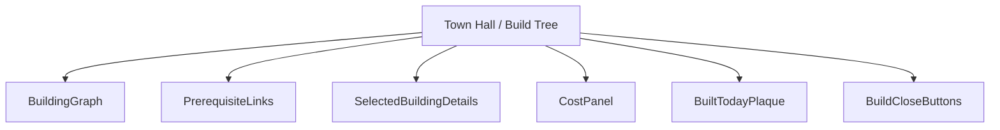
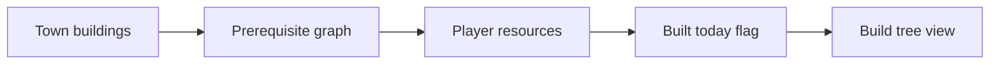
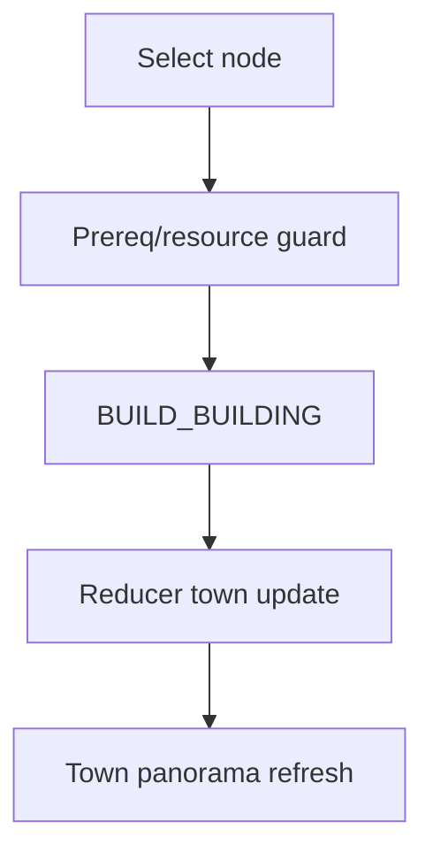
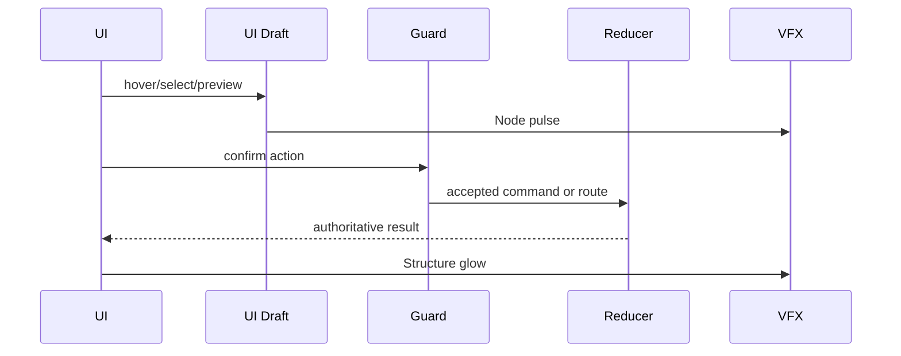
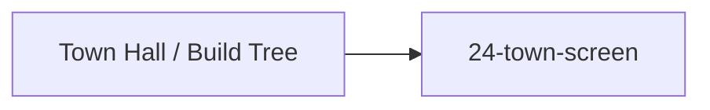

# Screen 30 Architecture: Town Hall / Build Tree

System: town
Screen ID: build-tree
Visual Archetype: curated-build-tree
Curation Status: curated-pass-2

## Purpose
Town construction graph with built, available, locked, and selected building nodes, prerequisite links, resource cost, and one-build-per-day guard.

## Visual Direction
- Original internal UI contract. Do not use third-party captures,
  copied franchise art, or external product pixels as implementation input.

## Visual Composition

## Screen Load And Data Resolution

## Main Interaction Flow

## Animation Flow

## Outgoing Transitions

## State Inputs
- town.buildings -> state.towns.byId[selected].buildings
- availableBuildings -> state.towns.byId[selected].availableBuilds
- selectedBuilding -> state.ui.buildTree.selectedBuildingId
- player.resources -> state.players.active.resources
- builtToday -> state.towns.byId[selected].builtToday

## Implementation Contract
- Mockup defines visual regions and data hooks only.
- Spec defines the component/state contract.
- Interactions define controls, timing, command routing, disabled states, and error behavior.
- Data contracts define schemas, config, localization, asset, audio, VFX, save, and replay references.
- Diagrams are screen-specific summaries of the same contract and must not introduce hidden behavior.
