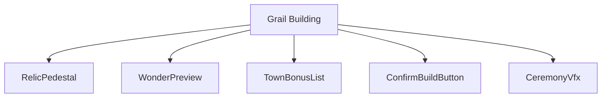
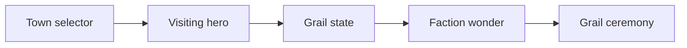
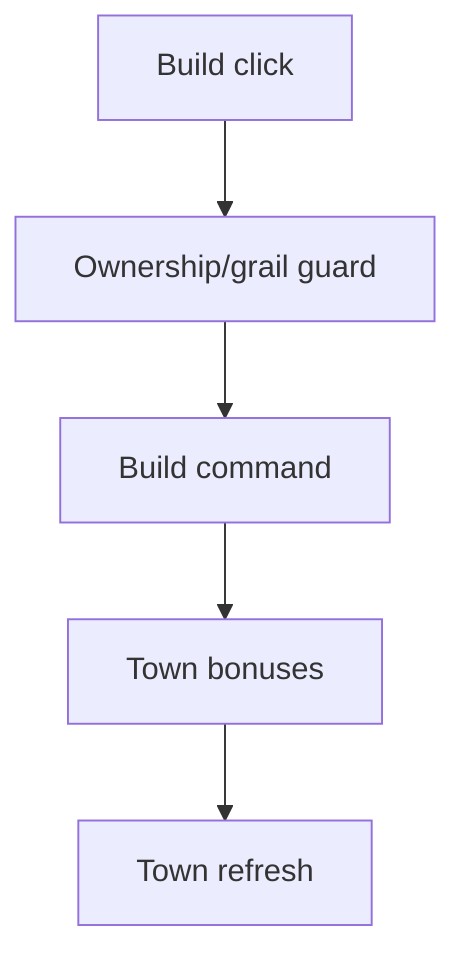
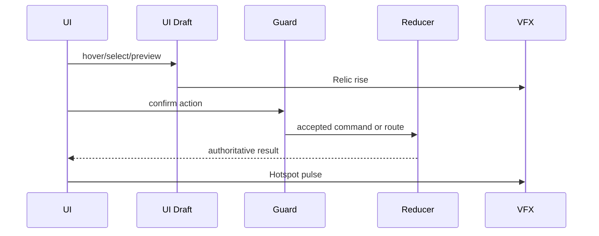
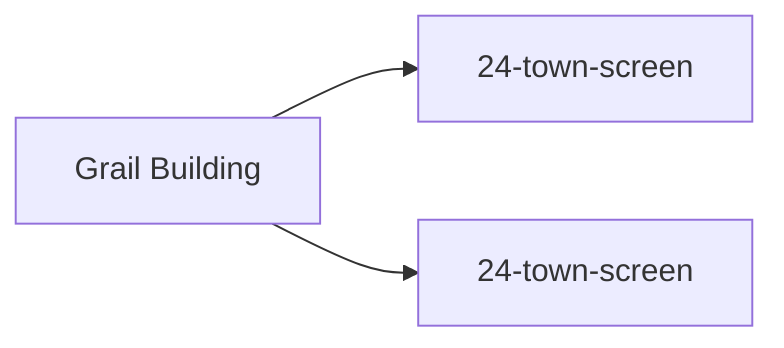

# Screen 31 Architecture: Grail Building

System: town
Screen ID: grail-building
Visual Archetype: curated-grail-building
Curation Status: curated-pass-4

## Purpose
Town grail construction ceremony after a hero brings the grail to a valid town.

## Visual Direction
- Original internal UI contract. Do not use third-party captures,
  copied franchise art, or external product pixels as implementation input.

## Visual Composition

## Screen Load And Data Resolution

## Main Interaction Flow

## Animation Flow

## Outgoing Transitions

## State Inputs
- townId -> state.towns.selectedTownId
- deliveringHero -> state.adventure.visitingHeroId
- grailRecord -> state.scenario.grail
- wonderDefinition -> selectors.towns.factionGrailBuilding
- bonusPreview -> selectors.towns.grailBonusPreview

## Implementation Contract
- Mockup defines visual regions and data hooks only.
- Spec defines the component/state contract.
- Interactions define controls, timing, command routing, disabled states, and error behavior.
- Data contracts define schemas, config, localization, asset, audio, VFX, save, and replay references.
- Diagrams are screen-specific summaries of the same contract and must not introduce hidden behavior.
