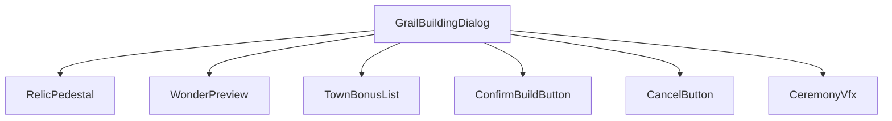
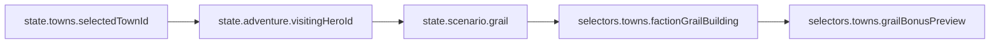
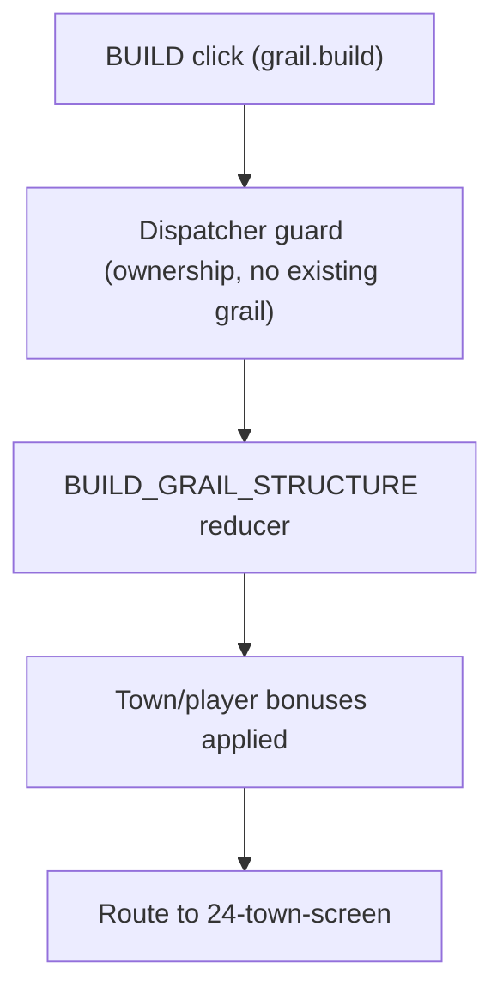
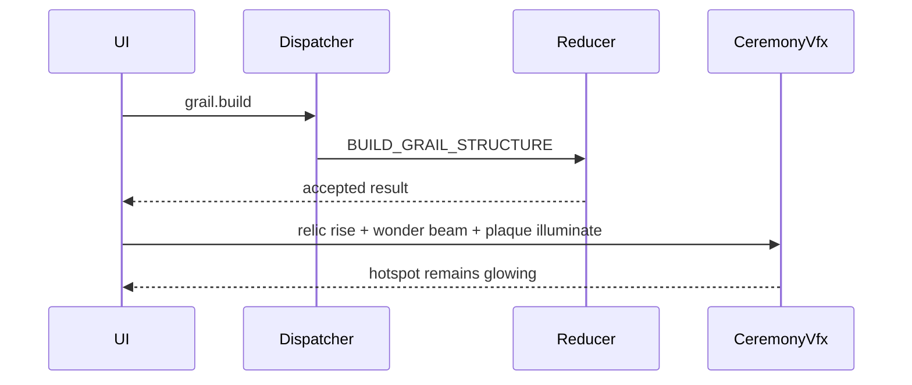
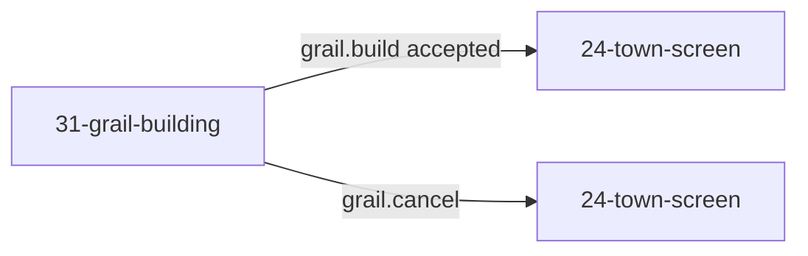

# Screen 31 Architecture: Grail Building

System: town
Screen ID: grail-building
Visual Archetype: curated-grail-building
Curation Status: curated-pass-4

## Purpose
Town grail-building ceremony. Triggered when a hero carrying the
grail artifact reaches a town the same player owns; confirms
construction of the faction-specific grail wonder and applies its
permanent bonuses. Companions: sibling `spec.md` (components,
bindings, animation contract), `interactions.md` (controls, errors),
`data-contracts.md` (schemas, assets, save/replay).

## Visual Direction
- Original internal UI contract. Do not use third-party captures,
  copied franchise art, or external product pixels as implementation
  input.

## Visual Composition

## Screen Load And Data Resolution

## Main Interaction Flow

## Animation Flow

`grail.inspect` (local-UI) drives a focus highlight on the focused
bonus plaque only — no reducer hop, no ceremony VFX. `grail.cancel`
(navigation) routes back without VFX.

## Outgoing Transitions

## State Inputs
Authoritative bindings live in sibling `spec.md` § State Bindings;
the list below mirrors them as a quick reference for the diagrams
above:

- `townId` ← `state.towns.selectedTownId`
- `deliveringHero` ← `state.adventure.visitingHeroId`
- `grailRecord` ← `state.scenario.grail`
- `wonderDefinition` ← `selectors.towns.factionGrailBuilding`
- `bonusPreview` ← `selectors.towns.grailBonusPreview`

## Implementation Contract
- `mockup.html` defines visible regions and data hooks only.
- `spec.md` owns the component / state contract and animation
  contract.
- `interactions.md` owns controls, command routing, navigation
  timing, disabled rules, and error surfaces.
- `data-contracts.md` owns schemas, config, localization, asset,
  audio, VFX, save, and replay references.
- The diagrams above are screen-specific summaries of the same
  contract — they MUST NOT introduce hidden behavior.

---

## 🔍 Sync Check

- **UI: ✔** — Visual Composition matches sibling `spec.md`
  Component Tree (now includes `CancelButton`); Main Interaction
  Flow matches sibling `interactions.md` § Actions; Outgoing
  Transitions are labeled per the action that drives each route.
- **Schema: ✔** — `BUILD_GRAIL_STRUCTURE` resolves to
  [`command.schema.json` `$defs.buildGrailStructure`](../../../../../content-schema/schemas/command.schema.json)
  and is registered in
  [`enums.snapshot.json`](../../../../../content-schema/enums.snapshot.json)
  line 235.
- **Tasks: ✔** — UI owner
  [`phase-2.07-ui-screen-backlog.31-grail-building-screen`](../../../../../tasks/phase-2/07-ui-screen-backlog/31-grail-building-screen.md)
  Reads-First all four package files; engine reducer owner
  [`phase-2.05-mod-system.07-build-grail-structure-command`](../../../../../tasks/phase-2/05-mod-system/07-build-grail-structure-command.md)
  Reads-First sibling `interactions.md`. Scenario `grail` block
  owner is
  [`mvp.05-adventure-map.22-obelisk-visits-and-grail-state`](../../../../../tasks/mvp/05-adventure-map/22-obelisk-visits-and-grail-state.md).

## ⚠ Issues

- **Animation Flow previously implied a generic UI ↔ Draft hop for
  hover/select/preview that did not match the rest of the package.**
  Sibling `interactions.md` classifies `grail.inspect` as `local-ui`
  with no draft state and no reducer hop. This rewrite scopes the
  sequence diagram to the build path and notes the inspect / cancel
  branches in prose. No new feature is introduced.
- **Outgoing-transitions diagram previously listed two unlabeled
  edges to `24-town-screen`.** This rewrite labels them with their
  action IDs (`grail.build accepted`, `grail.cancel`) so the diagram
  matches sibling `interactions.md` § Navigation Outcomes. No new
  destination introduced.
- **`state.scenario.grail` not in data-inventory.** Cross-package
  gap also flagged in sibling `spec.md` and `data-contracts.md`
  trailers. Owner:
  [`mvp.05-adventure-map.22-obelisk-visits-and-grail-state`](../../../../../tasks/mvp/05-adventure-map/22-obelisk-visits-and-grail-state.md)
  must add the row to
  [`data-inventory.md`](../../../data-inventory.md). Skill did
  not edit cross-checked files (Hard Prohibition D).
