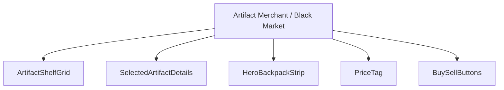
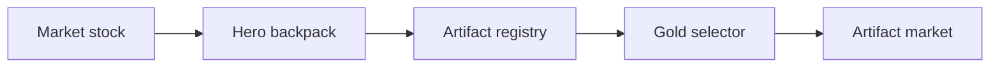
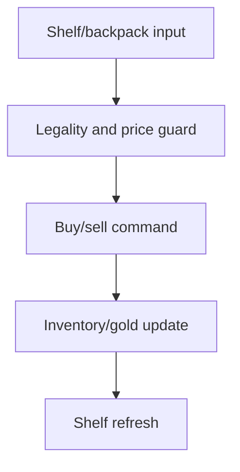
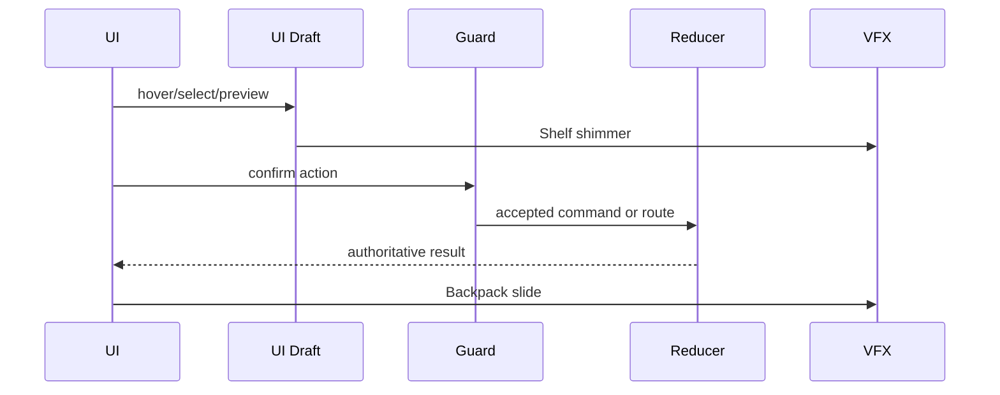
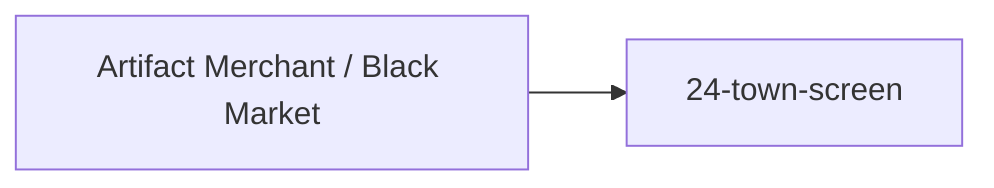

# Screen 32 Architecture: Artifact Merchant / Black Market

System: town
Screen ID: artifact-merchant-black-market
Visual Archetype: curated-artifact-market
Curation Status: curated-pass-4

## Purpose
Artifact shop or black market service for browsing, buying, and selling eligible artifacts.

## Visual Direction
- Original internal UI contract. Do not use third-party captures,
  copied franchise art, or external product pixels as implementation input.

## Visual Composition

## Screen Load And Data Resolution

## Main Interaction Flow

## Animation Flow

## Outgoing Transitions

## State Inputs
- marketStock -> state.towns.byId[selected].artifactMarketStock
- selectedArtifact -> state.ui.artifactMarket.selectedArtifactId
- heroBackpack -> state.heroes.byId[visiting].backpack
- pricePreview -> selectors.economy.artifactMarketPrice
- gold -> state.players.active.resources.gold

## Implementation Contract
- Mockup defines visual regions and data hooks only.
- Spec defines the component/state contract.
- Interactions define controls, timing, command routing, disabled states, and error behavior.
- Data contracts define schemas, config, localization, asset, audio, VFX, save, and replay references.
- Diagrams are screen-specific summaries of the same contract and must not introduce hidden behavior.
