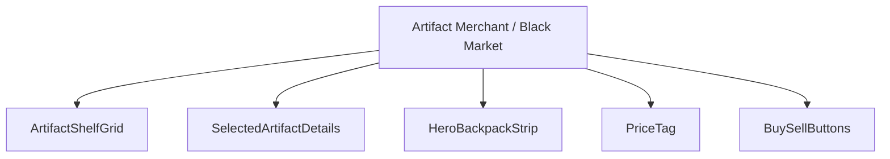
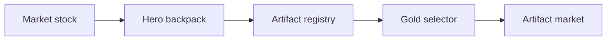
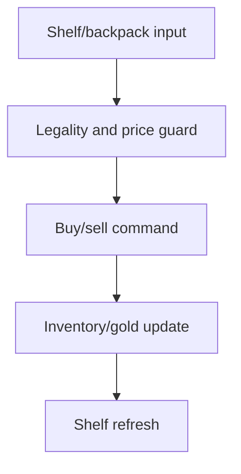
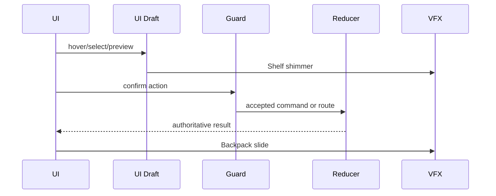
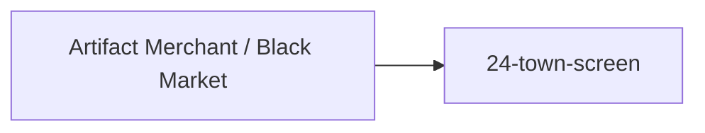

# Screen 32 Architecture: Artifact Merchant / Black Market

System: town
Screen ID: `artifact-merchant-black-market`
Visual Archetype: `curated-artifact-market`
Curation Status: `curated-pass-4`

## Purpose
Artifact shop / black market for browsing, buying, and selling
eligible artifacts at the visiting town.

## Visual Direction
- Original internal UI contract. Do not use third-party captures,
  copied franchise art, or external product pixels as implementation
  input.

## Visual Composition

## Screen Load And Data Resolution

## Main Interaction Flow

## Animation Flow

## Outgoing Transitions

## State Inputs
- `marketStock` ← `state.towns.byId[<selectedTownId>].artifactMarketStock`
- `selectedArtifact` ← `state.ui.artifactMarket.selectedArtifactId`
- `heroBackpack` ← `state.heroes.byId[<visitingHeroId>].backpack`
- `pricePreview` ← `selectors.economy.artifactMarketPrice`
- `gold` ← `state.players.active.resources.gold`

## Implementation Contract
- `mockup.html` defines visual regions and data hooks only.
- `spec.md` owns the component tree and state bindings.
- `interactions.md` owns controls, timing, command routing,
  disabled states, and error surfaces.
- `data-contracts.md` owns schemas, config, localization, asset,
  audio, VFX, save, and replay references.
- Diagrams above are screen-specific summaries of the same
  contract; they must not introduce hidden behavior.

---

## 🔍 Sync Check

- **UI: ✔** — Component tree, transitions, and state inputs match sibling [`spec.md`](./spec.md), [`interactions.md`](./interactions.md), and `mockup.html`.
- **Schema: ⚠** — Gameplay commands `BUY_ARTIFACT` and `SELL_ARTIFACT` are defined in [`command.schema.json`](../../../../../content-schema/schemas/command.schema.json) (`buyArtifact` / `sellArtifact` `$defs`), but their required payload includes `marketId`, which no state binding in this package names. Detailed in `## ⚠ Issues`.
- **Tasks: ✔** — Owning screen task [`phase-2.07-ui-screen-backlog.32-artifact-merchant-black-market-screen`](../../../../../tasks/phase-2/07-ui-screen-backlog/32-artifact-merchant-black-market-screen.md) reads First-Reads this file; reducer task [`phase-2.01-spells-artifacts.10-buy-artifact-command`](../../../../../tasks/phase-2/01-spells-artifacts/10-buy-artifact-command.md) implements the two reducers and cites Screen 32 in its acceptance criteria.

## ⚠ Issues

- **`marketId` payload field has no state binding.** The closed `BUY_ARTIFACT` / `SELL_ARTIFACT` schemas in [`command.schema.json`](../../../../../content-schema/schemas/command.schema.json) require `marketId: stringId`, but no field on `state.towns.byId[<townId>]` or on this screen's bindings names the market entity. Per CLAUDE.md ("Stable IDs are public API"), the visiting town's market must surface a stable ID. Owner: [`phase-2.01-spells-artifacts.10-buy-artifact-command`](../../../../../tasks/phase-2/01-spells-artifacts/10-buy-artifact-command.md) must either (a) add `artifactMarketId` to the town record and surface it through this screen's bindings, or (b) define a deterministic per-town derivation rule documented in the reducer file. Flagged here per Hard Prohibition B (do not invent the field).
- **Missing `data-inventory.md` rows.** `state.towns.byId[].artifactMarketStock` and `state.ui.artifactMarket.selectedArtifactId` are not registered in [`data-inventory.md`](../../../data-inventory.md). Per CLAUDE.md root contract ("every persisted field is registered in data-inventory.md"), the owning reducer task must add rows: domain=`towns` and `ui`, owner=[`phase-2.01-spells-artifacts.10-buy-artifact-command`](../../../../../tasks/phase-2/01-spells-artifacts/10-buy-artifact-command.md), persistence=`indexeddb` (stock) / `none` (ui draft). Surfaced rather than added per Hard Prohibition D.
