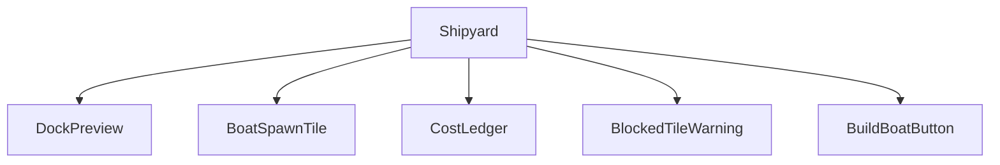
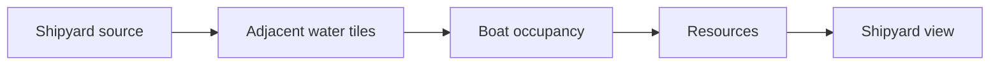
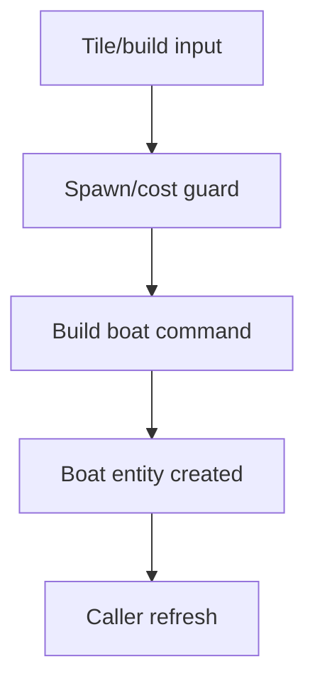
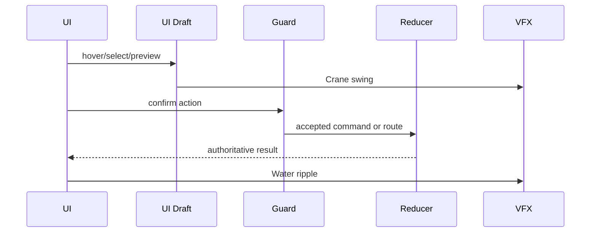
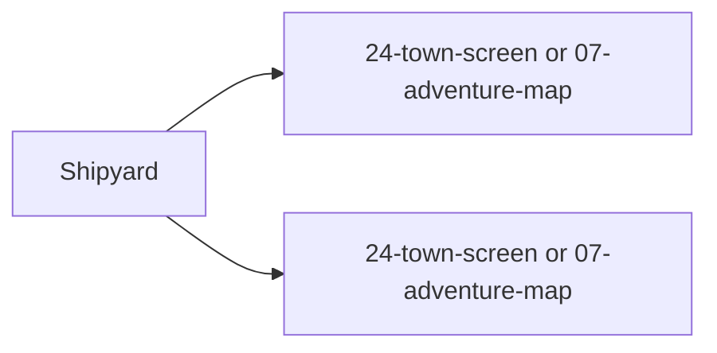

# Screen 33 Architecture: Shipyard

System: town
Screen ID: shipyard
Visual Archetype: curated-shipyard
Curation Status: curated-pass-4

## Purpose
Town or adventure shipyard service for purchasing a boat at an adjacent valid water tile.

## Visual Direction
- Original internal UI contract. Do not use third-party captures,
  copied franchise art, or external product pixels as implementation input.

## Visual Composition

## Screen Load And Data Resolution

## Main Interaction Flow

## Animation Flow

## Outgoing Transitions

## State Inputs
- shipyardId -> state.ui.shipyard.sourceId
- spawnTiles -> selectors.towns.shipyardBoatSpawnTiles
- selectedTile -> state.ui.shipyard.selectedSpawnTile
- cost -> selectors.economy.shipyardBoatCost
- resources -> state.players.active.resources

## Implementation Contract
- Mockup defines visual regions and data hooks only.
- Spec defines the component/state contract.
- Interactions define controls, timing, command routing, disabled states, and error behavior.
- Data contracts define schemas, config, localization, asset, audio, VFX, save, and replay references.
- Diagrams are screen-specific summaries of the same contract and must not introduce hidden behavior.
